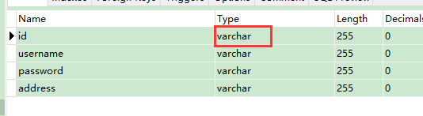
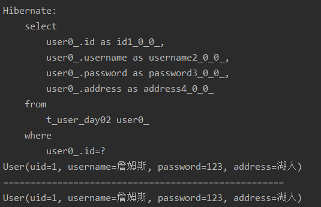
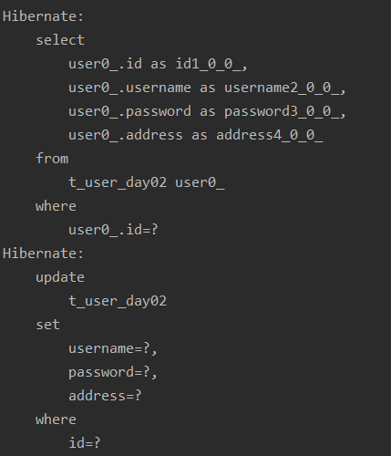
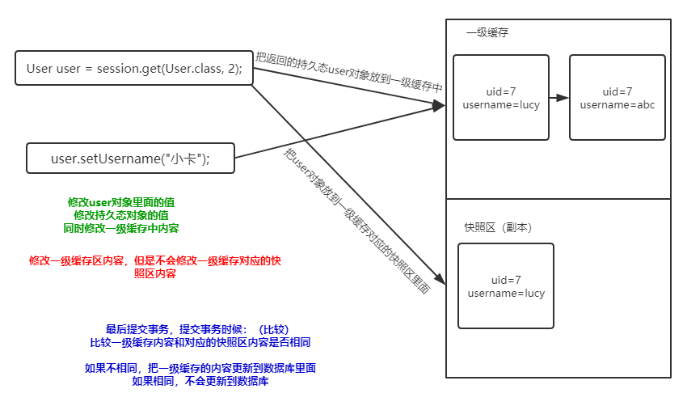

# 1、实体类编写规则

1. 实体类里面的属性私有的

2. 私有属性使用公开的 get 和 set 方法操作

3. 要求实体类有属性作为唯一键（一般使用 id 值）

4. 实体类属性建议不使用基本数据类型，使用基本数据类型对应的包装类

   1. 八个基本数据类型对应的包装类

      int——Integer

      char——Character

      其他的都是首字母大写，比如：double——Double

   2. 比如：表示学生的分数，加入 int score

      学生考了0分，int score = 0

      如果表示学生没有参加考试，int score = 0，不能准确表示学生是否参加考试

      - 解决：使用包装类就可以了，

        Integer score = 0，表示学生得了0分

        Integer score = null，表示学生没有参加考试

        

# 2、Hibernate 主键生成策略

1. Hibernate 要求实体类里面有一个属性作为唯一值，对应表主键，主键可以不同生成策略

2. Hibernate 主键生成策略有很多的值

   ```xml
   <!--
   	设置数据表id增长策略
       native：生成表id值就是主键自动增长
   -->
   <generator class="native"></generator>
   ```

3. 在class属性里面有很多值

   1. native：根据使用的数据库帮选择哪个值
   2. uuid：之前web阶段写代码生成 uuid 值，Hibernate 自动帮我们生成 uuid 值

   | 属性值 | 作用                                                         |
   | ------ | ------------------------------------------------------------ |
   | native | native由hibernate根据使用的数据库自行判断采用identity、hilo、sequence其中一种作为主键生成方式，灵活性很强，这样以来如果一个项目中使用多个数据库时，就可以使用这种方式 |
   | uuid   | Universally Unique Identifier的缩写，通用唯一识别码，UUID是由一组32位数的16进制数字所构成是指在一台机器上生成的数字，它保证对在同一时空中的所有机器都是唯一的； Hibernate在保存对象时，生成一个uuid字符串作为主键，保证了唯一性，但其无任何业务逻辑意义； 适用与所有的数据库，但是生成的主键占用的存储空间较大 |

4. 演示生成策略uuid

   ```java
   @Data
   public class User {
   
       //private int uid;
       private String uid;
       private String username;
       private String password;
       private String address;
   }
   ```

   ```xml
   <generator class="uuid"></generator>
   ```

   


# 3、实体类操作

## 3.1 对实体类CRUD操作

### 3.1.1 添加操作

调用 session 里面的 save 方法实现

```java
//添加功能
User user = new User("李四","1011","America");
//调用session的方法实现添加
session.save(user);
```

### 3.1.2 根据 id 查询

```java
@Test
public void testQueryById(){

    //1、调用工具得到SessionFactory
    SessionFactory sessionFactory = HibernateUtils.getSessionFactory();
    //2、获取Session
    Session session = sessionFactory.openSession();

    //3、根据id查询
    /**
     * 调用session里面的get方法
     * 第一个参数：实体类的class
     * 第二个参数：id值
     */
    User user = session.get(User.class, 1);
    System.out.println(user);

    //4、关闭
    session.close();
    sessionFactory.close();

}
```

### 3.1.3 修改操作

```java
@Test
public void updateUser(){

    //1、调用工具得到SessionFactory
    SessionFactory sessionFactory = HibernateUtils.getSessionFactory();
    //2、获取Session
    Session session = sessionFactory.openSession();
    //3、开启事务
    Transaction tx = session.beginTransaction();

    //4、修改操作
    //   修改uid=2记录username值
    //4.1根据id查询
    User user = session.get(User.class, 2);
    //4.2向返回的user对象里面设置修改之后的值
    user.setUsername("卡哇伊").setAddress("快船");
    //4.3调用session的方法update修改
    //执行过程：到user对象里面找到uid值，根据uid进行修改
    session.update(user);

    //5、关闭事务
    tx.commit();

    //6、关闭
    session.close();
    sessionFactory.close();
}
```

### 3.1.4 删除操作

```java
@Test
public void testDelete(){
    //1、调用工具得到SessionFactory
    SessionFactory sessionFactory = HibernateUtils.getSessionFactory();
    //2、获取Session
    Session session = sessionFactory.openSession();
    //3、开启事务
    Transaction tx = session.beginTransaction();

    //4、删除操作
    //第一种根据id查询对象
    /*
    User user = session.get(User.class, 4);
    session.delete(user);
     */

    //第二种
    User user = new User().setUid(5);
    session.delete(user);

    //5、关闭事务
    tx.commit();

    //6、关闭
    session.close();
    sessionFactory.close();
}
```

## 3.2 实体类对象状态（概念）

1. 实体类状态有三种：

   1. 瞬时态：对象里面没有 id 值，对象与 session 没有关联

   ```java
   User u = new User();
   u.setUsername("jdck");
   u.setPassword("1234");
   u.setAddress("China");
   ```

   2. 持久态：对象里面有 id 值，与 session 关联

   ```java
   User user = session.get(User.class,1);
   ```

   3. 托管态，对象有 id 值，对象与 session 没有关联

   ```java
   User user = new User();
   user.setUid()
   ```

2. 演示操作实体类对象的方法

   1. saveOrUpdate() 方法

   ```java
   //实体类对象状态是瞬时态，做添加
   User user = new User();
   user.setUsername("jack");
   user.setPassword("1234");
   user.setAddress("England")
   session.saveOrUpdate(user);
   
   //实体类对象是托管态和持久态，做修改
   User user = new User();
   user.setUid(6);
   user.setUsername("jack");
   user.setPassword("1234");
   session.saveOrUpdate(user);
   ```

   

# 4、Hibernate的缓存

<font size='5'>**什么是缓存？**</font>

1. 数据存到数据库里面，数据库本身是文件系统，使用流方式操作文件效率不是很高
   1. 把数据存到内存里面，不需要使用流方式，可以直接读取内存中数据
   2. 把数据放到内存中，提高读取效率

<font size='5'>**Hibernate缓存**</font>

1. Hibernate 框架中提供很多优化方法，Hibernate 的缓存就是一个优化方式

2. Hibernate 缓存特点

   第一类 Hibernate 的一级缓存

   1. Hibernate 的一级缓存默认打开的
   2. Hibernate 的一级缓存使用范围，是 Session 的范围，从 Session 创建到 Session 关闭
   3. Hibernate 的一级缓存中，存储数据必须是持久态数据

   第二类Hibernate 的二级缓存

   1. 目前一级不使用了，替代技术 redis
   2. 二级缓存默认不是打开的，需要配置
   3. 二级缓存使用范围，是 SessionFactory 范围

## 4.1 一级缓存

### 4.1.1 验证一级缓存存在

**验证方式**

首先根据 uid = 1 查询，返回对象；其次再根据 uid = 1查询，返回对象

```java
User user = session.get(User.class, 1);
System.out.println(user);

System.out.println("====================================================");

User user1 = session.get(User.class, 1);
System.out.println(user1);
```



第一次查询对象时，访问数据库；第二次查询数据库时，没有访问数据库。


### 4.1.2 一级缓存特性

1. 持久态自动更新数据库

```java
@Test
public void testDemo(){
    //1、调用工具得到SessionFactory
    SessionFactory sessionFactory = HibernateUtils.getSessionFactory();
    //2、获取Session
    Session session = sessionFactory.openSession();
    //3、开启事务
    Transaction tx = session.beginTransaction();

    User user = session.get(User.class, 2);

    user.setUsername("小卡");

    //5、关闭事务
    tx.commit();

    //6、关闭
    session.close();
    sessionFactory.close();
}
```






# 5、Hibernate 事务操作

## 5.1 事务相关概念

- 什么是事务？

在数据库操作中，一项书屋是由一条或多条操作数据库的SQL语句组成的一个不可分割的工作单元，当事务中的所有操作都正常完成时，整个事务才能被提交到数据库中，如果有一项没有完成，则整个事务都会被回滚

- 事务特性

原子性、一致性、隔离性、持久性

- 不考虑隔离性产生问题

  1. 脏读

     一个事务读取到另一个事务未提交的数据

  2. 不可重复读

     一个事务读到了另一个事务已经提交的update的数据，导致在另一个事务中的多次查询结果不一致

  3. 虚读/幻读

     一个事务读到了另一个事务已经提交的 insert 数据，导致在通过个事务中的多次查询结果不一致

- 设置事务隔离级别

  - mysql默认隔离级别  repeatable read

## 5.2 Hibernate事务代码规范写法

1. 代码结构

```java
try{
    开启事务
    提交事务
}catch(){
    回滚事务
}
```

```java
//事务规范代码
@Test
public void testTx() {

    SessionFactory sessionFactory = null;
    Session session = null;
    Transaction tx = null;

    try {
        sessionFactory = HibernateUtils.getSessionFactory();
        session = sessionFactory.openSession();

        //开启事务
        tx = session.beginTransaction();

        User user = new User();
        user.setUsername("约基奇").setPassword("9999").setAddress("掘金");

        session.save(user);

        int i = 1 / 0;

        //提交事务
        tx.commit();

    } catch (Exception e) {
        tx.rollback();
    } finally {
        session.close();
        sessionFactory.close();
    }
}
```

## 5.3 Hibernate绑定session

1. session类似于jdbc的connection，之前web阶段学过 threadLocal

2. 帮实现与本地线程绑定session

3. 获取与线程session

   1. 在Hibernate核心配置文件中配置

   ```java
   <!--在Hibernate核心配置文件中配置-->
   <property name="hibernate.current_session_context_class">thread</property>
   ```

   2. 调用SessionFactory里面的方法得到

   ```java
   //提供返回与本地线程绑定的session的方法
   public static Session getSessionobject(){
       return sessionFactory.getCurrentSession();
   }
   ```

4. 调用与本地线程绑定 session 的时候，关闭session报错，不需要手动关闭了


# 6、Hibernate 的 PAI 使用

## 6.1 Query 对象

1. 使用query对象，不需要写sql语句，但是写 hql 语句

   1. hql：hibernate query language：hibernate提供查询语言，和sql很相似

   2. hql和sql区别：

      使用sql操作表和表字段

      使用hql操作实体类和属性

2. 查询所有 hql 语言

   from 实体类名称

3. Query 对象使用

   1. 创建Query对象
   2. 调用Query对象里面的方法得到结果

```java
//使用Query对象
@Test
public void testQuery() {
    SessionFactory sessionFactory = null;
    Session session = null;
    Transaction tx = null;

    try {
        //与本地线程绑定的session
        sessionFactory = HibernateUtils.getSessionFactory();
        session = sessionFactory.openSession();
        //开启事务
        tx = session.beginTransaction();

        //1、创建Query方法
        //方法里面写 hql语句
        Query query = session.createQuery("from User");

        //2、调用query对象里面的方法得到结果
        List<User> list = query.list();

        for (User user : list) {
            System.out.println(user);
        }

        //提交事务
        tx.commit();
    } catch (Exception e) {
        tx.rollback();
    } finally {
        session.close();
        sessionFactory.close();
    }
}
```

## 6.2 Criteria 对象(已过时)

1. 使用这个对象也能查询操作，但是使用这个对象时候，不需要写语句，直接调用其中的方法实现
2. 实现过程
   1. 创建 criteria 对象
   2. 调用对象里面的方法得到结果

## 6.3 SQLQuery 对象

1. 使用Hibernate时候，调用底层sql实现
2. 实现过程
   1. 创建对象
   2. 调用对象防范得到结果

```java
//使用数组的方式取出

//使用SQLQuery对象
@Test
public void testSQLQuery(){
    SessionFactory sessionFactory = null;
    Session session = null;
    Transaction tx = null;
    try {
        sessionFactory = HibernateUtils.getSessionFactory();
        session = sessionFactory.openSession();
        tx = session.beginTransaction();

        //1、创建对象
        NativeQuery sqlQuery = session.createSQLQuery("select * from t_user_day02");
        //2、调用SQLQuery里面的方法，默认里面的结果是数组结构
        List<Object[]> list = sqlQuery.list();

        for (Object[] objects:list){
            System.out.println(Arrays.toString(objects));
        }

        System.out.println(list);

        tx.commit();
    }catch (Exception e){
        tx.rollback();
    }finally {
        session.close();
        sessionFactory.close();
    }
}
```

使用对象的方式取出

```java
//1、创建对象
NativeQuery sqlQuery = session.createSQLQuery("select * from t_user_day02");

//返回的list中每部分是对象形式
sqlQuery.addEntity(User.class);

List<User> list = sqlQuery.list();
for (User user:list){
    System.out.println(user);
}
```

