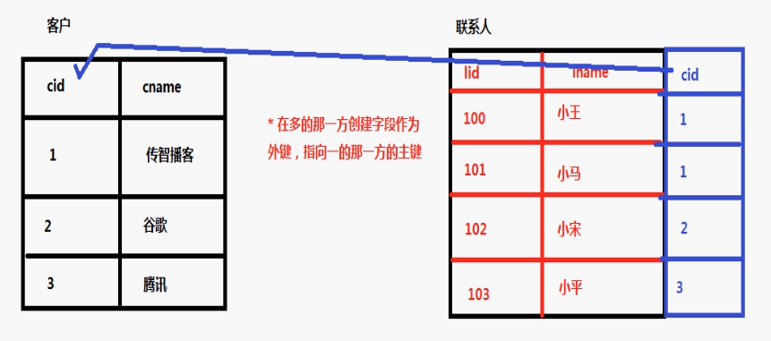
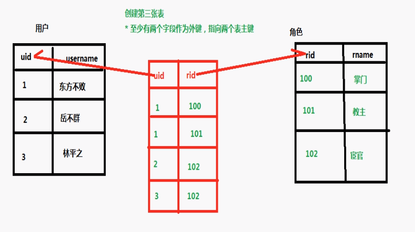
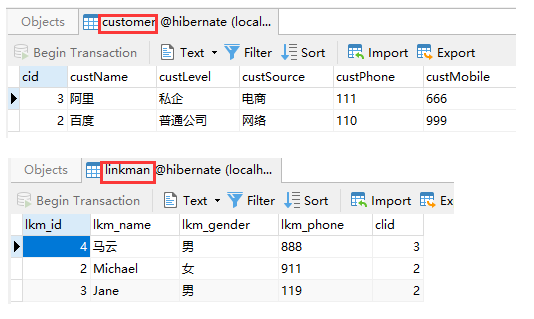
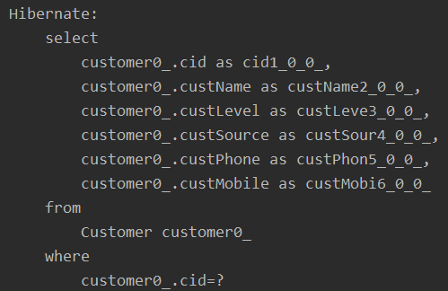
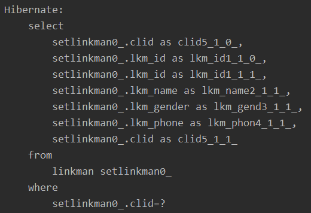
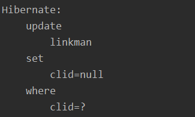
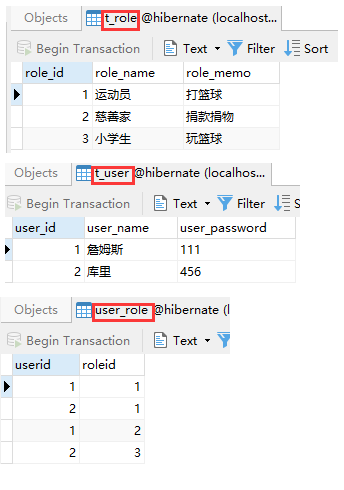
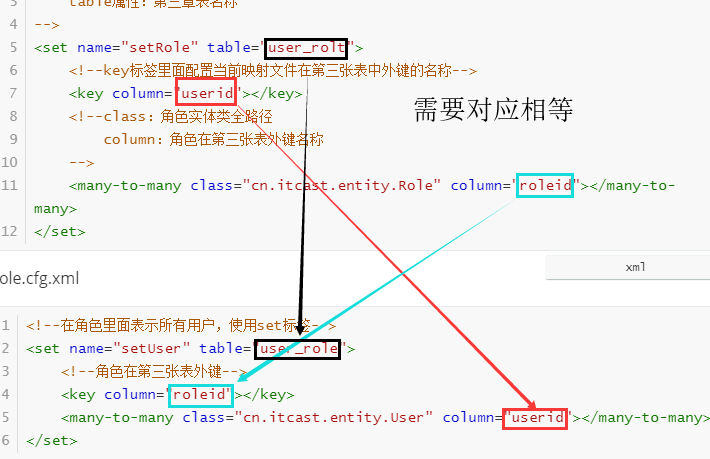

# 1、表与表之间关系回顾

## 1.1 一对多

1. 分类和商品的关系，一个分类里面有多个商品，一个商品只能属于一个分类

2. 客户和联系人是一对多关系

   客户：与公司有业务往来

   联系人：公司里面的员工

   公司与公司员工的关系：客户是一，联系人是多

   一个客户里面有多个联系人，一个联系人只能拥有一个客户

3. 一对多建表，通过外键建立关系



## 1.2 多对多

订单和商品的关系，一个订单有多个商品，一个商品属于多个订单



## 1.3 一对一

一个对一个


# 2、Hibernate的一对多的操作

## 2.1 一对多映射配置

1. 创建多个实体类，客户和联系人

2. 让两个实体类之间互相表示

   1. 在客户实体类里面表示多个联系人

      一个客户里面有多个联系人

   ```java
   /*
       在客户实体类里面表示多个联系人，一个客户有多个联系人
       Hibernate要求使用集合表示多的数据，使用set集合
    */
   private Set<LinkMan> setLinkMan = new HashSet<LinkMan>();
   ```

   2. 在联系人实体类里面表示所属客户

      一个联系人只能属于一个客户

   ```java
   //在联系人实体类里面表示所属对象，一个联系人只能属于一个客户
   private Customer customer;
   ```

3. 配置映射关系

   1. 一般一个实体类对应一个映射文件

   2. 把映射量基本配置完成

   3. 在映射文件中，配置一对多关系

      在客户映射文件中，表示所有联系人

   ```java
   <!--在客户映射文件中，表示所有联系人
       使用set标签表示所有联系人
       set标签里面有name属性
         属性值写在客户实体类里面表示联系人的set集合名称
   -->
   <set name="setLinkMan">
       <!--一对多建表，有外键
               Hibernate机制：双向维护外键，在一和多那一方都配置外键
               column属性值：外键名称
       -->
       <key column="clid"></key>
       <!--客户所有的联系人，class里面写联系人实体类全路径-->
       <one-to-many class="cn.itcast.entity.LinkMan"/>
   </set>
   ```

   ​				在联系人映射文件中，表示所属客户

   ```java
   <!--表示联系人所属客户
       name属性：因为联系人实体类使用customer对象表示，写customer名称
       class属性：customer全路径
       column属性：外键名称，需要一致
   -->
   <many-to-one name="customer" class="cn.itcast.entity.Customer" column="clid"></many-to-one>
   ```

4. 创建核心配置文件，把映射文件引入到核心配置文件中

   ```java
   <mapping resource="cn/itcast/entity/Customer.hbm.xml"/>
   <mapping resource="cn/itcast/entity/LinkMan.hbm.xml"/>
   ```

   

## 2.2 一对多级联操作

级联操作：

1. 级联保存

   添加一个客户，为这个客户添加多个联系人

2. 级联删除

   删除某一个客户，把这个客户里面的所有的联系人也删除



**一对多的级联保存**

- 复杂的写法

  ```java
  //演示一对多级联保存
  @Test
  public void testAddDemo1() {
      SessionFactory factory = null;
      Session session = null;
      Transaction tx = null;
  
      try {
          factory = HibernateUtils.getSessionFactory();
          session = factory.openSession();
          tx = session.beginTransaction();
  
          //添加一个客户，为这个客户添加一个联系人
          //1、创建客户和联系人操作
          Customer customer = new Customer();
          customer.setCustName("传智播客").setCustLevel("VIP").setCustSource("网络").setCustPhone("110").setCustMobile("999");
  
          LinkMan linkMan = new LinkMan();
          linkMan.setLkm_name("Lucy").setLkm_gender("女").setLkm_phone("911");
  
          //2、在客户表示联系人，在联系人表示客户
          //建立客户对象和联系人对象关系
          //2.1 把联系人放到客户实体类对象的set集合里面
          customer.getSetLinkMan().add(linkMan);
          //2.2 把客户对象放到联系人里面
          linkMan.setCustomer(customer);
  
          //3、保存到数据库
          session.save(customer);
          session.save(linkMan);
  
          tx.commit();
      }catch (Exception e){
          tx.rollback();
      }finally {
  
      }
  }
  ```

- 简化写法

  一般根据客户添加联系人

  1. 在客户映射文件中进行配置

     在客户映射文件里面set进行配置

  ```xml
  <set name="setLinkMan" cascade="save-update">
  ```

  2. 创建客户和联系人对象，只需要把联系人放到客户里面就可以了，最终只需要保存customer

  ```java
  //添加一个客户，为这个客户添加一个联系人
  //1、创建客户和联系人操作
  Customer customer = new Customer();
  customer.setCustName("百度").setCustLevel("普通公司").setCustSource("网络").setCustPhone("110").setCustMobile("999");
  
  LinkMan linkMan = new LinkMan();
  LinkMan linkMan1 = new LinkMan();
  linkMan.setLkm_name("Michael").setLkm_gender("女").setLkm_phone("911");
  linkMan1.setLkm_name("Jane").setLkm_gender("男").setLkm_phone("119");
  
  //把联系人放到客户里面
  customer.getSetLinkMan().add(linkMan);
  customer.getSetLinkMan().add(linkMan1);
  
  //3、保存客户
  session.save(customer);
  ```

  

  **一对多级联删除**

  1. 删除某个客户，把可以里面所有的联系人删除

  2. 具体操作

     1. 在客户映射文件，set标签，进行配置

        使用属性 cascade 属性值 delete

     ```xml
     <set name="setLinkMan" cascade="save-update,delete">
     ```

     2. 在代码中直接删除用户

        根据id查询用户，调用session里面delete删除

     ```java
     //1、根据id查询客户对象
     Customer customer = session.get(Customer.class, 1);
     //2、调用方法删除
     session.delete(customer);
     ```

  3. 执行过程：

     1. 根据id查询里面的客户

     

     2. 根据外键id查询联系人

     

     3. 把联系人的外键设为null

     

**一对多修改**

```java
//1、根据id查询联系人，根据id查询客户
Customer customer = session.get(Customer.class, 3);
LinkMan linkMan = session.get(LinkMan.class, 2);
//2、设置持久态对象值
//把客户放到联系人里面
linkMan.setCustomer(customer);
```


# 3、Hibernate的多对多的操作

## 3.1 多对多映射配置



以用户和角色为例测试

1. 创建实体类：用户和角色

2. 让两个实体类之间互相表示

   1. 一个用户里面表示所有角色，使用set集合
   2. 一个角色有多个用户，使用set集合

   ```java
   @Setter
   @Getter
   @NoArgsConstructor
   @Accessors(chain = true)
   public class Role {
   
       private Integer role_id;    //角色id
       private String role_name;   //角色名称
       private String role_memo;   //角色描述
   
       private Set<User> setUser = new HashSet<>();
   }
   ```

   ```java
   @Setter
   @Getter
   @NoArgsConstructor
   @Accessors(chain = true)
   public class User implements Serializable {
   
       private Integer user_id;        //用户id
       private String user_name;       //用户名称
       private String user_password;   //用户密码
   
       private Set<Role> setRole = new HashSet<>();  //用户角色
   }
   ```

3. 配置映射关系、

   1. 基本配置
   2. 配置多对多关系

   User.cfg.xml

   ```xml
   <!--在用户里面表示所有角色，使用set集合
       name属性：角色set集合名称
       table属性：第三章表名称
   -->
   <set name="setRole" table="user_rolt">
       <!--key标签里面配置当前映射文件在第三张表中外键的名称-->
       <key column="userid"></key>
       <!--class：角色实体类全路径
           column：角色在第三张表外键名称
       -->
       <many-to-many class="cn.itcast.entity.Role" column="roleid"></many-to-many>
   </set>
   ```

   Role.cfg.xml

   ```xml
   <!--在角色里面表示所有用户，使用set标签-->
   <set name="setUser" table="user_role">
       <!--角色在第三张表外键-->
       <key column="roleid"></key>
       <many-to-many class="cn.itcast.entity.User" column="userid"></many-to-many>
   </set>
   ```

   

4. 在核心配置文件中引入配置文件

## 3.2 多对多级联配置

### 3.2.1 保存信息

1. 在用户配置文件中set标签进行配置，cascade值save-update

2. 代码实现

   创建用户和角色对象，把角色放到用户里面，最终保存用户就可以了

```java
//添加两个用户，为每个用户添加两个角色
//1、创建对象
User user1 = new User();
user1.setUser_name("詹姆斯").setUser_password("111");

User user2 = new User();
user2.setUser_name("库里").setUser_password("456");

Role role1 = new Role();
role1.setRole_name("运动员").setRole_memo("打篮球");

Role role2 = new Role();
role2.setRole_name("小学生").setRole_memo("玩篮球");

Role role3 = new Role();
role3.setRole_name("慈善家").setRole_memo("捐款捐物");

//2、建立关系，把角色放到用户里
//user1 -- role1/role3
user1.getSetRole().add(role1);
user1.getSetRole().add(role3);

//user2 -- role1/role2
user2.getSetRole().add(role1);
user2.getSetRole().add(role2);

session.save(user1);
session.save(user2);
```


### 3.2.2 多对多级联删除

1. 在set标签进行配置，cascade 值 delete
2. 删除用户

```java
User user = session.find(User.class, 1);
session.delete(user);
```

### 3.2.3 维护第三张表关系

1. 用户和角色多对多关系，维护关系通过第三张表维护

2. 让某个用户有某个角色

   1. 根据id查询用户和角色
   2. 把角色对象放到用户set集合

   ```java
   User user = session.get(User.class, 1);
   Role role1 = session.get(Role.class, 1);
   Role role2 = session.get(Role.class, 2);
   
   //把用户放到用户的set集合里面
   user.getSetRole().add(role1);
   user.getSetRole().add(role2);
   ```

3. 让某个用户没有某个角色

   1. 根据id查询用户和角色
   2. 从用户里面把角色移除