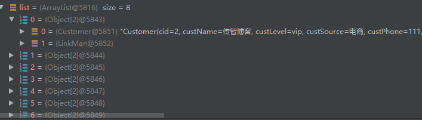
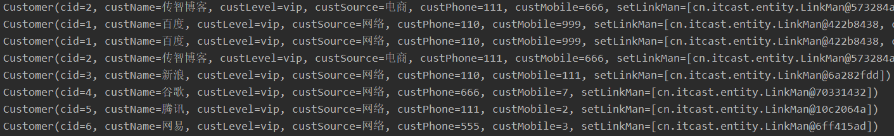
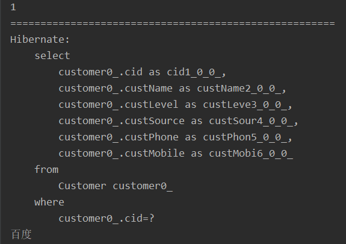
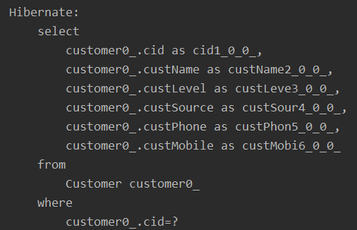
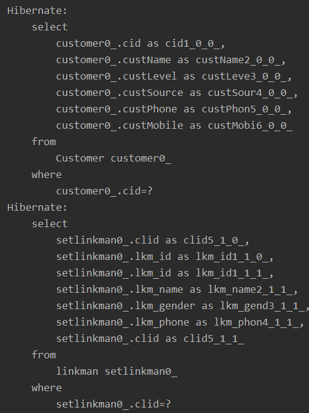
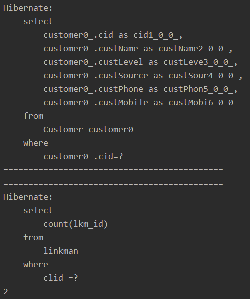

# 1、Hibernate 查询方式

## 1.1 对象导航查询

1. 根据id查询某个客户，在查询里面所有的联系人

```java
//查询cid=1客户，并查询这个客户里面所有的联系人
Customer customer = session.get(Customer.class, 1);
//查询这个客户里面所有联系人
//直接得到客户里面联系人的set集合
Set<LinkMan> setLinkMan = customer.getSetLinkMan();

System.out.println(setLinkMan.size());
```

## 1.2 OID查询

1. 根据id查询的某一条记录，返回对象

```java
Customer customer = session.get(Customer.class,1);
```

## 1.3 hql查询

### 1.3.1 查询所有

```java
Query query = session.createQuery("from Customer");
List<Customer> list = query.list();
```

### 1.3.2 条件查询

from 实体类名称 where 实体类属性名称=? and 实体类属性名称=? 

```java
//1、创建Query对象
Query query = session.createQuery("from Customer where cid=?0");

//2、设置条件值
//向？设置值
query.setParameter(0,1);

//3、调用方法得到结果
List<Customer> list = query.list();
for (Customer customer : list) {
    System.out.println(customer.getCid()+"::"+customer.getCustName());
}
```

from 实体类名称 where 实体类属性名称 like ?

```java
//1、创建Query对象
Query query = session.createQuery("from Customer where custName like ?0");

//2、设置条件值
//向？设置值
query.setParameter(0,"%智%");

//3、调用方法得到结果
List<Customer> list = query.list();
for (Customer customer : list) {
    System.out.println(customer.getCid()+"::"+customer.getCustName());
}
```

### 1.3.3 排序查询

from 实体类名称 order by 实体类属性名称 asc/desc

```java
//1、创建Query对象
Query query = session.createQuery("from Customer order by cid ASC");

//3、调用方法得到结果
List<Customer> list = query.list();
for (Customer customer : list) {
    System.out.println(customer.getCid()+"::"+customer.getCustName());
}
```

### 1.3.4 分页查询

在 hql 操作中，在语句中不能写 limit，Hibernate的Query对象封装了两个方法实现了分页操作

```java
//1、创建Query对象
Query query = session.createQuery("from Customer order by cid ASC");

//2、设置分页属性
//2.1 设置开始位置
query.setFirstResult(0);
query.setMaxResults(3);

//3、调用方法得到结果
List<Customer> list = query.list();
```

### 1.3.5 投影查询

投影查询：查询不是所有字段名，而是部分字段的值

投影查询hsl语句写法：

- select 实体类属性名称1,实体类属性名称2 from 实体类名称
- select 后面不能写*

```java
//1、创建Query对象
Query query = session.createQuery("select custName from Customer");

//3、调用方法得到结果
List<Object> list = query.list();
for (Object o:list){
    System.out.println(o);
}
```

### 1.3.6 聚集函数使用

常见的聚集函数：

- count、max、min、avg

hql聚集语句写法

- 查询表记录数

  select count(*) from 实体类名称

```java
//如果直接把object强转为 int 类型，会报ClassCastException异常

//1、创建Query对象
Query query = session.createQuery("select count(*) from Customer");

//3、调用方法得到结果
//query对象里面有方法，直接返回对象形式
Object o = query.uniqueResult();

//首先要把Object变成long类型，再转变成int类型
Long aLong = (Long) o;
int i = aLong.intValue();

System.out.println(i);
```


### 1.3.7 内连接查询

**sql语句**

```sql
select * from t_customer c,t_linkman where c.cid = l.clid

select * from t_customer c inner join t_linkman l on c.cid = l.cid
```

HQL语法：

from Customer c inner join c.setLinkMan

```java
//1、创建Query对象
Query query = session.createQuery("from Customer c inner join c.setLinkMan");
List list = query.list();
```

返回list，list里面每部分是数组形式



### 1.3.8 左外连接

```sql
select * from t_customer c left outer join t_linkman l on c.cid = l.cid
```

迫切左外连接

```java
//1、创建Query对象
Query query = session.createQuery("from Customer c left outer join fetch c.setLinkMan" );

List<Customer> list = query.list();

for (Customer customer : list){
    System.out.println(customer);
}
```


### 1.3.9 右外连接

```sql
select * from t_customer c right outer join t_linkman l on c.cid = l.cid
```

### 1.3.10 迫切内连接

- 迫切内连接和内连接底层实现一样的
- 区别：使用内连接返回list中每部分是数组，迫切内连接返回list每部分是对象

from Customer c inner join fetch c.setLinkMan

```java
//1、创建Query对象
Query query = session.createQuery("from Customer c inner join fetch c.setLinkMan");

List<Customer> list = query.list();

for (Customer customer : list){
    System.out.println(customer);
}
```



## 1.4 QBC查询

Criteria对象（过时）

## 1.5 本地sql查询

SQLQuery对象，使用普通sql实现查询


# 2、Hibernate 检索策略

## 2.1 检索策略的概念

**Hibernate 检索策略分为2类**

### 2.1.1 立即查询：

只要调用就立即执行语句查询

```java
Customer customer = session.get(Customer.class, 1);
```

### 2.1.2 延迟加载

```java
/**
 * 1、调用load方法之后，不会马上发送sql语句
 *      1、返回对象里面只有id值
 * 2、得到对象里面不是id的其他值是才会发送请求
 */
Customer customer = session.load(Customer.class, 1);
System.out.println(customer.getCid());
System.out.println("======================================================");
System.out.println(customer.getCustName());
```



延迟查询分成两类：

#### ① 类级别延迟

根据id查询返回实体类对象，调用load方法不会马上发送语句

上面案例就是

#### ② 关联级别延迟

查询某个客户，再查询这个客户的所有联系人，查询客户的所有联系人的过程是否需要延迟，这个过程称为关联级别延迟

1. 在映射文件中进行配置实现
   1. 根据客户得到所有联系人，在客户映射文件中配置
2. 在set标签上使用属性
   1. fetch：值select
   2. lazy：值
      - true：延迟
      - false：不延迟
      - extra：及其延迟

在Customer对象的配置文件集合上进行操作：

**延迟加载，默认**

```xml
<set name="setLinkMan" fetch="select" lazy="true">
```

```java
Customer customer = session.get(Customer.class, 1);
Set<LinkMan> setLinkMan = customer.getSetLinkMan();
```



**不延迟加载，只要调用就执行语句**

```xml
<set name="setLinkMan" fetch="select" lazy="true">
```

```java
Customer customer = session.get(Customer.class, 1);
Set<LinkMan> setLinkMan = customer.getSetLinkMan();
```



**懒加载，需要什么执行什么**

```xml
<set name="setLinkMan" fetch="select" lazy="extra">
```

```java
Customer customer = session.get(Customer.class, 1);
System.out.println("============================================");
Set<LinkMan> setLinkMan = customer.getSetLinkMan();
System.out.println("============================================");
System.out.println(setLinkMan.size());
```




# 3、批量抓取

查询所有的客户，返回 list 集合，遍历 list 集合，得到每个客户，得到每个客户的所有联系人

1. 通过遍历，发送多条sql语句

```java
//查询所有客户
Query query = session.createQuery("from Customer");
List<Customer> list = query.list();
//得到每个客户里面所有的联系人
for (Customer customer : list) {
    System.out.println(customer.getCid() + "::" + customer.getCustName());
    //每个客户里面所有的联系人
    Set<LinkMan> setLinkMan = customer.getSetLinkMan();
    for (LinkMan linkMan : setLinkMan) {
        System.out.println(linkMan.getLkm_id() + "::" + linkMan.getLkm_name());
    }
}
```

2. 在客户的映射文件中，set标签配置

   batch-size值，值越大发送语句越少

```xml
<set name="setLinkMan" batch-size="10">
```

