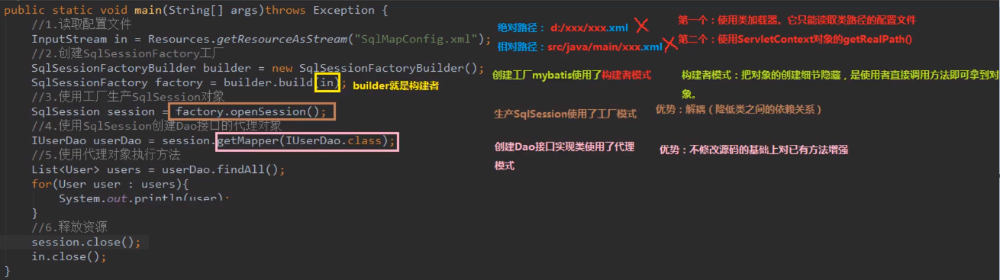
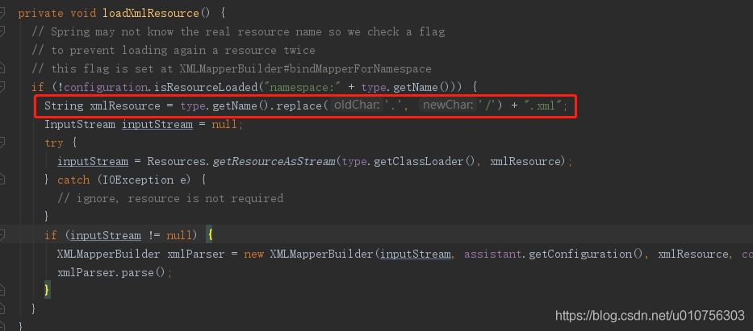
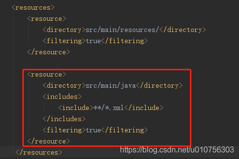

# 1. 什么是框架？

它是我们软件开发中的一套解决方案。不同的框架就是解决不同的问题。

好处：封装了很多细节，使开发者大大提高效率


# 2. 三层架构

- 表现层：用于展示数据。
- 业务层：处理业务需求
- 持久层：和数据库交互的


# 3. 持久层技术解决方案

JDBC技术：

- Connection
- PreparedStatement
- ResultSet
- Spring的JdbcTemplate：Spring中对jdbc的简单封装
- Apache的DBUtils：它和Spring的JdbcTemplate很像，也是对Jdbc的简单封装

以上这些都不是框架：JDBC是规范，Spring的JdbcTemplate和Apache的DBUtils都只是工具类


# 4. MyBatis的概述

`MyBatis` 是一个持久层框架，用 Java 编写

它封装了jdbc操作的很多细节，使开发者只需要关注sql语句本身，而无需关注注册驱动，创建连接等复杂过程

它使用了ORM思想实现了结果集的封装

ORM：Object Relational Mappging  对象关系映射；	

简单的说：就是把数据表和实体类及实体类的属性对应起来，让我们可以操作实体类就实现操作数据库表

​								user											User

​								  id											 userId

​							user_name								 userName

今天我们需要做到：实体类中的属性和数据库表的字段名称保持一致。

​								user											User

​								 id												 id

​							user_name								user_name


# 5. MyBatis的入门

## 5.1 mybatis的环境搭建

1. 第一步：创建maven工程并导入坐标
2. 第二步：创建实体类和dao的接口
3. 第三步：创建Mybatis的主配置文件：SqlMapConfig.xml
4. 第四步：创建映射配置文件：IUserDao.xml


## 5.2 环境搭建的注意事项

1）第一个：创建IUserDao.xml和IUserDao.java时名称是为了和我们之前的知识保持一致。在MyBatis中它把持久层的操作接口名称和映射文件也叫做：Mapper。	所以：IUserDao和IUserMapper是一样的。

2）第二个：在idea中创建目录的时候，它和包是不一样的。

- 包在创建时，com.itheima.dao它是三级结构
- 目录在创建时，com.itheima.dao是一级目录

3）第三个：mybatis的映射配置文件位置必须和dao接口的包结构相同

4）第四个：映射配置文件的mapper标签namespace属性的取值必须是dao接口的全限定类名

5）第五个：映射配置文件的操作配置（select），id属性的取值必须是dao接口的方法名

当我们遵从了第三、四、五点之后，我们在开发中就无需再写dao的实现类。


# 6. mybatis的入门案例

详情见：E:\workspace\workspace-frame\day01_eesy_01mybatis

**步骤**：

1. 读取配置文件
2. 创建SqlSessionFactory工厂
3. 创建SqlSession
4. 创建Dao接口的代理对象
5. 执行dao中的方法
6. 释放资源

**注意事项**：

- 不要忘记在映射配置中告知mybatis要封装到哪个实体类中
- 配置的方式：指定实体类的全限定类名

```java
public static void main(String[] args) throws Exception {
   //1.读取配置文件
   InputStream in = Resources.getResourceAsStream("SqlMapConfig.xml");
   //2.创建SqlSessionFactory工厂
   SqlSessionFactoryBuilder builder = new SqlSessionFactoryBuilder();
   SqlSessionFactory factory = builder.build(in);
   //3.使用工厂生产SqlSession对象
   SqlSession session = factory.openSession();
   //4.使用SqlSession创建Dao接口的代理对象
   IUserDao userDao = session.getMapper(IUserDao.class);
   //5.使用代理对象执行方法
   List<User> users = userDao.findAll();
   for (User user : users) {
       System.out.println(user);
   }
   //6.释放资源
   session.close();
   in.close();
}
```




# 7. mybatis基于注解的案例

把IUserDao.xml移除，在dao接口的方法上使用@Select注解，并且指定SQL语句。

同时需要在SqlMapConfig.xml中的mapper配置时，使用class属性指定dao接口的全限定类名

```java
public interface IUserDao {
    /**
    * 查询所有操作
    * @return
    */
    @Select("select * from user")//注解的方式
    List<User> findAll();
}
```

```xml
<!-- 指定映射配置文件的位置，映射配置文件指的是每个dao独立的配置文件
   如果是用注解来配置的话，此处应该使用class属性指定被注解的dao全限定类名
-->
<mappers>
   <mapper class="com.itheima.dao.IUserDao"/>
</mappers>
```

**明确**：

- 我们在实际开发中，都是越简便越好，所以都是不写dao实现类的方式，不管使用xml还是注解配置。

- 但是MyBatis它是支持写dao实现类的。

# 8. 自定义MyBatis的分析

**1. MyBatis在使用代理dao的方式实现增删改查时做什么事呢？**

只有两件事：

1. 创建代理对象
2. 在代理对象中调用 `select List`

**2. 自定义MyBatis能通过入门案例看到类**

- class Resources
- class SqlSessionFactoryBuilder
- interface SqlSessionFactory


`SqlMapConfig.xml`

```xml
<?xml version="1.0" encoding="UTF-8"?>
<!DOCTYPE configuration
        PUBLIC "-//mybatis.org//DTD Config 3.0//EN"
        "http://mybatis.org/dtd/mybatis-3-config.dtd">
<!-- mybatis的主配置文件 -->
<configuration>
    <!-- 配置环境 -->
    <environments default="mysql">
        <!--   配置mysql环境   -->
        <environment id="mysql">
            <!-- 配置事务的类型 -->
            <transactionManager type="JDBC"></transactionManager>
            <!-- 配置数据源（连接池） -->
            <dataSource type="POOLED">
                <!-- 配置连接数据库的4个基本信息 -->
                <property name="driver" value="com.mysql.jdbc.Driver"/>
                <property name="url" value="jdbc:mysql://localhost:3306/eesy_mybatis"/>
                <property name="username" value="root"/>
                <property name="password" value="1015"/>
            </dataSource>
        </environment>
    </environments>

    <!--  指定映射配置文件的位置，映射配置文件指的是每个dao独立的配置文件  -->
    <mappers>
        <mapper resource="com/itheima/dao/IUserDao.xml"></mapper>
    </mappers>
</configuration>
```

IUserDao.xml

```xml
<?xml version="1.0" encoding="UTF-8"?>
<!DOCTYPE mapper
        PUBLIC "-//mybatis.org//DTD Mapper 3.0//EN"
        "http://mybatis.org/dtd/mybatis-3-mapper.dtd">
 <mapper namespace="com.itheima.dao.IUserDao">
    <!-- 配置查询所有 -->
    <select id="findAll" resultType="com.itheima.daomain.User">
        select * from user
    </select>
</mapper>
```

# 9. 不使用 XML 实现操作

如果你愿意直接从 Java 代码而不是 XML 文件中构建配置，或者你想要自己的配置建造类，mybatis 也提供了完整的配置类，提供了所有与 XML 文件等价的配置项

```java
@Test
public void testNoXMLMybatis() {
    String driver = "com.mysql.jdbc.Driver";
    String url = "jdbc:mysql://101.200.151.40:3306/Mybatis-Test?serverTimezone=UTC";
    String username = "root";
    String password = "123456";

    //创建连接池
    DataSource dataSource = new PooledDataSource(driver, url, username, password);
    //事务
    JdbcTransactionFactory transactionFactory = new JdbcTransactionFactory();
    //创建环境
    Environment environment = new Environment("development", transactionFactory, dataSource);
    //创建配置
    Configuration configuration = new Configuration(environment);
    //开启驼峰命名规则
    configuration.setMapUnderscoreToCamelCase(true);
    //加入资源(Mapper)
    configuration.addMapper(IUserMapper.class);

    SqlSessionFactory factory = new SqlSessionFactoryBuilder().build(configuration);
    SqlSession session = factory.openSession();
    IUserMapper mapper = session.getMapper(IUserMapper.class);
    List<User> users = mapper.findAll();
    System.out.println("users = " + users);

    session.commit();
}
```

注意该例中，`configuration` 添加了一个配置类（mapper class）。映射器类是 Java 类，他们包含 SQL 映射语句的注解从而避免 XML 文件。不过，由于 Java 注解的一些限制以及某些 Mybatis 映射的复杂性，要使用大多数高级映射（比如：嵌套联合映射），仍需要使用 XML 配置。有鉴于此，如果存在一个同名 XML 配置文件，Mybatis 会自动查找并加载它（在这个例子中，基于类路径和 `IUserMapper.class` 的类名，会加载 `IUserMapper.xml`）

此处必须要把 `UserMapper.class` 和 `UserMapper.xml` 放在同一个目录下，因为在源码中写死了同一路径 xml



所以，代码目录如下：


并且，需要在 `pom.xml` 中将 `src/main/java` 下的 xml 文件打包进来，否则编译时无法把 xml 文件引入的，如下为 pom.xml 的配置：




