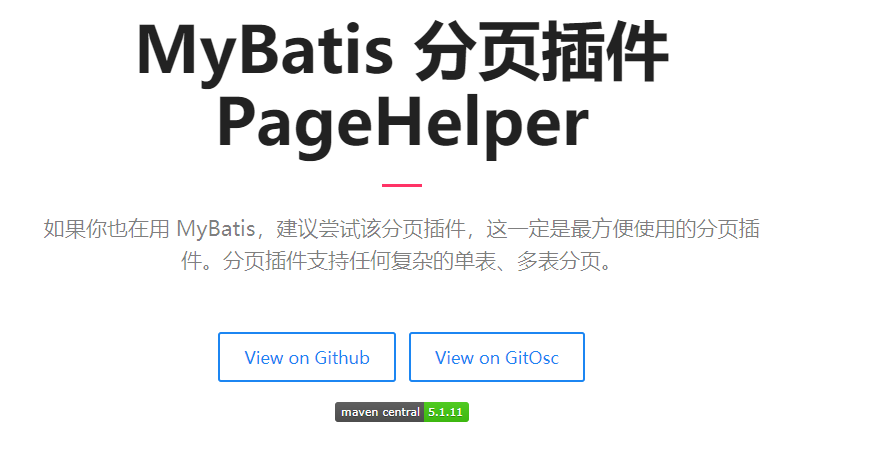

1. 回顾mybatis的自定义再分析和环境搭建+完善基于注解的mybatis
2. mybatis的crud（基于代理dao的方式）
3. mybatis中的参数深入及结果集的深入
4. mybatis基于传统dao的方式（自己编写dao的实现类）——了解的内容
5. mybatis中的配置（主配置文件：SqlSessionConfig.xml）
  - properties标签
  - typeAliases标签
  - mappers标签的子标签：package	

------

# 1、mybatis的CRUD（xml）

entity 类

```java
public class User{			//首先定义了一个和表列名相同属性名的类
private Integer id;
private String username;
private String address;
private String sex;
private Date birthday;
}
```

测试执行

```java
class Test {
    //测试类已经定义好的方法
    private InputStream in;
    private SqlSession sqlSession;
    private IUserDao userDao;

    @Before//在测试方法执行之前执行
    public void init() throws Exception {
        //1.读取配置文件，生成字节输入流
        in = Resources.getResourceAsStream("SqlMapConfig.xml");
        //2.获取SqlSessionFactory
        SqlSessionFactory factory = new SqlSessionFactoryBuilder().build(in);
        //3.获取SqlSession对象
        sqlSession = factory.openSession();
        //4.获取dao的代理对象
        userDao = sqlSession.getMapper(IUserDao.class);
    }

    @After//用于在测试方法之后执行
    public void destroy() throws Exception {
        //提交事务
        sqlSession.commit();
        //6.释放资源
        sqlSession.close();
        in.close();
    }
}
```

## 1.1 向数据库增添数据

```java
void saveUser(User user);	//向UserDao接口中增加的方法
```

```xml
<!-- 映射文件UserDao.xml中定义 -->
<!-- 保存用户 -->
<insert id="saveUser" parameterType="com.itheima.domain.User">
	<!-- 配置插入操作后，获取插入数据的id -->
    <selectKey keyProperty="id" keyColumn="id" resultType="INTEGER" order="AFTER">
       select last_insert_id();
    </selectKey>
       insert into user(id,username,address,sex,birthday)values (#{id},#{username},#{address},#{sex},#{birthday});
</insert>
```

```java
@Test//测试保存数据的方法
public void testSave(){
   User user = new User();
   user.setUsername("张三");
   user.setAddress("南阳市");
   user.setSex("男");
   user.setBirthday(new Date());
   System.out.println("保存操作之前"+user);
   //执行保存方法
   userDao.saveUser(user);
   System.out.println("保存操作之后"+user);
}
```

## 1.2 删除数据库中信息

```java
void deleteUser(Integer userId);	//向UserDao接口中增加的方法
```

```xml
<!-- 映射文件UserDao.xml中定义 -->
<!-- 删除用户 -->
<delete id="deleteUser" parameterType="INTEGER">
   delete from user where id = #{id};
</delete>
```

```java
@Test
public void testDelete(){
   //5.执行删除方法
   userDao.deleteUser(82);
}
```

## 1.3 修改数据库中信息

```java
void updateUser(User user);		//向UserDao接口中增加的方法
```

```xml
<!-- 映射文件UserDao.xml中定义 -->
<!-- 更新用户 -->
<update id="updateUser" parameterType="com.itheima.domain.User">
	update user set username=#{username},address=#{address},sex=#{sex},birthday=#{birthday} where id=#{id};
</update>
```

```java
@Test
public void testUpdate(){
   User user = new User();
   user.setId(50);
   user.setUsername("mybatis Update user");
   user.setAddress("南阳市");
   user.setSex("男");
   user.setBirthday(new Date());
   //执行保存方法
   userDao.updateUser(user);
}
```

## 1.4 查询数据库中信息

### 1.4.1 查询数据库中所有信息

```java
List<User> findAll();	//向UserDao接口中增加的方法
```

```xml
<!-- 映射文件UserDao.xml中定义 -->
<select id="findAll" resultType="com.itheima.domain.User">
   select * from user;
</select>
```

```java
@Test
public void testFindAll(){

    //5.执行查询所有的方法
    List<User> users = userDao.findAll();
    for (User user : users){
        System.out.println(user);
    }
}
```

### 1.4.2 单个信息查询

```java
User findById(Integer userId);	//向UserDao接口中增加的方法
```

```xml
<!-- 映射文件UserDao.xml中定义 -->
<select id="findById" parameterType="INTEGER" resultType="com.itheima.domain.User">
    select * from user where id = #{id};
</select>
```

```java
@Test
public void testFindOne(){
    //5.执行查询一个方法
    User user = userDao.findById(45);
    System.out.println(user);
}
```

### 1.4.3 查询数据库中数据总个数

```java
int findTotal();	//向UserDao接口中增加的方法
```

```xml
<!-- 映射文件UserDao.xml中定义 -->
<select id="findTotal" resultType="INTEGER">
     select count(*) from user;
</select>
```

```java
@Test
public void testFindTotal(){
     int total = userDao.findTotal();
     System.out.println(total);
}
```


# 2、mybatis的CRUD（注解）

## 2.1 查询数据

### 2.1.1 查询所有

主配置文件：Maybatis-Config.xml

```xml
<mappers>
    <mapper class="com.kuang.mapper.UserMapper"/>
</mappers>
```

接口：IUserMapper

```java
@Select("select * from user")
List<User> selectAll();
```

测试

```
@Test
public void testSelectAll(){
    SqlSession session = MybatisUtils.getSqlSession();
    UserMapper mapper = session.getMapper(UserMapper.class);
    List<User> users = mapper.selectAll();
    for (User user : users) {
        System.out.println(user);
    }
    session.close();
}
```

### 2.1.2 条件查询

xml（同上）

接口

```java
@Select("select * from user where id = #{id}")
User selectById(@Param("id") Integer id);
```

测试

```java
@Test
public void testSelectById(){
    SqlSession session = MybatisUtils.getSqlSession();
    UserMapper mapper = session.getMapper(UserMapper.class);
    User user = mapper.selectById(5);
    System.out.println(user);
    session.close();
}
```

## 2.2 添加数据

xml（同上）

接口

```java
@Insert("insert into user(id,name,pwd)values(#{id},#{name},#{pwd})")
int insertUser(User user);
```

测试

```java
@Test
public void testSelectInsert(){
    SqlSession session = MybatisUtils.getSqlSession();
    UserMapper mapper = session.getMapper(UserMapper.class);
    User user = new User().setId(2).setName("库里").setPwd("66666");
    int i = mapper.insertUser(user);
    System.out.println(i);
    session.close();
}
```

## 2.3 修改数据

xml（同上）

接口

```java
@Update("update user set name = #{name},pwd=#{pwd} where id=#{id}")
int updateUser(User user);
```

测试

```java
@Test
public void testUpdateUser(){
    SqlSession session = MybatisUtils.getSqlSession();
    UserMapper mapper = session.getMapper(UserMapper.class);
    User user = new User().setId(7).setName("哈登").setPwd("7777");
    int i = mapper.updateUser(user);
    System.out.println(i);
    session.close();
}
```

## 2.4 删除数据

xml（同上）

接口

```java
@Delete("delete from user where id = #{id}")
int deleteUser(@Param("id") Integer id);
```

测试

```java
@Test
public void testDeleteUser(){
    SqlSession session = MybatisUtils.getSqlSession();
    UserMapper mapper = session.getMapper(UserMapper.class);
    int i = mapper.deleteUser(3);
    System.out.println(i);
    session.close();
}
```

## 2.5 关于@Param() 注解

- 基于类型的参数或者String类型，需要加入
- 引用类型不需要加
- 如果只有一个基本类型的话，可以忽略，但是建议大家都加上！
- 我们在SQL中引用的就是我们这里的 @Param() 中设定的属性名

# 3、分页

## 3.1 limit分页（推荐）

接口

```java
public List<User> selectUserLimit(HashMap<String,Integer> map);
```

mapper.xml

```xml
<select id="selectUserLimit" parameterType="map" resultMap="resultMap">
    select * from user limit #{startIndex},#{maxSize}
</select>
```

测试

```java
@Test
public void testSelectLimit(){
    SqlSession session = MybatisUtils.getSqlSession();
    UserMapper mapper = session.getMapper(UserMapper.class);

    HashMap<String,Integer> map = new HashMap<String, Integer>();
    map.put("startIndex",0);
    map.put("maxSize",2);

    List<User> users = mapper.selectUserLimit(map);
    for (User user : users){
        System.out.println(user);
    }

    session.close();
}
```


## 3.2 RowBounds 分页（不推荐）

接口

```java
public List<User> selectUseming，OMGrRowBounds(HashMap<String,Integer> map);
```

mapper.xml

```xml
<select id="selectUserRowBounds" resultMap="resultMap">
    select * from user
</select>
```

测试

```java
@Test
public void testRowBounds(){
    SqlSession session = MybatisUtils.getSqlSession();

    RowBounds rowBounds = new RowBounds(0,2);

    List<User> users = session.selectList("com.kuang.mapper.UserMapper.selectUserRowBounds",null,rowBounds);
    for (User user : users) {
        System.out.println(user);
    }

    session.close();
}
```


## 3.3 分页插件




# 4、OGNL表达式

## 4.1 传递pojo对象

MyBatis使用ognt表达式解析对象字段的值，#{}获取${}括号中的值为pojo属性名称

## 4.2 传递pojo包装对象

开发中通过pojo传递查询条件，查询条件是综合的查询条件，不仅包括用户查询条件还包括其他的查询条件（比如将用户购买商品信息也作为查询条件），这时可以使用包装对象传递输入参数，Pojo类中包括pojo。

需求：根据用户名查询用户信息：插叙条件放到QueryVo的user属性中。

- 全称：Object Graphic Navigation Language

  ​			对象	 图			 导航		语言

  它是通过对象的取值方法来获取数据，在写法上吧get给省略了。

- 比如：我们获取用户的名称

  ​			类中的写法：	user.getUsername()

  ​			OGNL表达式写法：	user.username

- mybatis中为什么能直接写username，而不用user呢：

  ​		因为在parameterType中已经提供了属性所属的类，所以此时不需要写对象名


### 4.2.1 由其他对象进行模糊查询

```java
//在类QueryVo中
public class QueryVo {
	private User user;
	public User getUser() {
   		return user;
	}

	public void setUser(User user) {
   		this.user = user;
	}
}
```

```java
//向UserDao接口中增加的方法
List<User> findUserByVo(QueryVo vo);//根据query查询中的条件查询用户
```

```xml
<!-- 映射文件UserDao.xml中定义 -->
<!-- 根据query的条件查询用户 -->
<select id="findUserByVo" parameterType="com.itheima.domain.QueryVo" resultType = "com.itheima.domain.User">
	select * from user where username like #{user.username};
</select>
```

```java
@Test
public void testFindByVo(){
     QueryVo vo = new QueryVo();
     User user = new User();
     user.setUsername("%王%");
     vo.setUser(user);
     List<User> users = userDao.findUserByVo(vo);
     for (User u : users) {
         System.out.println(u);
     }
}
```

### 4.2.2 类的属性名和表的列名不同

```java
public class User{			 	//				   表的列名
	private Integer userId;		 //					id
	private String userName;	 //					username
	private String userAddress;  //					address
	private String userSex; 	 //					sex
	private Date userBirthday;	 //					birthday
}
```

注意：如果类属性和表列名不同时，无法使用原来的方法。

> 方法一

```xml
<!-- 在查询语句中起别名 -->
<select id="findAll" resultType="cn.itheima.domain.user">
select id as userId,username as userName,address as userAddress,sex as userSex,birthday as userBirthday from user;
</select>
```

优缺点：执行效率高，操作麻烦


>方法2

```xml
<!--配置查询结果的列名和实体类的属性名的对应关系-->
<resultMap id="userMap" type="com.itheima.domain.User">
    <!--主键对应值-->
    <id property="userId" column="id"></id>
    <!--非主键字段的对应-->
    <result property="userName" column="username"></result>
    <result property="userAddress" column="address"></result>
    <result property="userSex" column="sex"></result>
    <result property="userBirthday" column="birthday"></result>
</resultMap>

<!-- 将引用的方法上加上resultMap -->
<select id="findAll" resultMap="userMap">
        select * from user;
</select>
```

优缺点：执行效率低，操作容易

<font color='red'>注：mybatis中已经写好了接口的实现类，但是也支持自己写接口的实现类。</font>

```java
public class User{
	private Integer id;
	private String username;
	private String address;
	private String sex;
	private Date birthday;
}
```

```java
List<User> findAll();//UserDao接口中增加的方法

void updateUser(User user);
```

```java
//UserDaoImpl实现类中的方法

public List<User> findAll() {
//1.根据factory获取SqlSession对象
SqlSession session = factory.openSession();
//2.调用session中的方法，实现查询列表
List<User> users = session.selectList("com.itheima.dao.IUserDao.findAll");//参数就是能获取配置文件的key
//3.释放资源
session.close();
return users;
}

public void updateUser(User user) {
	//1.根据factory获取SqlSession对象
	SqlSession session = factory.openSession();
	//2.调用方法实现保存
	session.insert("com.itheima.dao.IUserDao.updateUser",user);
	//3.事务提交
	session.commit();
	//4.释放资源
	session.close();
}
```

```java
<!-- 查询所有 -->
<select id="findAll" resultType="com.itheima.domain.User">
select * from user;
</select>

<!-- 更新用户 -->
<update id="updateUser" parameterType="com.itheima.domain.User">
update user set username=#{username},address=#{address},sex=#{sex},birthday=#{birthday} where id=#{id};
</update>
```

# 5、PreparedStatement的执行方法

1）`execute`：他能执行CRUD中的任意一种语句，它的返回值是一个boolean类型，表示是否有结果集，有结果集是true，没有结果集是false。

2）`executeUpdate`：它只能执行CURD语句，查询语句无法执行，他的返回值是影响数据库记录的行数

3）`executeQuery`：它只能执行select语句，无法执行增删改。执行结果封装的结果集ResultSet对象

# 6、mybatis中的配置

（主配置文件：SqlSessionConfig.xml）

## 6.1 原先的配置文件

（properties标签）

```xml
<?xml version="1.0" encoding="UTF-8"?>
<!DOCTYPE configuration
   PUBLIC "-//mybatis.org//DTD Config 3.0//EN"
   "http://mybatis.org/dtd/mybatis-3-config.dtd">
<!-- mybatis的主配置文件 -->
<configuration>
<!-- 配置环境 -->
<environments default="mysql">
   <!--   配置mysql环境   -->
   <environment id="mysql">
       <!-- 配置事务的类型 -->
       <transactionManager type="JDBC"></transactionManager>
       <!-- 配置数据源（连接池） -->
       <dataSource type="POOLED">
           <!-- 配置连接数据库的4个基本信息 -->
           <property name="driver" value="com.mysql.jdbc.Driver"/>
           <property name="url" value="jdbc:mysql://localhost:3306/eesy_mybatis"/>
           <property name="username" value="root"/>
           <property name="password" value="1015"/>
       </dataSource>
   </environment>
</environments>

<!--  指定映射配置文件的位置，映射配置文件指的是每个dao独立的配置文件  -->
<mappers>
   <mapper resource="com/itheima/dao/IUserDao.xml"></mapper>
</mappers>
</configuration>
```

将数据库连接信息单独拿出来：

- 配置properties

  可以在标签内部配置连接数据的信息，也可以通过属性引用外部配置文件信息。

- resource属性：

  用于指定配置文件的位置，是按照类路径的写法写，并且必须存在于类路径下。

- url属性：

- 是要求按照url的写法来写地址

  - URL： Uniform Resource Location 统一资源定位符，它是可以唯一标识一个资源的位置它的写法：

    http://localhost:8080/mybatisserver/demo1Servlet

    协议      主机    端口             	URI

  - URI：Uniform Resource Identifier 统一资源标识符，它是在应用中可以唯一定位一个资源的

## 6.2 包含数据库连接信息

jdbcConfig.properties

```properties
jdbc.driver=com.mysql.jdbc.Driver
jdbc.url=jdbc:mysql://localhost:3306/eesy_mybatis
jdbc.username=root
jdbc.password=1015
```

## 6.3 配置文件

SqlMapConfig.xml

```xml
<?xml version="1.0" encoding="UTF-8"?>
<!DOCTYPE configuration
   PUBLIC "-//mybatis.org//DTD Config 3.0//EN"
   "http://mybatis.org/dtd/mybatis-3-config.dtd">
<configuration>
    <!-- 对应上面文件的url -->
    <properties url="file:///E:/workspace/workspace-frame/day02_eesy_01mybatisCRUD/src/main/resources/jdbcConfig.properties">
    <!-- resource需要在当前文件夹下
        <properties resource="jdbcConfig.properties">
        -->
    </properties>
    <!-- 配置环境 -->
    <environments default="mysql">
       <!--  配置mysql的环境  -->
       <environment id="mysql">
           <!-- 配置事务 -->
           <transactionManager type="JDBC"></transactionManager>
           <!-- 配置连接池 -->
           <dataSource type="POOLED">
               <property name="driver" value="${jdbc.driver}"></property>
               <property name="url" value="${jdbc.url}"></property>
               <property name="username" value="${jdbc.username}"></property>
               <property name="password" value="${jdbc.password}"></property>
           </dataSource>
       </environment>
    </environments>
    <!-- 配置映射文件的位置 -->
    <mappers>
       <mapper resource="com/itheima/dao/IUserDao.xml"></mapper>
    </mappers>
</configuration>
```

## 6.4 mapper标签

在主配置文件中定义了别名之后，就不需要在映射文件中写全限定类名，只需要写别名即可。

```xml
<!-- 第一种方式 -->
<typeAliases>
<!-- 
	typeAlias用于配置别名，type属性指定的是实体类全限定类名，alias属性指定别名，当指定了别名之后就不再区分大小写，可能需要写很多typeAlias标签
	-->
<typeAlias type="com.itheima.domain.User" alias="user"></typeAlias>
</typeAliases>
```

```xml
<!-- 第二种方式（推荐） -->
<typeAliases>
	<!-- 用于指定要配置别名的包，该包下的实体类都会注册别名，而且别名就是类名，不再区分大小写 -->
	<package name="com.itheima.domain"/>
</typeAliases>
```

配置映射文件

```xml
<!-- 配置映射文件的位置 -->
<!-- 原先的方法，第一种方法 -->
<mappers>
	<mapper resource="com/itheima/dao/IUserDao.xml"></mapper>
</mappers>

<!-- 第二种方法（推荐） -->
<mappers>
    <!-- package标签是用于指定dao接口所在的包，当指定了之后就不需要再写mapper以及resource或者class了 -->
    <package name="com.itheima.dao"/>
</mappers>
```


