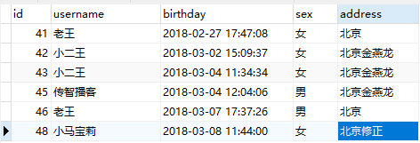
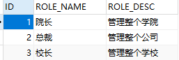
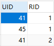
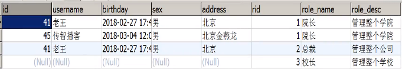
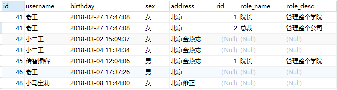
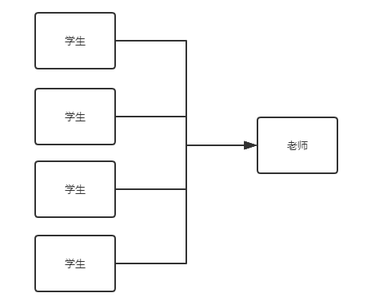

1. mybatis中的连接池以及事务控制							<font color='red'>（原理部分了解，应用部分会用）</font>

	- mybatis中连接池使用及分析
	- mybatis事务控制的分析

2. mybatis基于xml配置的动态SQL语句使用                 <font color='red'>(会用即可)</font>

	​		mappers配置文件中的几个标签：

	​					\<if>

	​					\<where>

	​					\<foreach>

	​					\<sql>

3. mybatis中的多表操作                                                <font color='red'>(掌握应用)</font>

	- 一对多
	- 一对一  （  ？）
	- 多对多

------

# 1、连接池

​		我们在实际开发中都会使用连接池。

​		因为它可以减少我们获取连接所消耗的时间

# 2、mybatis中的连接池

​		mybatis连接池提供了3种方式的配置

- 配置的位置：

	​		主配置文件的SqlMapConfig.xml中的dataSource标签，type属性就是表示采用何种连接池方式

- type属性的取值：

	- POOLED：采用传统的javax.sql.DataSource规范中的连接池，mybatis中有针对规范的实现

	- UNPOOLED：采用传统的获取连接的方式，虽然也实现了java.sql.DataSource接口，但是并没有使用池的思想

	- JNDI：采用服务器提供的JNDI技术实现，来获取DataSource对象，不同的服务器所拿到DataSource是不一样的

		注意：如果不是web或者maven的war工程，是不能使用的。

		我们课程中使用的是tomcat服务器，采用连接池就是dbcp连接池

# 3、mybatis中的事务

- 什么是事务
- 事务的四大特性ACID
- 不考虑隔离性会产生的3个问题
- 解决方法：四种隔离级别

它是通过SqlSession对象的commit方法和rollback方法实现事务的提交和回滚。

```java
/*
	SqlSessionFactory创建SqlSession对象时，其中一个重载的方法
	SqlSession openSession(boolean autoCommit);
	向其中传入true时，程序运行之后，会自动运行commit方法
*/
sqlSession = factory.openSession(true);
```

# 4、mappers配置文件的标签

<font color='red' size=5>注意：</font>

​		**因为已经配置了resultMap，所以在查询语句中可以写对应的命名，但是其他地方需要跟类属性名称相同。**

```xml
<!--配置查询结果的列名和实体类的属性名的对应关系-->
<resultMap id="userMap" type="user">
   <!--主键对应值-->
   <id property="userId" column="id"></id>
   <!--非主键字段的对应-->
   <result property="userName" column="username"></result>
   <result property="userAddress" column="address"></result>
   <result property="userSex" column="sex"></result>
   <result property="userBirthday" column="birthday"></result>
</resultMap>
```

## 4.1 if标签

```java
/**
* 根据传入参数条件
* @param user 查询的条件，有可能有用户名，有可能有性别，也有可能有地址，HIA有可能是都有
* @return
*/
List<User> findUserByCondition(User user);
```

```xml
<!-- 根据条件查询 -->
<select id="findUserByCondition" resultMap="userMap" parameterType="user">
    select * from user where 1=1
    <if test="userName != null">	//判断可以配置多个if标签
        and username = #{userName}
    </if>
    <if test="userSex != null">
           and sex = #{userSex}
    </if>
</select>
```

```java
//测试if条件方法
@Test
public void testFindByCondition(){
	User u = new User();
	u.setUserName("老王");
	u.setUserSex("女");
	List<User> users = userDao.findUserByCondition(u);
	for (User user : users){
   		System.out.println(user);
	}
}
```

## 4.2 where标签

简化了一些代码，无需再查询语句后面写 where 1=1

```xml
<select id="findUserByCondition" resultMap="userMap" parameterType="user">
   select * from user
   <where>
       <if test="userName != null">
           username = #{userName}
       </if>
       <if test="userSex != null">
           sex = #{userSex}
       </if>
   </where>
</select>
```

## 4.3 foreach标签

如何想要查询 select * from user where id in(41,42,43)中的数据

```java
public class QueryVo {
   private User user;
   private List<Integer> ids;
   public User getUser() {
       return user;
   }
   public void setUser(User user) {
       this.user = user;
   }
   public List<Integer> getIds() {
       return ids;
   }
   public void setIds(List<Integer> ids) {
       this.ids = ids;
   }
}
```

```java
/**
* 根据queryvo中提供的id集合，查询用户信息
* @param vo
* @return
*/
List<User> findUserInIds(QueryVo vo);
```

```xml
<!--根据QueryVo中的id集合实现查询用户列表-->
<select id="findUserInIds" resultMap="userMap" parameterType="queryvo">
select * from user
<where>
   <if test="ids != null and ids.size() > 0">
       <foreach collection="ids" open="and id in(" close=")" item="id" separator=",">
           #{id}	<!--这里的id对应前面属性里的 item 中的值-->
       </foreach>
   </if>
</where>
</select>
```

```java
/**
* 测试方法
* 根据QueryVo中的id集合实现查询用户列表
*/
@Test
public void testFindByIds(){
  	QueryVo vo = new QueryVo();
  	List<Integer> list = new ArrayList<Integer>();
  	list.add(41);
  	list.add(42);
  	list.add(43);
  	vo.setIds(list);
    List<User> users = userDao.findUserInIds(vo);
    for (User user:users){
        System.out.println(user);
    }
}
```

## 4.4 sql&include标签（了解）

```xml
<!-- 抽取重复的sql语句 -->
<sql id="defaultUser">
	select * from user
</sql>
```

```xml
<!-- 其他方法调用时简化 -->
<select id="findUserByCondition" resultMap="userMap" parameterType="user">
	<include refid="defaultUser"></include>
    <where>
       <if test="userName != null">
           and username = #{userName}
       </if>
    </where>
</select>
```

# 5、mybatis中的多表查询

**表之间的关系有几种：**

- 一对多
- 多对一
- 一对一
- 多对多

**举例**

- 用户和订单就是一对多
- 订单和用户就是多对一
  - 一个用户可以下多个订单
  - 多个订单属于同一个用户
- 人和身份证就是一对一
  - 一个人只能有一个身份证号
  - 一个身份证号只能属于一个人
- 老师和学生之间就是多对多
  - 一个学生可以被多个老师教过
  - 一个老师可以教多个学生

**特例**

​			如果拿出每一张订单，他都只能属于一个用户。

​			所有mybatis就把多对一看成了一对一。


> 多表查询

**示例：用户和账户**

​	一个用户可以有多个账户

​	一个账户只能属于一个用户（多个账户也可以属于同一个用户）

**步骤：**

1. 建立两张表：用户表、账户表

   让用户表和账户表之间具备一对多的关系，需要使用外键在账户表中添加

2. 建立两个实体类：用户实体类和账户实体类

   让用户和账户的实体类能体现出来一对多的关系

3. 建立两个配置文件

   用户的配置文件

   账户的配置文件

4. 实现配置

   当我们查询用户时，可以同时得到用户下所包含的账户信息

   当我们查询账户时，可以同时得到账户的所属用户信息

## 5.1 示例：账户和用户（一对一）

**例题：**

1. 查询所有账户信息以及对应的用户名和地址

> 第一种方法

```java
@Data
public class AccountUser extends Account {
    private static final long serialVersionUID = 5183898908729696518L;
    private String username;
    private String address;
}
```

```java
public class Account implements Serializable {
	private Integer id;
	private Integer uid;
	private Double money;
	//get、set、toString方法...
}
```

```java
//IAccountDao接口方法
List<AccountUser> findAllAccountUser();
```

```java
<select id="findAllAccountUser" resultType="accountuser">
	select a.*,u.username,u.address from account a,user u where u.id = a.uid;
</select>
```

```java
//测试方法
@Test
public void testFindAllAccountUser(){
	List<AccountUser> aus = accountDao.findAllAccountUser();
	for (AccountUser au:aus){
		System.out.println(au);
	}
}
```


第二种方法（推荐）

​	更能体现实体之间的关系

```java
@Data
public class Account implements Serializable {
    private static final long serialVersionUID = -4004895055122621654L;
    private Integer id;
    private Integer uid;
    private Double money;

    private AccountUser accountUser;
}
```

```xml
<!-- 定义封装account和user的resultMap -->
<resultMap id="accountUserMap" type="account">
    <id property="id" column="aid"></id>
    <result property="uid" column="uid"></result>
    <result property="money" column="money"></result>
    <!-- 一对一的关系映射：配置封装user的内容-->
    <!-- 此处的column是如何能查到property，javaType是提示封装到的对象 -->
    <association property="user" column="uid" javaType="user">
      <id property="id" column="id"></id>
      <result column="username" property="username"></result>
      <result column="address" property="address"></result>
      <result column="sex" property="sex"></result>
      <result column="birthday" property="birthday"></result>
    </association>
</resultMap>

<!-- 查询所有 -->
<select id="findAllAccounts" resultMap="accountMap">
    select a.*, u.username, u.address
    from Account a, AccountUser u
    where u.id = a.uid
</select>
```

```java
public interface IAccountMapper {
    public List<Account> findAllAccounts();
}
```

```java
/**
 * 测试查询所有
  */
 @Test
 public void testFindAll(){
    	List<Account> accounts = accountDao.findAll();
    	for (Account account:accounts) {
       	System.out.println("-----------------------------------------------");
        	System.out.println(account);
        	System.out.println(account.getUser());
    	}
}
```

## 5.2 示例：用户和账户（一对多）

2. 查询所有用户信息和账户（一对多的关系）

```java
public class User implements Serializable {
    private Integer id;
    private String username;
    private String address;
    private String sex;
    private Date birthday;
    
    //一对多关系映射，主表实体应该包含从表实体的集合引用
    private List<Account> accounts;
    
    //get、set方法
    
    @Override
    public String toString() {
        return "User{" +
                "id=" + id +
                ", username='" + username + '\'' +
                ", address='" + address + '\'' +
                ", sex='" + sex + '\'' +
                ", birthday=" + birthday +
                '}';
    }
}
```

```xml
<!--定义user的resultMap-->
<resultMap id="userAccountMap" type="user">
    <id property="id" column="id"></id>
    <result property="username" column="username"></result>
    <result property="address" column="address"></result>
    <result property="sex" column="sex"></result>
    <result property="birthday" column="birthday"></result>
    <!--配置user对象中accounts集合的映射-->
    <collection property="accounts" ofType="account">
        <id column="aid" property="id"></id>
        <result column="uid" property="uid"></result>
        <result column="money" property="money"></result>
    </collection>
</resultMap>
```

```xml
<!-- 查询所有 -->
<select id="findAll" resultMap="userAccountMap">
    select * from user u left outer join account a on u.id = a.uid;
</select>
```

```java
/**
 * 测试查询所有
 */
@Test
public void testFindAll(){
   	List<User> users = userDao.findAll();
   	for (User user:users){
   	    System.out.println("------------------------------------");
   	    System.out.println(user);
   	    System.out.println(user.getAccounts());
   	}
}
```


## 5.3 示例：用户和角色（多对多）

一个用户可以有多个角色

一个角色可以赋予多个用户

**步骤：**

1. 建立两张表：用户表、角色表

   让用户表和角色表具有多对多的关系，需要使用中间表，中间表中包含各自的主键，在中间表中是外键

2. 建立两个实体类：用户实体类和角色实体类

   让用户和角色的实体类能体现出来多对多的关系

   各自包含对方一个集合的引用

3. 建立两个配置文件

   用户的配置文件

   角色的配置文件

4. 实现配置

   当我们查询用户时，可以同时得到用户所包含的角色信息

   当我们查询角色时，可以同时得到角色所赋予的用户信息

**实例**

有三张表user、role、user_role表

​													user表



​															role表



​															user_role表



​														目标图：



1. 当我们查询角色时，可以同时得到角色所赋予的用户信息

```java
public class Role implements Serializable {
        private Integer roleId;
        private String roleName;
        private String roleDesc;
    
        //多对多的关系映射，一个角色可以赋予多个用户
        private List<User> users;
        //get、set方法
}
```

```xml
<!--定义role表的ResultMap-->
<resultMap id="roleMap" type="role">
    <id property="roleId" column="rid"></id>
    <result property="roleName" column="role_name"></result>
    <result property="roleDesc" column="role_desc"></result>
    <collection property="users" ofType="user">
        <id column="id" property="id"></id>
        <result column="username" property="username"></result>
        <result column="address" property="address"></result>
        <result column="sex" property="sex"></result>
        <result column="birthday" property="birthday"></result>
    </collection>
</resultMap>

<!--查询所有-->
<select id="findAll" resultMap="roleMap">
    select u.*,r.id as rid,r.role_name,r.role_desc from role r
    left outer join user_role ur on r.id = ur.rid
    left outer join user u on u.id = ur.uid
</select>
```

```java
/**
 * 测试查询所有
 */
@Test
public void testFindAll(){
   List<Role> roles = roleDao.findAll();
   for(Role role:roles){
       System.out.println("--------每个角色信息-------");
       System.out.println(role);
       System.out.println(role.getUsers());
   }
}
```


2. 当我们查询用户时，可以同时得到用户所包含的角色信息

   ​																	目标图：



```java
public class User implements Serializable {
    private Integer id;
    private String username;
    private String address;
    private String sex;
    private Date birthday;
    
    //多对多的关系映射，一个用户可以具备多个角色
    private List<Role> roles;
    //set、get方法
}
```

```xml
<!--定义user的resultMap-->
<resultMap id="userAccountMap" type="user">
    <id property="id" column="id"></id>
    <result property="username" column="username"></result>
    <result property="address" column="address"></result>
    <result property="sex" column="sex"></result>
    <result property="birthday" column="birthday"></result>
    <!--配置角色集合的权限-->
    <collection property="roles" ofType="role">
        <id property="roleId" column="rid"></id>
        <result property="roleName" column="role_name"></result>
        <result property="roleDesc" column="role_desc"></result>
    </collection>
</resultMap>

<!-- 查询所有 -->
<select id="findAll" resultMap="userAccountMap">
    select u.*,r.id as rid,r.role_name,r.role_desc from user u
    left outer join user_role ur on u.id = ur.uid
    left outer join role r on r.id = ur.rid
</select>
```

```java
@Test
public void testFindAll(){
    List<User> users = userDao.findAll();
    for (User user:users){
        System.out.println("------------------------------------");
        System.out.println(user);
        System.out.println(user.getRoles());
    }
}
```


# 6、JNDI（略）

Java Naming and Directory Interface,Java命名和目录接口

```xml
<?xml version="1.0" encoding="UTF-8"?>
<Context>
    <!--
    <Resource
    name="jdbc/eesy_mybatis"						数据源的名称
    type="javax.sql.DataSource"						数据源类型
    auth="Container"								数据源提供者
    maxActive="20"									最大活动数
    maxWait="10000"									最大等待时间
    maxIdle="5"										最大空闲数
    username="root"									用户名
    password="1234"									密码
    driverClassName="com.mysql.jdbc.Driver"			驱动类
    url="jdbc:mysql://localhost:3306/eesy_mybatis"	连接url字符串
    />
     -->
    <Resource
            name="jdbc/eesy_mybatis"
            type="javax.sql.DataSource"
            auth="Container"
            maxActive="20"
            maxWait="10000"
            maxIdle="5"
            username="root"
            password="1015"
            driverClassName="com.mysql.jdbc.Driver"
            url="jdbc:mysql://localhost:3306/eesy_mybatis"
    />
</Context>
```

```xml
<?xml version="1.0" encoding="UTF-8"?>
<!-- 导入约束 -->
<!DOCTYPE configuration
        PUBLIC "-//mybatis.org//DTD Config 3.0//EN"
        "http://mybatis.org/dtd/mybatis-3-config.dtd">
<configuration>
    <typeAliases>
        <package name="com.itheima.domain"></package>
    </typeAliases>
    <!-- 配置mybatis的环境 -->
    <environments default="mysql">
        <!-- 配置mysql的环境 -->
        <environment id="mysql">
            <!-- 配置事务控制的方式 -->
            <transactionManager type="JDBC"></transactionManager>
            <!-- 配置连接数据库的必备信息  type属性表示是否使用数据源（连接池）-->
            <dataSource type="JNDI">
                <property name="data_source" value="java:comp/env/jdbc/eesy_mybatis"/>
            </dataSource>
        </environment>
    </environments>

    <!-- 指定mapper配置文件的位置 -->
    <mappers>
        <mapper resource="com/itheima/dao/IUserDao.xml"/>
    </mappers>
</configuration>
```

```jsp
<!--通过tomcat进行访问-->
<%@ page import="java.io.InputStream" %>
<%@ page import="org.apache.ibatis.io.Resources" %>
<%@ page import="org.apache.ibatis.session.SqlSessionFactoryBuilder" %>
<%@ page import="org.apache.ibatis.session.SqlSessionFactory" %>
<%@ page import="org.apache.ibatis.session.SqlSession" %>
<%@ page import="com.itheima.dao.IUserDao" %>
<%@ page import="com.itheima.domain.User" %>
<%@ page import="java.util.List" %>
<%@ page language="java" contentType="text/html; charset=UTF-8" pageEncoding="UTF-8"%>
<html>
<body>
<h2>Hello World!</h2>
    <%
        //1.读取配置文件
        InputStream in = Resources.getResourceAsStream("SqlMapConfig.xml");
        //2.创建SqlSessionFactory工厂
        SqlSessionFactoryBuilder builder = new SqlSessionFactoryBuilder();
        SqlSessionFactory factory = builder.build(in);
        //3.使用工厂生产SqlSession对象
        SqlSession sqlSession = factory.openSession();
        //4.使用SqlSession创建Dao接口的代理对象
        IUserDao userDao = sqlSession.getMapper(IUserDao.class);
        //5.使用代理对象执行方法
        List<User> users = userDao.findAll();
        for (User user : users) {
            System.out.println(user);
        }
        //6.释放资源
        sqlSession.close();
        in.close();
    %>
</body>
</html>
```


# 7、Mybatis (kuang)

## 7.1 多对一关系映射

[项目](E:\workspace\workspace-frame\mybatis\kuang\Mybatis-Study\mybatis-04)



**实体类**：

```java
@Data
public class Student implements Serializable {

    private Integer id;
    private String name;
    
    private Teacher teacher;
}
```

```java
@Data
public class Teacher implements Serializable {

    private Integer id;
    private String name;
}
```

**接口：**

```java
public interface StudentMapper {
    List<Student> getAll();
}
```


**1、普通查询**

**思路：**

1. 查询所有学生的信息
2. 根据查询出来的学生的 tid ，寻找对应的老师！  子查询

```xml
<resultMap id="student_teacher" type="student">
    <association property="teacher" column="tid" select="getTeacher"/>
</resultMap>

<select id="getAll" resultMap="student_teacher">
    select * from student
</select>

<select id="getTeacher" resultType="teacher">
    select * from teacher where id = #{tid}
</select>
```


**2、结果嵌套处理**

```xml
<resultMap id="student_teacher" type="student">
    <id property="id" column="sid"></id>
    <result property="name" column="sname"></result>
    <association property="teacher" javaType="teacher">
        <result property="name" column="tname"></result>
    </association>
</resultMap>

<select id="getAll" resultMap="student_teacher">
    select s.id sid,s.name sname,t.name tname
    from student s,teacher t
    where s.tid = t.id
</select>
```

【测试】：

```java
@Test
public void test01(){
    SqlSession session = MybatisUtils.getSqlSession();
    StudentMapper mapper = session.getMapper(StudentMapper.class);
    List<Student> list = mapper.getAll();
    for (Student student : list) {
        System.out.println(student);
    }
    session.close();
}
```


## 7.2 一对多关系映射

目标：查询所有老师和对应的所有学生

**实体类**

```java
@Data
@Accessors(chain = true)
public class Teacher implements Serializable {

    private Integer id;
    private String name;

    private List<Student> students;
}
```

**接口**

```java
public List<Teacher> findAllAttributes();
```

**映射文件**

```java
<resultMap id="teacher_student" type="teacher">
    <id property="id" column="tid"></id>
    <result property="name" column="tname"></result>
    <collection property="students" ofType="student">
        <result property="name" column="sname"></result>
    </collection>
</resultMap>

<select id="findAllAttributes" resultMap="teacher_student">
    select t.id tid,t.name tname,s.name sname
    from teacher t
    left join student s on t.id = s.tid
</select>
```


## 7.3 小结

1. 关联 - association【多对一】
2. 集合 - collection【一对多】
3. javaType  &  ofType
   1. JavaType 用来指定实体类中属性的类型
   2. ofType 用来指定映射到 List 或者集合中的 pojo 类型，泛型中的约束类型


**注意点**：

- 保证 SQL 的可读性，尽量保证通俗易懂
- 注意一对多和多对一中，属性名和字段的问题！
- 如果问题不好排查错误，可以使用日志，建议使用 log4j


**面试高频**

- MySQL 引擎
- InnoDB 底层原理
- 索引
- 索引优化

