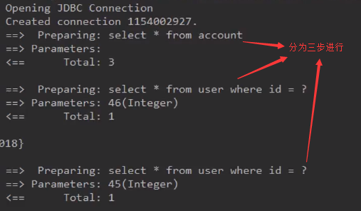
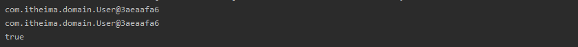
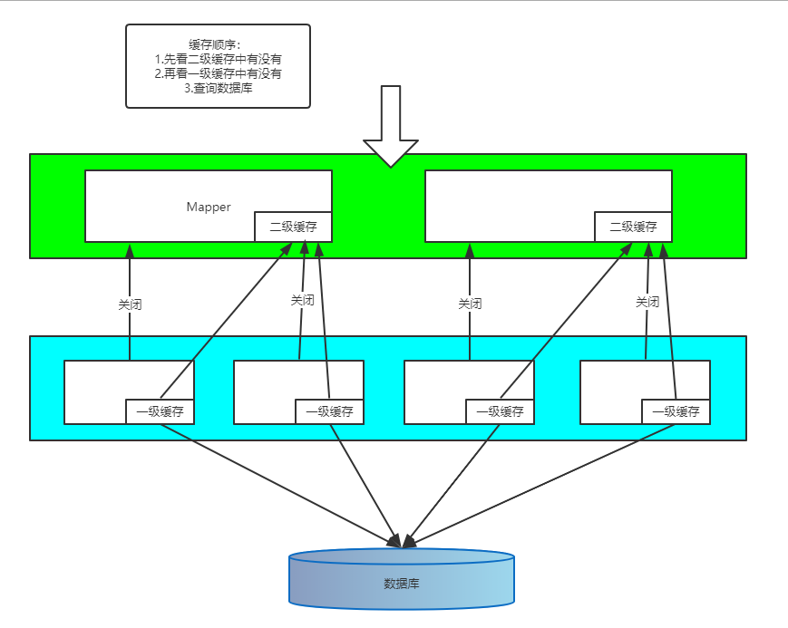

# 1、MyBatis中的延迟加载

- 问题：

	​	在一对多中，当我们有一个用户，它有100个账户。

	​	在查询用户的时候，要不要把关联的账户查出来？

	​	在查询账务的时候，要不要把关联的用户查出来？

	​	

	​	在查询用户时，用户下的账户信息应该是，什么时候使用，什么时候查询的。

	​	在查询账户时，账户的所属用户信息应该是随着账户查询时一起查询出来。

	

- 什么是延迟加载

	​	在真正使用数据时才发起查询，不用的时候不查询。按需加载（懒加载）

- 什么是立即加载

	​	不管用不用，只要一调用方法，马上发起查询

- 在对应的四种表关系中：一对多、多对一、一对一、多对多

	- 一对多、多对多：通常情况下我们都是采用延迟加载。
	- 多对一、一对一：通常情况下我们都是采用立即加载。


## 1.1 一对一情况下延迟加载

```java
public class Account implements Serializable {

   private Integer id;
   private Integer uid;
   private Double money;

   //从表实体应该包含一个主表实体
   private User user;
   //get、set方法
}
```

```xml
<!-- IAccountDao.xml文件中 -->
<mapper namespace="com.itheima.dao.IAccountDao">
    <!-- 定义封装account和user的resultMap -->
    <resultMap id="accountUserMap" type="account">
        <id property="id" column="id"></id>
        <result property="uid" column="uid"></result>
        <result property="money" column="money"></result>
        <!--
           一对一的关系映射：配置封装user的内容
           select属性指定的内容，查询用户的唯一标识，
           column属性指定的内容，用户根据id查询时，所需要的参数的值
        -->
        <association property="user" column="uid" javaType="user" select = "com.itheima.dao.IUserDao.findById">
        </association>
    </resultMap>

    <!-- 查询所有 -->
    <select id="findAll" resultMap="accountUserMap">
        select * from account;
    </select>
</mapper>
```

```xml
<!-- com.itheima.dao.IUserDao.xml中定义的方法 -->
<!--根据id查询用户-->
<select id="findById" parameterType="INT" resultType="user">
    select * from user where id = #{uid};
</select>
```

```xml
<!-- SqlMapConfig.xml文件中配置延迟 -->
<!--配置参数-->
<settings>
    <!--开启MyBatis支持延迟加载-->
    <setting name="lazyLoadingEnabled" value="true"/>
    <setting name="aggressiveLazyLoading" value="false"/>
</settings>
```




## 1.2 一对多情况下延迟加载

原理同上（一对一情况）

# 2、MyBatis中的缓存

- 什么是缓存

	​	存在于内存中的临时数据

- 为什么使用缓存

	​	减少和数据库的交互次数，提高执行效率

- 什么样的数据能使用缓存，什么样的数据不能使用

	- 适用于缓存：

		​		经常查询并且不经常改变的

		​		数据的正确与否对最终结果影响不大

	- 不适用与缓存：

		​		经常改变的数据

		​		数据的正确与否对最终结果影响很大的

		​		例如：商品的库存，银行的汇率，股市的牌价

## 2.1 MyBatis中的一级缓存和二级缓存

### 2.1.1 一级缓存

- 它指的是MyBatis中SqlSession对象的缓存
- 当我们执行查询之后，查询的结果会同时存入到SqlSession为我们提供一块区域中。
- 该区域的结构是一个Map,当我们再次查询同样的数据，mybatis会先去SqlSession中查询是否有，有的话直接拿来用
- 当SqlSession对象消失时，mybatis的一级缓存也就消失了

**测试缓存：**

```java
/**
 * 测试一级缓存
 */
@Test
public void testFirstLevelCache(){

    User user1 = userDao.findById(41);
    System.out.println(user1);

    User user2 = userDao.findById(41);
    System.out.println(user2);

    System.out.println(user1==user2);
}
```




**清除缓存**

```java
@Test
public void testFirstLevelCache(){
    User user1 = userDao.findById(41);
    System.out.println(user1);

    /*第一种方法清除缓存
      sqlSession.close();

      再次获取SqlSession对象
      sqlSession = factory.openSession();
	*/

    //2.第二种方法清空缓存
    sqlSession.clearCache();

    userDao = sqlSession.getMapper(IUserDao.class);

    User user2 = userDao.findById(41);
    System.out.println(user2);
    System.out.println(user1==user2);
}
```


**缓存失效的情况**：

1. 查询不同的东西
2. 增删改操作，可能会改变原来的数据，所以不必定会刷新缓存
3. 查询不同的 mapper 
4. 手动清理缓存

**一级缓存默认开启**


### 2.1.2 二级缓存

- 二级缓存也叫全局缓存，以及缓存作用域太低了，所以诞生了二级缓存
- 基于 namespace 级别的缓存，一个名称空间，对应一个二级缓存
- 工作机制
  - 一个会话查询一条数据，这个数据就会被放在当前会话的一级缓存中
  - 如果当前会话关闭了，这个会话对应的一级缓存就没了；但是我们想要的是，会话关闭了，一级缓存中的数据被保存到二级缓存中
  - 新的会话查询信息，就可以从二级缓存中获取信息
  - 不同的mapper查出的数据会放在自己对应的缓存（map）中

**步骤**：

1. 开启全局缓存

```java
<!--默认是开启的，为了增强可读性-->
<setting name="cacheEnabled" value="true"/>
```

2. 在使用二级缓存的 Mapper 中开启

```xml
<cache/>
```

也可以添加属性

```xml
<cache
  eviction="FIFO"
  flushInterval="60000"
  size="512"
  readOnly="true"/>
```

3. 测试

```java
@Test
public void testCache() {
    SqlSession session = MybatisUtils.getSqlSession();
    SqlSession session1 = MybatisUtils.getSqlSession();

    TeacherMapper mapper = session.getMapper(TeacherMapper.class);
    Teacher teacher = mapper.findById(1);
    System.out.println(teacher);
    session.close();

    TeacherMapper mapper1 = session1.getMapper(TeacherMapper.class);
    Teacher teacher1 = mapper1.findById(1);
    System.out.println(teacher1);

    session1.close();
}
```

只查询了一次


<font size=5>小结：</font>

- 只要开启了二级缓存，在同一个 Mapper 下就有效
- 所有的数据都会先放在一级缓存中
- 只有当会话提交，或者关闭的时候，才会提交到二级缓存中


# 3、Mybatis中缓存实现原理




# 4、MyBatis中的注解开发

​	<font color='red' size='4'>注意：</font>

​				**当mybatis中同时存在注解和dao的xml文件时，不管系统是否引用，程序都会报错。**

## 4.1 环境搭建

```properties
jdbc.driver=com.mysql.jdbc.Driver
jdbc.url=jdbc:mysql://localhost:3306/ee42
jdbc.username=root
jdbc.password=1015
```

```xml
<?xml version="1.0" encoding="UTF-8"?>
<!DOCTYPE configuration
   PUBLIC "-//mybatis.org//DTD Config 3.0//EN"
   "http://mybatis.org/dtd/mybatis-3-config.dtd">
<configuration>

<!--引入外部配置文件-->
<properties resource="jdbcConfig.properties"></properties>
<!--配置别名-->
<typeAliases>
   <package name="com.itheima.domain"/>
</typeAliases>

<environments default="mysql">
   <environment id="mysql">
       <transactionManager type="JDBC"></transactionManager>
       <dataSource type="POOLED">
           <property name="driver" value="${jdbc.driver}"/>
           <property name="url" value="${jdbc.url}"/>
           <property name="username" value="#{jdbc.username}"/>
           <property name="password" value="#{jdbc.password}"/>
       </dataSource>
   </environment>
</environments>

<!--指定带有注解的dao接口所在位置-->
<mappers>
   <package name="com.itheima.dao"/>
</mappers>

</configuration>
```

```java
public class User implements Serializable {
    private Integer id;
    private String username;
    private String address;
    private String sex;
    private Date birthday;
    //get、set方法
}
```

```java
/**
* 在MyBatis中针对，CRUD一共有四个注解
* @Select @Insert @Update @Delete
*/
public interface IUserDao {
   /**
    * 查询所有用户
    * @return
    */
   @Select("select * from user")
   List<User> findAll();
}
```


当表的列名和类的属性名称不同时

```java
//在接口其中一个方法上加注释
@Results(id = "userMap",value = {	//此处id被其他调用，可以获得类和列对应
    @Result(id = true,column = "id",property = "userId"),//此处id默认为false，判断是否是主键
    @Result(column = "id",property = "userId"),
    @Result(column = "username",property = "userName"),
    @Result(column = "address",property = "userAddress"),
    @Result(column = "birthday",property = "userBirthday")
})
```

例：

```java
@Select("select * from user")
@Results(id = "userMap",value = {
     @Result(id = true,column = "id",property = "userId"),
     @Result(column = "id",property = "userId"),
     @Result(column = "username",property = "userName"),
     @Result(column = "address",property = "userAddress"),
     @Result(column = "birthday",property = "userBirthday")
})
List<User> findAll();

@Select("select * from user where id=#{id}")
@ResultMap(value = {"userMap"})//其他方法只需调用即可
//@ResultMap("userMap") 只有value属性时，value不用写，数组中只有一个值时，{}不用写
User findOne(Integer id);
```


## 4.2 单表CRUD操作

（略）

## 4.3 多表查询操作

> 注解实现一对一关系的映射

```java
public class Account implements Serializable {
    private Integer id;
    private Integer uid;
    private Double money;
    //多对一（mybatis中称之为一对一）的映射，一个账户只能属于一个用户
    private User user;
}
```

```java
/**
 * 查询所有账户,并且获取每个用户所属的用户信息
 * @return
 */
 @Select("select * from account")
 @Results(id = "accountMap",value = {
     @Result(id = true,column = "id",property = "id"),
     @Result(column = "uid",property = "uid"),
     @Result(column = "money",property = "money"),
     @Result(property = "user",column = "uid",
     		one = @One(select = "com.itheima.dao.IUserDao.findOne",fetchType = FetchType.EAGER))
})//one注解是Result注解里的，One注解里的select是能唯一确定用户的方法，fetchType对应的是延迟
List<Account> findAll();
```

```java
//User中根据主键查询类的方法，与上面想对应
/**
 * 根据id查询
 * @param id
 * @return
 */
@Select("select * from user where id=#{id}")
@ResultMap(value = {"userMap"})
User findOne(Integer id);
```

```java
@Test
public void testFindAll(){
   List<Account> accounts = accountDao.findAll();
   for (Account account:accounts){
        System.out.println("----------------------------------------------");
        System.out.println(account);
        System.out.println(account.getUser());
   }
}
```


> 注解实现一对多关系的映射

```java
public class User implements Serializable {
    private Integer userId;
    private String userName;
    private String userAddress;
    private String userSex;
    private Date userBirthday;
    private List<Account> accounts;
}
```

```java
/**
 * 查询所有用户
 * @return
 */
@Select("select * from user")
@Results(id = "userMap",value = {
     @Result(id = true,column = "id",property = "userId"),
     @Result(column = "username",property = "userName"),
     @Result(column = "address",property = "userAddress"),
     @Result(column = "birthday",property = "userBirthday"),
     @Result(property = "accounts",column = "id",
            many = @Many(select = "com.itheima.dao.IAccountDao.findAccountByUid",
                   fetchType = FetchType.LAZY))
})
List<User> findAll();
```

```java
//Account中主键查询类的方法，与上面相对应
/**
 * 根据用户id查询账户信息
 * @param userId
 * @return
 */
@Select("select * from account where uid=#{userId}")
@ResultMap("accountMap")
Account findAccountByUid(Integer userId);
```

```java
@Test
public void testFindAll(){
       List<User> users = userDao.findAll();
       for(User user:users){
           System.out.println("--------------------------------------------");
           System.out.println(user);
           System.out.println(user.getAccounts());
       }
}
```


> 缓存的配置

二级缓存的配置

```xml
<!--Mybatis中默认为true，此项可配可不配-->
<!--配置开启二级缓存-->
 <settings>
     <setting name="cacheEnabled" value="true"/>
 </settings>
```

```java
//注解开启二级缓存的必须条件
@CacheNamespace(blocking = true)
public interface IUserDao {

}
```

```java
@Test
public void testFindOne(){
    SqlSession session = factory.openSession();
    IUserDao userDao = session.getMapper(IUserDao.class);
    User user = userDao.findOne(45);
    System.out.println(user);

    session.close();//释放一级缓存

    SqlSession session1 = factory.openSession();//再次打开session
    IUserDao userDao1 = session1.getMapper(IUserDao.class);
    User user1 = userDao1.findOne(45);
    System.out.println(user1);

    session1.close();

}
```


