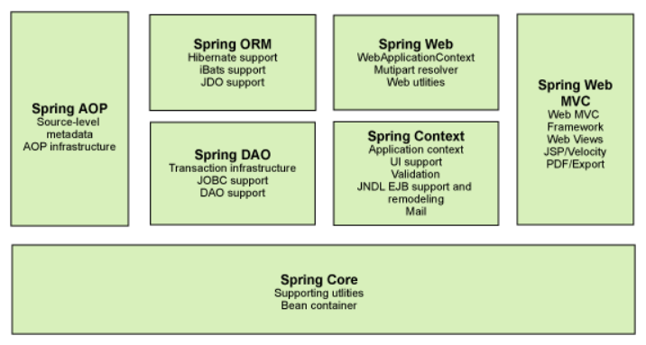

[toc]

# 1、Spring

## 1.1 简介

- Spring：春天  --->  给软件行业带来了春天
- 2002，首次推出了 Spring 框架的雏形：interface21 框架
- Spring框架即以 interface21 框架为基础，经过重新设计，并不断丰富其内涵，于2004年3月24日发不了 1.0 正式版
- **Rod Johnson**，Spring Framework创建人，著名作者。难想象Rod Johnson的学历，真的让好多人大吃一惊，他是悉尼大学的博士，然而他的专业不是计算机，而是音乐学。
- Spring理念：使现有的技术更加容易使用，本身是一个大杂烩，整合了现有的技术框架


- SSH：Struct2 + Spring + Hibernate
- SSM：SpringMvc + Spring + Mybaits


官网：[官网](https://spring.io/projects/spring-framework)

官方下载地址：[下载地址](https://repo.spring.io/release/org/springframework/spring/)

GitHub：[GitHub](https://github.com/spring-projects/spring-framework)


```xml
<dependency>
    <groupId>org.springframework</groupId>
    <artifactId>spring-webmvc</artifactId>
    <version>5.2.0.RELEASE</version>
</dependency>

<dependency>
    <groupId>org.springframework</groupId>
    <artifactId>spring-jdbc</artifactId>
    <version>5.2.0.RELEASE</version>
</dependency>
```


## 1.2 优点

- Spring是一个开源的免费的框架（容器）
- Spring是一个轻量级的、非入侵式的框架
- 控制反转（IOC），面向切面编程（AOP）
- 支持事务的处理，对框架的支持


**总结：Spring是一个轻量级的控制反转（IOC）和面向切面（AOP）的框架**


## 1.3 组成




## 1.4 扩展

在Spring的官网有这个介绍：现代化的 java 开发！说白了就是基于Spring的开发


- Spring Boot
  - 一个快速开发的脚手架
  - 基于SpringBoot可以快速的开发单个微服务
  - 约定大于配置
- SpringCloud
  - SpringCloud是基于SpringBoot实现的


因为现在大多数公司都在使用SpringBoot进行快速开发，学习SpringBoot的前提，需要完全掌握Spring及SpringMVC！承上启下的作用！


**弊端：发展了太久之后，违背了原来的理念！配置十分繁琐，人称 "配置地狱"**


# 2、IOC理论推导

[项目](E:\workspace\workspace-frame\spring\kuang\spring-01-ioc)


1. UserDao 接口

    

2. UserDaoImpl 实现类

    

3. UserService 业务接口

    

4. UserServiceImpl 业务实现类


在我们之前的业务中，用户的需求可能会影响我们原来的代码，我们需要根据用户的需求去修改代码！如果程序代码量十分大，修改一次的成本代价十分昂贵。


我们使用一个 Set 接口实现，已经发生了革命性的变化！

```java
private UserMapper mapper;

public void setMapper(UserMapper mapper) {
    this.mapper = mapper;
}
```


- 之前，程序时主动创建对象，控制权在程序猿手上！
- 使用了 set 注入之后，程序不再具有主动性，而是变成了被动的接受对象！


这种思想，从本质上解决了问题，我们程序猿不再去管理对象的创建了。系统的耦合性大大降低！。可以更加专注的在业务的实现上，这就是IOC的原型！


## IOC本质

**控制反转（Inversion of Control），是一种设计思想，DI（依赖注入）是实现IOC的一种方法**，也有人认为DI知识IOC的另一种说法。没有IOC的程序，我们使用面向对象编程，对象的创建与对象间的依赖关系完全硬编码在程序中，对象的创建有程序自己控制，控制反转后将对象的创建转移给第三方，个人认为所谓控制反转就是：获得依赖对象的方式反转了。


采用XML方式配置Bean的时候，Bean的定义信息是和实现分离的，而采用注解的方式可以把二者合为一体，Bean的定义信息直接以注解的形式定义在实现类中，从而达到零配置的目的。

**控制反转是一种通过描述（XML或注解）并通过第三方去生产或获取特定对象的方式。在Spring中实现控制反转的是IOC容器，其实现方法时依赖注入（Dependency Injection，DI）**


**实体类**

```java
@Data
public class Hello {
    private String str;
}
```

**applicationContext.xml**

```xml
<?xml version="1.0" encoding="UTF-8"?>
<beans xmlns="http://www.springframework.org/schema/beans"
       xmlns:xsi="http://www.w3.org/2001/XMLSchema-instance"
       xsi:schemaLocation="http://www.springframework.org/schema/beans
        http://www.springframework.org/schema/beans/spring-beans.xsd">

    <bean id="hello" class="com.cyy.pojo.Hello">
        <property name="str" value="Spring"/>
    </bean>
</beans>
```

【测试】

```java
@Test
public void test01(){

    //获取Spring的上下文对象
    ApplicationContext context = new ClassPathXmlApplicationContext("applicationContext.xml");
    //我们的对象现在都在Spring中管理了，我们要使用，直接去里面拿就可以了
    Hello hello = (Hello) context.getBean("hello");
    System.out.println(hello.toString());
}
```

结果：Hello(str=Spring)


hello对象是由Spring创建的，hello对象的属性是由Spring容器创建的，这个过程就叫做**控制反转**


- **控制：谁来控制对象的创建,传统应用程序的对象是由程序本身控制创建的，使用Spring后，对象是由Spring来创建的。**

- **反转：程序本身不创建对象，而变成被动的接收对象**

- **依赖注入：就是利用set方法来进行注入的**


# 3、IOC创建对象的方式

1. 使用无参构造器创建对象，默认！

2. 假设我们要使用有参构造创建对象（可以不含setter方法）

   ```java
   public class User implements Serializable {
   
       private String name;
       private Integer age;
   
       public User(String name, Integer age) {
           this.name = name;
           this.age = age;
       }
   }
   ```

   1. 下标赋值

      ```xml
      <bean id="User" class="com.cyy.pojo.User">
          <constructor-arg index="0" value="张三"/>
          <constructor-arg index="1" value="18"/>
      </bean>
      ```

   2. 类型赋值

      ```xml
      <bean id="User" class="com.cyy.pojo.User">
          <constructor-arg type="java.lang.String" value="张三"/>
          <constructor-arg type="java.lang.Integer" value="18"/>
      </bean>
      ```

   3. 参数名赋值

      ```xml
      <bean id="User" class="com.cyy.pojo.User">
          <constructor-arg name="name" value="张三"/>
          <constructor-arg name="age" value="18"/>
      </bean>
      ```


总结：在配置文件加载的时候，容器中管理的对象就已经初始化了


# 4、Spring 配置

[项目](E:\workspace\workspace-frame\spring\kuang\spring-03-ioc2)

## 4.1 别名

```xml
<!--别名，如果添加了别名，我们也可以使用别名获取到这个对象-->
<alias name="User" alias="user2"/>
```

```java
//可以直接使用别名来获取对象
User user = context.getBean("user2", User.class);
```


## 4.2 Bean的配置

```xml
<!--
    id：bean的唯一标识，也就是相当于我们学的对象名
    class：bean对象所对应的全限定名：包名+类型
    name：也是别名，而且name可以同时取多个别名,使用别名获取对象
-->
<bean id="People" class="com.cyy.pojo.People" name="p1,p2">
    <property name="commend" value="Hello World"/>
</bean>
```


## 4.3 import

import，一般用于团队开发使用，它可以将多个配置文件，导入合并为一个

```xml
<import resource="bean1.xml"/>
<import resource="bean2.xml"/>
```

使用的时候，直接使用总的配置就可以了


# 5、依赖注入

[项目](E:\workspace\workspace-frame\spring\kuang\spring-04-di)

## 5.1 构造器注入

前面已经讲过


## 5.2 set方式注入【重点】

1. 复杂类型

    ```java
   @Setter
   @ToString
   public class Address {
       private String address;
   }
   ```

2. 真实测试类型

    ```java
   @Setter
   @ToString
   public class Student {
       private String name;
       private Address address;
       private String[] books;
       private List<String> hobbys;
       private Map<String, String> card;
       private Set<String> games;
       private String wife;
       private Properties info;
   }
   ```

3. applicationContext.xml

    ```xml
   <?xml version="1.0" encoding="UTF-8"?>
   <beans xmlns="http://www.springframework.org/schema/beans"
          xmlns:xsi="http://www.w3.org/2001/XMLSchema-instance"
          xsi:schemaLocation="http://www.springframework.org/schema/beans
           https://www.springframework.org/schema/beans/spring-beans.xsd">
   
       <bean id="student" class="com.cyy.pojo.Student">
   
           <!--第一种，普通值注入，value-->
           <property name="name" value="cyy"/>
   
           <!--第二种，Bean注入，ref-->
           <property name="address" ref="address"/>
   
           <!--数组-->
           <property name="books">
               <array>
                   <value>红楼梦</value>
                   <value>三国演义</value>
                   <value>西游记</value>
                   <value>水浒传</value>
               </array>
           </property>
   
           <!--list-->
           <property name="hobbys">
               <list>
                   <value>听歌</value>
                   <value>敲代码</value>
                   <value>看电影</value>
               </list>
           </property>
   
           <!--Map-->
           <property name="card">
               <map>
                   <entry key="username" value="root"/>
                   <entry key="password" value="1015"/>
               </map>
           </property>
   
           <!--Set-->
           <property name="games">
               <set>
                   <value>LOL</value>
                   <value>COC</value>
                   <value>BOB</value>
               </set>
           </property>
   
           <!--null-->
           <property name="wife">
               <null></null>
           </property>
   
           <!--properties-->
           <property name="info">
               <props>
                   <prop key="学号">7</prop>
                   <prop key="性别">男</prop>
               </props>
           </property>
   
       </bean>
   
       
       <bean id="address" class="com.cyy.pojo.Address">
           <property name="address" value="地址在南阳"/>
       </bean>
   </beans>
   ```

4. 测试类

   ```java
   @Test
   public void test01(){
       ApplicationContext context = new ClassPathXmlApplicationContext("applicationContext.xml");
       Student student = context.getBean("student", Student.class);
       System.out.println(student);
   }
   ```

   ```
   测试结果：
   
   Student(name=cyy, address=Address(address=地址在南阳), books=[红楼梦, 三国演义, 西游记, 水浒传], hobbys=[听歌, 敲代码, 看电影], card={username=root, password=1015}, games=[LOL, COC, BOB], wife=null, info={学号=7, 性别=男})
   ```


## 5.3 扩展方式注入

我们可以使用p命名空间或c命名空间进行注入

```xml
<?xml version="1.0" encoding="UTF-8"?>
<beans xmlns="http://www.springframework.org/schema/beans"
       xmlns:xsi="http://www.w3.org/2001/XMLSchema-instance"
       xmlns:p="http://www.springframework.org/schema/p"
       xmlns:c="http://www.springframework.org/schema/c"
       xsi:schemaLocation="http://www.springframework.org/schema/beans
        https://www.springframework.org/schema/beans/spring-beans.xsd">

    <!--p命名空间需要实体类有空参构造器和setter方法-->
    <bean id="user" class="com.cyy.pojo.User" p:name="张三" p:age="15"/>

    <!--c命名空间需要实体类有全参构造器-->
    <bean id="user2" class="com.cyy.pojo.User" c:name="李四" c:age="16"/>

</beans>
```


注意点：p命名和c命名空间不能直接使用，需要导入xml约束

```xml
xmlns:p="http://www.springframework.org/schema/p"
xmlns:c="http://www.springframework.org/schema/c"
```


## 5.4 bean的作用域


1. 单例模式（Spring默认机制）

   ```xml
   <!--不配置作用域时默认是单例-->
   <bean id="accountService" class="com.something.DefaultAccountService" scope="singleton"/>
   ```

2. 原型模式：每次从作用域中get的时候，都会产生一个新对象

   ```xml
   <bean id="accountService" class="com.something.DefaultAccountService" scope="prototype"/>
   ```

3. 其余的request、session、application这些只能在web开发中使用到！


# 6、Bean的自动转配

[项目](E:\workspace\workspace-frame\spring\kuang\spring-05-Autowired)

- 自动装配是Spring满足bean依赖的一种方式
- Spring会在上下文中自动寻找，并自动给bean装配属性


在Spring中有三种装配的方式

1. 在xml中显式的配置
2. 在java中显式配置
3. 隐式的自动装配bean【重要】


## 6.1 测试

```xml
<bean id="cat" class="com.cyy.pojo.Cat"/>
<bean id="dog" class="com.cyy.pojo.Dog"/>

<bean id="people" class="com.cyy.pojo.People">
    <property name="name" value="张三"/>
    <property name="cat" ref="cat"/>
    <property name="dog" ref="dog"/>
</bean>
```

```java
@Test
public void test01() {
    ApplicationContext context = new ClassPathXmlApplicationContext("applicationContext.xml");
    People people = context.getBean("people", People.class);
    people.getCat().shout();
    people.getDog().shout();
}
```


## 6.2 ByName自动装配

```xml
<bean id="cat" class="com.cyy.pojo.Cat"/>
<bean id="dog" class="com.cyy.pojo.Dog"/>

<!--
    byName：会自动在容器上下文查找，和自己对象set方法后面的之对应的bean id
-->
<bean id="people" class="com.cyy.pojo.People" autowire="byName">
    <property name="name" value="张三"/>
</bean>
```


## 6.3 ByType自动装配

```xml
<bean class="com.cyy.pojo.Cat"/>
<bean class="com.cyy.pojo.Dog"/>

<!--
    byName：会自动在容器上下文查找，和自己对象set方法后面的之对应的bean id
    byType：会自动在容器上下文查找，和自己对象属性类型相同的bean，不需要bean的id值
-->
<bean id="people" class="com.cyy.pojo.People" autowire="byType">
    <property name="name" value="张三"/>
</bean>
```


**小结：**

- byName的时候，需要保证所有的bean的id唯一，而且这个bean需要和自动注入的属性的set方法的值一致
- byType的时候，需要保证所有bean的class唯一，而且这个bean需要和自动追的属性的类型一致


## 6.4 使用注解实现自动装配

jdk1.5 支持的注解，Spring2.5就支持注解了

The introduction of annotation-based configuration raised the question of whether this approach is “better” than XML.

**使用注解须知：**

1. 导入约束，context的约束

2. 配置注解的支持

   ```xml
   <?xml version="1.0" encoding="UTF-8"?>
   <beans xmlns="http://www.springframework.org/schema/beans"
       xmlns:xsi="http://www.w3.org/2001/XMLSchema-instance"
       xmlns:context="http://www.springframework.org/schema/context"
       xsi:schemaLocation="http://www.springframework.org/schema/beans
           https://www.springframework.org/schema/beans/spring-beans.xsd
           http://www.springframework.org/schema/context
           https://www.springframework.org/schema/context/spring-context.xsd">
   
       <context:annotation-config/>
   
   </beans>
   ```

   

### @Autowired【推荐】

直接在属性上使用即可！也可以在setter方法上使用

使用Autowired我们可以不用编写setter方法了，前提是你这个自动装配的属性在IOC（Spring）容器中存在，且符合名字 byName

```java
@Getter
@ToString
public class People implements Serializable {

    private String name;

    @Autowired
    private Dog dog;
    
    @Autowired
    private Cat cat;
}
```


#### @Nullable

字段标记了这个注解，说明这个字段可以为null

```java
public @interface Autowired {
    boolean required() default true;
}
```

【代码】

```java
public class People implements Serializable {

    private String name;

    //如果显示定义了Autowired的required属性为false，说明这个对象可以为null，否则不允许为空
    @Autowired(required = false)
    private Dog dog;

    @Autowired
    private Cat cat;
}
```


#### @Qualifier

如果 @Autowired 自动装配的环境比较复杂，自动装配无法通过一个注解【@Autowired】完成的时候，我们可以使用 @Qualifier(value="xxx")去配置@Autowired的使用，指定一个唯一的bean对象注入。

例如：

```java
public class People implements Serializable {

    private String name;

    @Autowired
    @Qualifier(value = "dog111")	//必须是同一类型的，否则会直接报错
    private Dog dog;

    @Autowired
    @Qualifier(value = "cat111")
    private Cat cat;

}
```


### @Resource

java的元注解

```java
public class People implements Serializable {
    
    @Resource(name = "cat111")
    private Cat cat;
    
    @Resource
    private Dog dog;
    
}
```


**小结：**

@Resource和@Autowired的区别：

- 都是用来自动装配的，都可以放在属性字段上
- @Autowired通过byType的方式实现，而且必须要求这个对象存在！【常用】
- @Resource默认通过byName的方式实现，如果找不到名字，则通过byType实现！如果两个都找不到的情况下，就报错！
- 执行顺序不同：@Autowired通过byType的方式实现，@Resource默认通过byName的方式实现


# 7、使用注解开发

[项目](E:\workspace\workspace-frame\spring\kuang\spring-06-Annotation)

在Spring4之后，要使用注解开发，必须要保证aop的包导入了


使用注解需要导入 context 约束，增加注解的支持

```xml
<?xml version="1.0" encoding="UTF-8"?>
<beans xmlns="http://www.springframework.org/schema/beans"
    xmlns:xsi="http://www.w3.org/2001/XMLSchema-instance"
    xmlns:context="http://www.springframework.org/schema/context"
    xsi:schemaLocation="http://www.springframework.org/schema/beans
        https://www.springframework.org/schema/beans/spring-beans.xsd
        http://www.springframework.org/schema/context
        https://www.springframework.org/schema/context/spring-context.xsd">

    <context:annotation-config/>

</beans>
```


1. bean

   **@Component**

   ```java
   //相当于配置了 <bean id="user" class="com.cyy.pojo.User"/>
   @Component
   public class User implements Serializable {
   ```

2. 属性如何注入

   **@Value**

   ```java
   @Component
   @ToString
   public class User implements Serializable {
   
       @Value("张三")		//简单的可以直接使用注解，复杂类型还是建议使用xml配置
       private String name;
   }
   ```

3. 衍生的注解

   @Component 有几个衍生注解，我们在开发中，会按照 mvc 三层架构分层

   - dao					【@Repository】
   - service              【@Service】
   - controller         【@Controller】

   这四个注解功能都是一样的，都是代表将某个类注册到 Spring 中，配置Bean

4. 自动装配置

   <a href="###@Autowired【推荐】">点击跳转</a>

5. 作用域

   ```java
   @Component
   @Scope("prototype")
   public class User implements Serializable {
   
       @Value("张三")
       private String name;
   }
   ```

6. 小结

   xml与注解：

   - xml更加万能，适用于任何场所！维护简单方便
- 注解只负责完成属性的注入
   - 我们在使用的过程中，只需要注意一个问题：必须让注解生效，就需要开启注解的支持
   
   ```xml
   <!--指定要扫描的包，这个包下的注解就会生效-->
   <context:component-scan base-package="com.cyy.pojo"/>
   
   <context:annotation-config/>
   ```
   
   

# 8、使用Java的方式配置Spring

我们现在要完全不适用Spring的配置了，全权交给 Java 来做

JavaConfig 是 Spring 的一个子项目，在Sprig4之后，它成为了一个核心功能！


**实体类**

```java
//@Component 说明这个类被Spring接管了，注册到了容器中
@Component
public class User implements Serializable {

    private String name;

    public String getName() {
        return name;
    }

    @Value("李四")        //属性注入值
    public void setName(String name) {
        this.name = name;
    }

    @Override
    public String toString() {
        return "User{" +
                "name='" + name + '\'' +
                '}';
    }
}
```

配置类

```java
//这个也会被Spring容器托管，注册到容器中，因为它本身就是一个@Component
//@Configuration代表这是一个配置类，就像我们之前看到的 applicationContext.xml
@Configuration
@ComponentScan("com.cyy.pojo")
@Import(CyyConfig2.class)
public class CyyConfig {

    /**
     * 注册一个bean，就相当于我们之前写的一个bean标签
     * 这个方法的名字，就相当于bean标签的id属性
     * 这个方法的返回值，就相当于bean标签中的class属性
     *
     * @return 返回值就是要注入到bean的对象
     */
    @Bean
    public User getUser() {
        return new User();
    }
}
```

**测试类**

```java
public class TestDemo {
    @Test
    public void test01(){
        //如果完全使用了配置类方式去做，我们就只能通过 AnnotationConfig 上下文来获取容器
        //通过配置类的class对象加载
ApplicationContext context = new AnnotationConfigApplicationContext(CyyConfig.class);
        User getUser = context.getBean("getUser", User.class);
        System.out.println(getUser.getName());
    }
}


/*
测试结果：

李四
*/
```


这种纯Java注解的方式，在SpringBoot中随处可见


# 9、代理模式

为什么要学习代理模式？因为这就是SpringAOP的底层！【SpringAOP 和 SpringMVC】

代理模式的分类：

- 静态代理
- 动态代理


## 9.1 静态代理

[项目](E:\workspace\workspace-frame\spring\kuang\spring-08-proxy\src\main\java\com\cyy\demo)

角色分析：

- 抽象对象：一般会使用接口或者抽象类来解决
- 真实角色：被代理的角色
- 代理角色：代理真实角色，代理真实对象后，我们一般会做一些附属操作
- 客户：访问代理对象的人


代码步骤：

1. 接口

   ```java
   //租房
   public interface Rent {
       public void rent();
   }
   ```

2. 真实角色

   ```java
   //房东
   public class Host implements Rent {
       @Override
       public void rent() {
           System.out.println("将房子出租");
       }
   }
   ```

3. 代理角色

   ```java
   //中介
   public class Proxy implements Rent {
   
       public Proxy(Host host) {
           this.host = host;
       }
   
       private Host host;
   
       @Override
       public void rent() {
           host.rent();
           seeHouse();
       }
   
       public void seeHouse() {
           System.out.println("看房");
       }
   }
   ```

4. 客户访问代理角色

   ```java
   //客户
   public class Client {
       public static void main(String[] args) {
           //房东要租房子
           Host host = new Host();
           //代理，中介帮房东租房子，但是代理一般会有一些附加操作
           Proxy proxy = new Proxy(host);
   
           //不用直接面对房东，直接找中介租房就可以了
           proxy.rent();
       }
   }
   ```


**代理模式的好处：**

- 可以使真实角色的操作更加纯粹，不用去关注一些公共的业务
- 公共业务就交给代理对象，实现了业务的分工
- 公共业务发生扩展的时候，方便集中管理

**缺点：**

- 一个真实角色就会产生一个代理角色，代码量会翻倍，开发效率会降低


## 9.2 加深理解

[代码](E:\workspace\workspace-frame\spring\kuang\spring-08-proxy\src\main\java\com\cyy\demo1)


## 10.3 动态代理

[代码](E:\workspace\workspace-frame\spring\kuang\spring-08-proxy\src\main\java\com\cyy\demo2)

- 动态代理和静态代理角色一样
- 动态代理的代理类是动态生成的，不是我们直接写好的
- 动态代理分为两大类：基于接口的动态代理，基于类的动态代理
  - 基于接口：jdk 动态代理
  - 基于类：cglib
  - java字节码实现：javasist


需要了解两个类：Proxy（代理），InvocationHandler（调用处理程序） 


**动态代理的好处：**

- 可以使真实角色的操作更加纯粹，不用去关注一些公共的业务
- 公共业务就交给代理对象，实现了业务的分工
- 公共业务发生扩展的时候，方便集中管理
- 一个动态代理类代理的是一个接口，一般就是对应的一类业务
- 一个动态代理类可以代理多个类，只要是实现了同一个接口即可


# 10、AOP

[项目](E:\workspace\workspace-frame\spring\kuang\spring-09-aop)

## 10.1 什么是AOP

AOP（Aspect Oriented Programming）意为：面向切面编程，通过预编译方式和运行期动态代理实现程序功能的同一维护的一种技术。AOP是OOP的延续，是软件开发中的一个热点，也是Spring框架中的一个重要内容，是函数式编程的一种衍生范型。利用AOP可以对业务遍及的各个部分进行隔离，从而使得业务逻辑各部分之间的耦合度降低，提高程序的可重用性，同时提高了开发的效率。


## 10.2 AOP在Spring中的作用

==提供声明式事务：允许用户自定义切面==

- 横切关注点：跨越应用程序多个模块的方法或功能。即是，与我们业务逻辑相关的，但是我们需要关注的部分，就是横切关注点。如日志、安全、缓存、事务等等……
- 切面（ASPECT）：横切关注点 被模块化 的特殊对象。即，它是一个类
- 通知（Advice）：切面必须要完成的工作。即，它是类中的一个方法
- 目标（Target）：被通知对象
- 代理（Proxy）：向目标对象应用通知之后创建的对象
- 切入点（PointCut）：切面通知执行的 "地点" 的定义
- 连接点（JoinPoint）：与切入点匹配的执行点


SpringAOP中，通过Advice定义横切逻辑，Spring中支持5种类型的Advice

| 通知类型     | 连接点               | 实现接口                                        |
| ------------ | -------------------- | ----------------------------------------------- |
| 前置通知     | 方法方法前           | org.springframework.aop.MethodBeforeAdvice      |
| 后置通知     | 方法后               | org.springframework.aop.AfterReturningAdvice    |
| 环绕通知     | 方法前后             | org.aopalliance.intercept.MethodInterceptor     |
| 异常抛出通知 | 方法抛出异常         | org.springframework.aop.ThrowsAdvice            |
| 引介通知     | 类中增加新的方法属性 | org.springframework.aop.IntroductionInterceptor |


## 10.3 使用Spring实现AOP

【重点】使用AOP导入，需要导入一个依赖包

```xml
<dependency>
    <groupId>org.aspectj</groupId>
    <artifactId>aspectjweaver</artifactId>
    <version>1.9.4</version>
</dependency>
```


### 1、使用Spring的API接口实现

==主要是通过SpringAPI接口实现==

**接口**

```java
public interface UserService {
    public void insert();
    public void delete();
    public void update();
    public void query();
}
```

**实现类**

```java
public class UserServiceImpl implements UserService {
    @Override
    public void insert() {
        System.out.println("添加用户");
    }

    @Override
    public void delete() {
        System.out.println("删除用户");
    }

    @Override
    public void update() {
        System.out.println("修改用户");
    }

    @Override
    public void query() {
        System.out.println("查询用户");
    }
}
```

**增强的方法**

```java
public class Log implements MethodBeforeAdvice {

    /**
     * @param method    要执行的目标对象的方法
     * @param args      参数
     * @param target    目标对象
     * @throws Throwable
     */
    public void before(Method method, Object[] args, Object target) throws Throwable {
        System.out.println(target.getClass().getName()+"执行了"+method.getName()+"方法");
    }
}
```

```java
public class AfterLog implements AfterReturningAdvice {

    //returnValue：方法的返回值
    public void afterReturning(Object returnValue, Method method, Object[] objects, Object target) throws Throwable {
        System.out.println("执行了" + method.getName() + "方法，返回结果为" + returnValue);
    }
}
```


**配置文件**

```xml
<?xml version="1.0" encoding="UTF-8"?>
<beans xmlns="http://www.springframework.org/schema/beans"
       xmlns:xsi="http://www.w3.org/2001/XMLSchema-instance"
       xmlns:aop="http://www.springframework.org/schema/aop"
       xsi:schemaLocation="http://www.springframework.org/schema/beans
        https://www.springframework.org/schema/beans/spring-beans.xsd
        http://www.springframework.org/schema/aop
        https://www.springframework.org/schema/aop/spring-aop.xsd">

    <bean id="userService" class="com.cyy.service.UserServiceImpl"/>
    <bean id="log" class="com.cyy.log.Log"/>
    <bean id="afterLog" class="com.cyy.log.AfterLog"/>

    <!--方式一：使用原生态Spring API接口-->
    <!--配置aop：需要导入aop的约束-->
    <aop:config>
        <!--切入点  expression：表达式  execution(要执行的位置)-->
        <aop:pointcut id="pointcut" expression="execution(* com.cyy.service.UserServiceImpl.*(..))"/>

        <!--执行环绕增强-->
        <aop:advisor advice-ref="log" pointcut-ref="pointcut"/>
        <aop:advisor advice-ref="afterLog" pointcut-ref="pointcut"/>
    </aop:config>
</beans>
```


### 2、自定义来实现AOP

==主要是切面定义==

自定义类

```java
public class DiyPointCut {

    public void before() {
        System.out.println("方法执行之前");
    }

    public void after() {
        System.out.println("方法执行之后");
    }
}
```

```xml
<?xml version="1.0" encoding="UTF-8"?>
<beans xmlns="http://www.springframework.org/schema/beans"
       xmlns:xsi="http://www.w3.org/2001/XMLSchema-instance"
       xmlns:aop="http://www.springframework.org/schema/aop"
       xsi:schemaLocation="http://www.springframework.org/schema/beans
        https://www.springframework.org/schema/beans/spring-beans.xsd
        http://www.springframework.org/schema/aop
        https://www.springframework.org/schema/aop/spring-aop.xsd">

    <bean id="userService" class="com.cyy.service.UserServiceImpl"/>
    <bean id="log" class="com.cyy.log.Log"/>
    <bean id="afterLog" class="com.cyy.log.AfterLog"/>
    <bean id="diyPointCut" class="com.cyy.diy.DiyPointCut"/>

    <!--第二种方式，自定义实现-->
    <aop:config>
        <aop:aspect id="diy" ref="diyPointCut">
            <aop:pointcut id="point" expression="execution(* com.cyy.service.UserServiceImpl.*(..))"/>
            <aop:before method="before" pointcut-ref="point"/>
            <aop:after method="after" pointcut-ref="point"/>
        </aop:aspect>
    </aop:config>

</beans>
```


### 3、使用直接实现AOP

**切面**

```java
@Aspect //声明是一个切面
public class AnnotationPointcut {

    @Before("execution(* com.cyy.service.UserServiceImpl.*(..))")
    public void before() {
        System.out.println("方法执行之前");
    }

    @After("execution(* com.cyy.service.UserServiceImpl.*(..))")
    public void after() {
        System.out.println("方法执行之后");
    }

    @AfterReturning("execution(* com.cyy.service.UserServiceImpl.*(..))")
    public void afterReturn() {
        System.out.println("方法返回值之后");
    }

    @Around("execution(* com.cyy.service.UserServiceImpl.*(..))")
    public void around(ProceedingJoinPoint joinPoint) throws Throwable {
        System.out.println("===============环绕前===============");
        Object proceed = joinPoint.proceed();       //执行方法
        System.out.println("===============环绕后===============");
    }
}
```

配置文件

```xml
<!--第三种方式，使用注解-->
<bean id="annotationPointcut" class="com.cyy.diy.AnnotationPointcut"/>
<!--开启注解支持      JDK（默认proxy-target-class="false"）     cglib（默认proxy-target-class="true"）  -->
<aop:aspectj-autoproxy proxy-target-class="false"/>
```


# 11、整合Mybatis

步骤：

1. 导入相关的jar包
   - junit
   - mybatis
   - mysql数据库
   - spring相关的
   - aop植入
   - mybatis-spring
2. 编写配置文件
3. 测试


## 11.1 回忆mybatis

- 编写实体类
- 编写核心配置文件
- 编写接口
- 编写 Mapper.xml
- 测试


## 11.2 mybatis-spring

[项目](E:\workspace\workspace-frame\spring\kuang\spring-10-mybatis)

[官方网址](http://mybatis.org/spring/zh/index.html)


步骤：

1. 编写数据源配置
2. SqlSessionFactory
3. SqlSessionTemplate
4. 需要给接口加实体类
5. 将自己写的实现类，加入的Spring中
6. 测试使用即可


# 12、声明式事务

## 12.1 回顾事务

- 把一组业务当成一个业务员来做，要么都成功，要么都失败
- 事务在项目开发中，十分的重要，涉及到数据的一致性问题，不能马虎
- 确保完整性和一致性


事务ACID原则：

- 原子性（Atomicity）：一个事务是一个不可分割的工作单位，事务中包括的操作要么都做，要么都不做
- 一致性（Consistency）：事务必须是使数据从一个一致状态变到另一个一致性状态。一致性和原子性是密切相关的。
- 隔离性（Isolation）：一个事务的执行不能被其他事务干扰。即一个事务内部的操作及使用的数据对开发的其他事务是隔离的，并发执行的各个事务之间不能互相干扰
- 持久性（Durability）：持久性也称为永久性，指一个事务一旦提交，它对数据库中数据的改变就应该是永久性的。接下来的其他操作或故障不应该对其有任何影响。


## 12.2 spring中得到事务管理

- 声明式事务：AOP
- 编程式事务：需要在代码中，进行事务的管理 


**声明式事务（交给容器管理事务）**

```xml
<bean id="transactionManager" class="org.springframework.jdbc.datasource.DataSourceTransactionManager">
  <constructor-arg ref="dataSource" />
</bean>

<!--不改变源有的代码，将事务插入到需要的方法中-->
<!--结合AOP实现事务的植入-->
<!--配置事务通知：-->
<tx:advice id="txAdvice" transaction-manager="transactionManager">
    <!--给哪些方法配置事务-->
    <!--配置事务的传播特性：-->
    <tx:attributes>
        <tx:method name="insert" propagation="REQUIRED"/>
        <tx:method name="delete" propagation="REQUIRED"/>
        <tx:method name="update" propagation="REQUIRED"/>
        <tx:method name="query" read-only="true"/>
        <tx:method name="*" propagation="REQUIRED"/>
    </tx:attributes>
</tx:advice>

<!--配置事务植入-->
<aop:config>
    <aop:pointcut id="txPointCut" expression="execution(* com.cyy.mapper.*.*(..))"/>
    <aop:advisor advice-ref="txAdvice" pointcut-ref="txPointCut"/>
</aop:config>
```


思考：为什么需要事务？

- 如果不配置事务，可能存在数据提交不一致的情况
- 如果我们不在Spring中配置声明式事务，我们就需要在代码中手动配置事务
- 事务在项目的开发中十分重要，涉及到数据的一致性和完整性问题，不容马虎！


