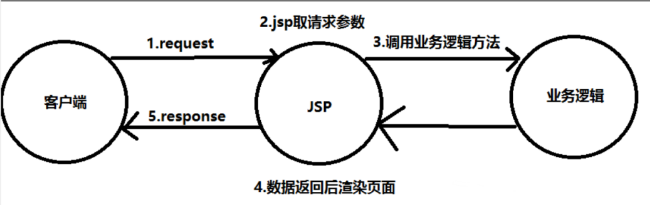
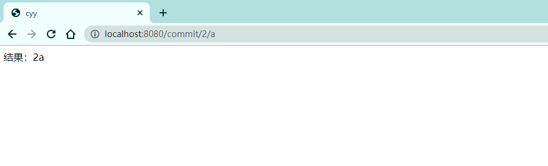
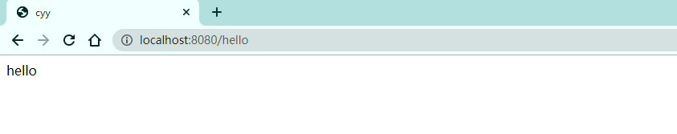

# 1、回顾 MVC

## 1.1 什么是 MVC

- MVC 是模型（Model）、视图（View）、控制器（Controller）的简写，是一种软件设计规范
- 是将业务逻辑、数据、显示分离的方法来组织代码
- MVC 主要作用是**降低了视图与业务逻辑间的双向耦合**
- MVC不是一种设计模式，**MVC是一种架构模式**。当然不同的 MVC 存在差异

Model（模型）：数据模型，提供要展示的数据，因此包含数据和行为，可以认为是领域模型或 JavaBean 组件（包含数据和行为），不过现在一般都分离开来：Value Object（数据 Dao）和服务层（行为 Service）。也就是模型提供了模型数据查询和模型数据的状态更新等功能，包括数据和业务

View（视图）：负责进行模型的展示，一般就是我们见到的用户界面，客户向看到的东西

Controller（控制器）：接收客户请求，委托给模型进行处理（状态改变），处理完毕后把返回的模型数据返回给视图，由视图负责展示。也就是说控制器做了个调度员的工作


最典型的 MVC 就是 JSP + servlet + Javabean 的模式


## 1.2 Model 1 时代

- 在 web 早期的开发中，通常采用的都是 Model 1
- Model 1 中，主要分为两层，视图层和模型层



Model 1优点：架构简单，比较适合小型项目开发

Model 2缺点：JSP 职责不单一，职责过重，不便于维护

## 1.3 Model 2 时代

Model 2 把一个项目分成三部分，包括视图、控制、模型


1. 用户发送请求
2. Servlet 接收请求数据，并调用对应的业务逻辑方法
3. 业务处理完毕，返回更新后的数据给 servlet
4. servlet 转向到 JSP，由 JSP 来渲染页面
5. 相应给前端更新后的页面


**职责分析**

Controller：控制层

1. 取得表单数据
2. 调用业务逻辑
3. 转向指定的页面

Model：模型

1. 业务逻辑
2. 保存数据的状态

View：视图

1. 显示页面

Model 2 这样不仅提高代码的复用率与项目的扩展性，且大大降低了项目的维护成本。Model 1 模式的实现比较简单，适用于快速开发小规模项目，Model 1 中 JSP 页面本身兼容 View 和 Controller 两种角色，将控制逻辑和表现逻辑混杂在一起，从而导致代码的重用率非常低，增加了应用的扩展性和维护的难度。Model 2 消除了Model 1的缺点

## 1.4 回顾 Servlet

1. 新建一个 Maven 项目当做父工程！pom 依赖！

```xml
<dependencies>
   <dependency>
       <groupId>junit</groupId>
       <artifactId>junit</artifactId>
       <version>4.12</version>
   </dependency>
   <dependency>
       <groupId>org.springframework</groupId>
       <artifactId>spring-webmvc</artifactId>
       <version>5.1.9.RELEASE</version>
   </dependency>
   <dependency>
       <groupId>javax.servlet</groupId>
       <artifactId>servlet-api</artifactId>
       <version>2.5</version>
   </dependency>
   <dependency>
       <groupId>javax.servlet.jsp</groupId>
       <artifactId>jsp-api</artifactId>
       <version>2.2</version>
   </dependency>
   <dependency>
       <groupId>javax.servlet</groupId>
       <artifactId>jstl</artifactId>
       <version>1.2</version>
   </dependency>
</dependencies>
```

2. 建立一个 Module，springmvc-01-servlet，添加 Web app 的支持
3. 导入 servlet 和 jsp 的 jar 依赖

```xml
<dependency>
   <groupId>javax.servlet</groupId>
   <artifactId>servlet-api</artifactId>
   <version>2.5</version>
</dependency>
<dependency>
   <groupId>javax.servlet.jsp</groupId>
   <artifactId>jsp-api</artifactId>
   <version>2.2</version>
</dependency>
```

4. 编写一个 `Servlet` 类，用来处理用户的请求

```java
package com.kuang.servlet;

//实现Servlet接口
public class HelloServlet extends HttpServlet {
   @Override
   protected void doGet(HttpServletRequest req, HttpServletResponse resp) throws ServletException, IOException {
       //取得参数
       String method = req.getParameter("method");
       if (method.equals("add")){
           req.getSession().setAttribute("msg","执行了add方法");
      }
       if (method.equals("delete")){
           req.getSession().setAttribute("msg","执行了delete方法");
      }
       //业务逻辑
       //视图跳转
       req.getRequestDispatcher("/WEB-INF/jsp/hello.jsp").forward(req,resp);
  }

   @Override
   protected void doPost(HttpServletRequest req, HttpServletResponse resp) throws ServletException, IOException {
       doGet(req,resp);
  }
}
```

5. 编写 `Hello.jsp`，在 WEB-INF 目录下新建一个 jsp 的文件夹，新建 hello.jsp

```jsp
<%@ page contentType="text/html;charset=UTF-8" language="java" %>
<html>
<head>
    <title>cyy</title>
</head>
<body>
    ${msg}
</body>
</html>
```

6. 在 `web.xml` 中注册 `Servlet`

```xml
<?xml version="1.0" encoding="UTF-8"?>
<web-app xmlns="http://xmlns.jcp.org/xml/ns/javaee"
        xmlns:xsi="http://www.w3.org/2001/XMLSchema-instance"
        xsi:schemaLocation="http://xmlns.jcp.org/xml/ns/javaee http://xmlns.jcp.org/xml/ns/javaee/web-app_4_0.xsd"
        version="4.0">
   <servlet>
       <servlet-name>HelloServlet</servlet-name>
       <servlet-class>com.kuang.servlet.HelloServlet</servlet-class>
   </servlet>
   <servlet-mapping>
       <servlet-name>HelloServlet</servlet-name>
       <url-pattern>/user</url-pattern>
   </servlet-mapping>
</web-app>
```

7. 配置 Tomcat，并启动测试

- http://localhost:8080/user?method=add
- http://localhost:8080/user?method=delete


**MVC 框架要做哪些事情**

1. 将 url 映射到 Java 类或 Java 类的方法
2. 封装用户提交的数据
3. 处理请求 — 调用相关的业务处理 — 封装响应数据
4. 将响应的数据进行渲染，jsp/html 等表示层数据

**说明**

常见的服务器端 MVC 框架有：Struts、Spring MVC、ASP.NET MVC、Zend Framework、JSF；常见前端 MVC 框架：vue、angularjs、react、backbone；由 MVC 演化出了另外一些设计模式，如：MVP、MVVM等等……

# 2、什么是 SpringMVC

## 2.1 概述


<font color='red'>Spring MVC 是 Spring Framework 的一部分，是基于 Java 实现 MVC 的轻量级 Web 框架</font>

查看官方文档：https://docs.spring.io/spring-framework/docs/current/reference/html/web.html#spring-web


**我们问什么要学习 SpringMVC？**

SpringMVC 的特点：

1. 轻量级，简单易学
2. 高效，基于请求响应的 MVC 框架
3. 与 Spring 兼容性好，无缝结合
4. 约定优于配置
5. 功能强大，RESTful、数据验证、格式化、本地化、主题等
6. 简洁灵活

Spring de web 框架围绕 `DispatcherServlet` 【调度 Servlet】 设计

`Dispatcher` 的作用是将请求并发到不同的处理器。从 Spring 2.5 开始，使用 Java 5 或者以上版本的用户可以采用基于主机形式进行开发，十分简洁

正因为 SpringMVC 好，简单，便捷，易学，天生和 Spring 无缝集成（使用 Spring IOC 和 AOP），使用约定优于配置，能够进行简单的 junit 测试，支持 Restful 风格，异常处理，本地化，国际化，数据验证，类型转换，拦截器等等……所以要学习

## 2.2 中心控制器

Spring 的 web 框架围绕 `DispatcherServlet` 设计。`DispatcherServlet` 的作用是将请求分发到不同的处理器。从 Spring 2.5 开始，使用 Java 5或者以上版本的用户可以采用基于注解的 `controller` 声明方式

SpringMVC 框架像许多其他 MVC 框架一样，**以请求为驱动，围绕一个中心 Servlet 分派请求及提供其他功能，`DispatcherServlet` 是一个实际的 `Servlet`（它继承自 `HttpServlet` 基类）**


**SpringMVC 的原理如下图所示：**

当发起请求时被前置的控制器拦截到请求，根据请求参数生成代理请求，找到请求对应的实际控制器，控制器处理请求，创建数据模型，访问数据库，将模型响应给中心控制器，控制器使用模型与视图渲染视图结果，将结果返回给中心控制器，再将结果返回给请求者


## 2.3 SpringMVC 执行原理


图为 SpringMVC 的一个较为完整的流程图，实线为 SpringMVC 框架提供的技术，不需要开发者实线，虚线表示需要开发者实现


**简要分析流程**

1. `DispatcherServlet` 表示前端控制器，是整个 SpringMVC 的控制中心。用户发出请求，`DispatcherServlet` 接收请求并拦截请求

我们假设请求的 url 为：http://localhost:8080/SpringMVC/hello

如上 url 拆分为三部分：

- http://localhost:8080：服务器域名
- SpringMVC：部署在服务器上的 web 站点
- hello：表示控制器

通过分析，如上 url 表示为：请求位于服务器 localhost:8080 上的 SpringMVC 站点的 hello 控制器

2. `HandlerMapping` 为处理器映射。`DispatcherServlet` 调用 `HandlerMapping`，`HandlerMapping` 根据请求 url 查找 `Handler`
3. `HandlerExecution` 表示具体的 Handler，其主要作用是根据 url 查找控制器，如上 url 被查找控制器为：hello
4. `HandlerExecution` 将解析后的信息传递给 `DispatcherServlet`，如解析控制器映射等
5. `HandlerAdapter` 表示处理器适配器，将按照特定的规则去执行 `Handler`
6. `Handler` 让具体的 `Controller` 去执行
7. `Controller` 将具体的执行信息返回给 `HandlerAdapter`，如 `ModelAndView`
8. `HandlerAdapter` 将视图逻辑名或模型传递给 `DispatcherServlet`
9. `DispatcherServlet` 调用视图解析器（`ViewResolver`）来解析 `HandlerAdapter` 传递的逻辑视图名
10. 视图解析器将解析的逻辑视图名传给 `DispatcherServlet`
11. `DispatcherServlet` 根据视图解析器解析的视图结果，调用具体的视图
12. 最终视图呈现给用户

# 3、第一个MVC程序

## 3.1 配置版

1. 新建一个 Module，springmvc-02-hello，添加 web 的支持
2. 确定导入了一个 SpringMVC 的依赖
3. 配置 web.xml，注册 `DispatcherServlet`

```xml
<?xml version="1.0" encoding="UTF-8"?>
<web-app xmlns="http://xmlns.jcp.org/xml/ns/javaee"
         xmlns:xsi="http://www.w3.org/2001/XMLSchema-instance"
         xsi:schemaLocation="http://xmlns.jcp.org/xml/ns/javaee http://xmlns.jcp.org/xml/ns/javaee/web-app_4_0.xsd"
         version="4.0">
  
  <!--1、注册DispatcherServlet-->
  <servlet>
    <servlet-name>springmvc</servlet-name>
    <servlet-class>org.springframework.web.servlet.DispatcherServlet</servlet-class>
    <!--关联一个SpringMVC的配置文件：【servlet-name】-servlet.xml-->
    <init-param>
      <param-name>contextConfigLocation</param-name>
      <param-value>classpath:springmvc-servlet.xml</param-value>
    </init-param>
      <!--启动级别：1-->
    <load-on-startup>1</load-on-startup>
  </servlet>
  
  <!-- / 匹配所有的请求，（不包括.jsp） -->
  <!-- /* 匹配所有的请求：（包括jsp） -->
  <servlet-mapping>
    <servlet-name>springmvc</servlet-name>
    <url-pattern>/</url-pattern>
  </servlet-mapping>
  
</web-app>
```

4. 编写 SpringMVC 的配置文件！名称：springmvc-servlet.xml：【servletname】-servlet.xml。说明：这里的名称是按照官方来的

```xml
<?xml version="1.0" encoding="UTF-8"?>
<beans xmlns="http://www.springframework.org/schema/beans"
      xmlns:xsi="http://www.w3.org/2001/XMLSchema-instance"
      xsi:schemaLocation="http://www.springframework.org/schema/beans
       http://www.springframework.org/schema/beans/spring-beans.xsd">

</beans>
```

5. 添加处理映射器

```xml
<bean class="org.springframework.web.servlet.handler.BeanNameUrlHandlerMapping"/>
```

6. 添加处理器映射器

```xml
<bean class="org.springframework.web.servlet.mvc.SimpleControllerHandlerAdapter"/>
```

7. 添加视图解析器

```xml
<!--视图解析器:DispatcherServlet给他的ModelAndView-->
<bean class="org.springframework.web.servlet.view.InternalResourceViewResolver" id="InternalResourceViewResolver">
   <!--前缀-->
   <property name="prefix" value="/WEB-INF/jsp/"/>
   <!--后缀-->
   <property name="suffix" value=".jsp"/>
</bean>
```

8. 编写我们要操作业务 `Controller`，要么实现 `Controller` 接口，要么增加注解；需要返回一个 `ModelAndView`，装数据，封视图

```java
package com.cyy.controller;

import org.springframework.web.servlet.ModelAndView;
import org.springframework.web.servlet.mvc.Controller;

import javax.servlet.http.HttpServletRequest;
import javax.servlet.http.HttpServletResponse;

/**
 * @Author cyy
 * @Date 2021/1/20 12:20
 */
public class HelloController implements Controller {
    @Override
    public ModelAndView handleRequest(HttpServletRequest request, HttpServletResponse response) throws Exception {
        //ModelAndView  模型和视图
        ModelAndView mv = new ModelAndView();
        //封装对象，放在 ModelAndView 中，Model
        mv.addObject("msg", "HelloSpringMVC");
        //封装要跳转的视图，放在 ModelAndView 中
        mv.setViewName("hello");        //  /WEB-INF/jsp/hello.jsp
        return mv;
    }
}
```

9. 将自己写的类交给 SpringIOC 容器，注册 Bean

```xml
<bean id="/hello" class="com.cyy.controller.HelloController"></bean>
```

10. 写要跳转的 jsp 页面，显示 `ModelAndView` 存放的数据，以及我们的正常页面：

```jsp
<%@ page contentType="text/html;charset=UTF-8" language="java" %>
<html>
<head>
    <title>cyy</title>
</head>
<body>
    ${msg}
</body>
</html>
```

11. 配置 Tomcat 启动测试！


**可能遇到的问题：访问出现 404，排查步骤：**

1. 查看控制台输出，看一下是不是缺少了什么 jar 包
2. 如果 jar 包存在，显示无法输出，就在 IDEA 的项目发布中，添加 lib 依赖
3. 重启 Tomcat 即可解决

## 3.2 注解版

1. 新建一个 Module，springmvc-03-hello-annotation，添加 web 支持
2. 由于 Maven 可能存在资源过滤的问题，我们将完善配置

```xml
<build>
   <resources>
       <resource>
           <directory>src/main/java</directory>
           <includes>
               <include>**/*.properties</include>
               <include>**/*.xml</include>
           </includes>
           <filtering>false</filtering>
       </resource>
       <resource>
           <directory>src/main/resources</directory>
           <includes>
               <include>**/*.properties</include>
               <include>**/*.xml</include>
           </includes>
           <filtering>false</filtering>
       </resource>
   </resources>
</build>
```

3. 在 pom.xml 文件引入相关的依赖：主要有 Spring 框架核心库、SpringMVC、servlet、JSTL等

```xml
<dependencies>
    <dependency>
        <groupId>org.springframework</groupId>
        <artifactId>spring-webmvc</artifactId>
        <version>5.1.9.RELEASE</version>
    </dependency>
    <dependency>
        <groupId>javax.servlet</groupId>
        <artifactId>servlet-api</artifactId>
        <version>2.5</version>
    </dependency>
    <dependency>
        <groupId>javax.servlet</groupId>
        <artifactId>jstl</artifactId>
        <version>1.2</version>
    </dependency>
    <dependency>
        <groupId>org.springframework</groupId>
        <artifactId>spring-context</artifactId>
        <version>5.1.9.RELEASE</version>
    </dependency>
</dependencies>
```

4. 配置 web.xml

注意点：

```xml
<?xml version="1.0" encoding="UTF-8"?>
<web-app xmlns="http://xmlns.jcp.org/xml/ns/javaee"
        xmlns:xsi="http://www.w3.org/2001/XMLSchema-instance"
        xsi:schemaLocation="http://xmlns.jcp.org/xml/ns/javaee http://xmlns.jcp.org/xml/ns/javaee/web-app_4_0.xsd"
        version="4.0">

   <!--1.注册servlet-->
   <servlet>
       <servlet-name>SpringMVC</servlet-name>
       <servlet-class>org.springframework.web.servlet.DispatcherServlet</servlet-class>
       <!--通过初始化参数指定SpringMVC配置文件的位置，进行关联-->
       <init-param>
           <param-name>contextConfigLocation</param-name>
           <param-value>classpath:springmvc-servlet.xml</param-value>
       </init-param>
       <!-- 启动顺序，数字越小，启动越早 -->
       <load-on-startup>1</load-on-startup>
   </servlet>

   <!--所有请求都会被springmvc拦截 -->
   <servlet-mapping>
       <servlet-name>SpringMVC</servlet-name>
       <url-pattern>/</url-pattern>
   </servlet-mapping>

</web-app>
```

**/ 和 /* 的区别**

<url-patten>/</url-patten> 不会匹配到 .jsp，只针对我们编写的请求；即：.jsp 不会进入 spring 的 `DispatcherServlet` 类。<url-patten>/*</url-patten> 会匹配 .jsp，会出现返回 jsp 视图时再次进入 spring 的 `DispatcherServlet` 类，导致找不到对应的 controller 所以报 404 错

- 注意 web.xml 版本问题，要最新版！
- 注册 `DispatcherServlet`
- 关联 SpringMVC 的配置文件
- 启动级别为 1
- 映射路径为 / 【不要用 /*，会404】


5. 添加 SpringMVC 配置文件

在 `resource` 目录下添加 `springmvc-servlet.xml` 配置文件，配置的形式与 Spring 容器配置基本类似，为了支持基于注解的 IOC，设置了自动扫描包的功能，具体配置信息如下：

```xml
<?xml version="1.0" encoding="UTF-8"?>
<beans xmlns="http://www.springframework.org/schema/beans"
      xmlns:xsi="http://www.w3.org/2001/XMLSchema-instance"
      xmlns:context="http://www.springframework.org/schema/context"
      xmlns:mvc="http://www.springframework.org/schema/mvc"
      xsi:schemaLocation="http://www.springframework.org/schema/beans
       http://www.springframework.org/schema/beans/spring-beans.xsd
       http://www.springframework.org/schema/context
       https://www.springframework.org/schema/context/spring-context.xsd
       http://www.springframework.org/schema/mvc
       https://www.springframework.org/schema/mvc/spring-mvc.xsd">

   <!-- 自动扫描包，让指定包下的注解生效,由IOC容器统一管理 -->
   <context:component-scan base-package="com.kuang.controller"/>
   <!-- 让Spring MVC不处理静态资源 -->
   <mvc:default-servlet-handler />
    
   <!--
   支持mvc注解驱动
       在spring中一般采用@RequestMapping注解来完成映射关系
       要想使@RequestMapping注解生效
       必须向上下文中注册DefaultAnnotationHandlerMapping
       和一个AnnotationMethodHandlerAdapter实例
       这两个实例分别在类级别和方法级别处理。
       而annotation-driven配置帮助我们自动完成上述两个实例的注入。
    -->
   <mvc:annotation-driven />

   <!-- 视图解析器 -->
   <bean class="org.springframework.web.servlet.view.InternalResourceViewResolver"
         id="internalResourceViewResolver">
       <!-- 前缀 -->
       <property name="prefix" value="/WEB-INF/jsp/" />
       <!-- 后缀 -->
       <property name="suffix" value=".jsp" />
   </bean>

</beans>
```

在视图解析器中我们把所有的视图都存放在 `/WEB-INF/`  目录下，这样可以保证视图安全，因为这个目录下的文件，客户端不能直接访问

- 让 IOC 的注解生效
- 静态资源过滤：HTML、JS、CSS、图片、视频……
- MVC 的注解驱动
- 配置视图解析器


6. 创建 Controller

编写一个 Java 控制类：`com.cyy.controller.HelloController`，注意编码规范

```java
package com.cyy.controller;

import org.springframework.stereotype.Controller;
import org.springframework.ui.Model;
import org.springframework.web.bind.annotation.RequestMapping;

/**
 * @Author cyy
 * @Date 2021/1/20 15:23
 */
@Controller
@RequestMapping("/HelloController")
public class HelloController {

    //真实访问地址：项目名/HelloController/hello
    @RequestMapping("/hello")
    public String sayHello(Model model) {
        //向模型中添加属性msg与值，可以在jsp页面中取出并渲染
        model.addAttribute("msg","hello,SpringMVC");
        return "hello";
    }
}
```

- `@Controller` 是为了让 Spring IOC 容器初始化时自动扫描
- `@RequestMapping` 是为了映射请求路径，这里因为类与方法上都有映射所以访问应该是 `/HelloController/hello`
- 方法中声明 `Model` 类型的参数是为了把 `Action` 中的数据带到视图中
- 方法返回的结果是视图的名称 hello，加上配置文件中的前后缀变成 `WEB-INF/jsp/hello.jsp`


7. 创建视图层

在 `WEB-INF/jsp` 目录中创建 `hello.jsp`，视图可以直接取出并展示从 `Controller` 带回的信息；可以通过 EL 表达式取出 Model 中存放的信息，或者对象

```jsp
<%@ page contentType="text/html;charset=UTF-8" language="java" %>
<html>
<head>
    <title>cyy</title>
</head>
<body>
    ${msg}
</body>
</html>
```

8. 配置 Tomcat 运行

配置 Tomcat，开启服务器，访问对应的请求路径


## 3.3 小结

实现步骤非常的简单

1. 新建一个 web 项目
2. 导入相关 jar 包
3. 编写 web.xml，注册 `DispatcherServlet`
4. 编写 SpringMVC 配置文件
5. 接下来就是去创建对应的控制类，controller
6. 最后完善前端视图和 controller 之间的对应
7. 测试运行调试

使用 SpringMVC 必须配置的三大件：**处理器映射器、处理器适配器、视图解析器**

通常，我们只需要手动配置视图解析器，而处理器映射器和处理器适配器只需要开启注解驱动即可，而省去了大段的 xml 配置

# 4、RestFul 和 控制器

## 4.1 控制器 Controller

- 控制器负责提供访问应用程序的行为，通常通过接口定义或注解定义两种方法实现
- 控制器负责解析用户的请求并将其转换为一个模型
- 在 SpringMVC 中一个控制器类可以包含多个方法
- 在 SpringMVC 中对于一个 Controller 的配置方式有很多种


## 4.2 实现 Controller 接口

`Controller` 是一个接口，在 `org.springframework.web.servlet.mvc` 包下，接口中只有一个方法：

```java
//实现该接口的类获得控制器功能
@FunctionalInterface
public interface Controller {

    //处理请求切返回一个模型与视图对象
   @Nullable
   ModelAndView handleRequest(HttpServletRequest request, HttpServletResponse response) throws Exception;
}
```

**测试**

1. 新建一个 Module，springmvc-04-controller。将刚才的 03 拷贝一份，我们进行操作！
   - 删除 `HelloController`
   - mvc 的配置文件只留下视图解析器
2. 编写一个 `Controller` 类，`ControllerTest1`

```java
package com.cyy.controller;

import org.springframework.web.servlet.ModelAndView;
import org.springframework.web.servlet.mvc.Controller;

import javax.servlet.http.HttpServletRequest;
import javax.servlet.http.HttpServletResponse;

/**
 * 定义控制器
 * 注意点：不要导错包，实现Controller接口，重写方法
 */
public class ControllerTest1 implements Controller {
    @Override
    public ModelAndView handleRequest(HttpServletRequest request, HttpServletResponse response) throws Exception {
        ModelAndView mv = new ModelAndView();
        mv.addObject("msg", "ControllerTest1");
        mv.setViewName("test");
        return mv;
    }
}
```

3. 编写完毕后，去 Spring 配置文件中注册请求的 bean；name 对应请求路径，class 对应请求处理的类

```xml
<bean name="/t1" class="com.cyy.controller.ControllerTest1"/>
```

4. 编写前端 test.jsp，注意在 WEB-INF/jsp 目录下编写，对应我们的视图解析器

```jsp
<%@ page contentType="text/html;charset=UTF-8" language="java" %>
<html>
<head>
    <title>cyy</title>
</head>
<body>
    ${msg}
</body>
</html>
```

5. 配置 Tomcat 运行测试


**说明：**

- 实现接口 `Controller` 定义控制器是较老的办法
- 缺点是：一个控制器中只有一个方法，如果要多个方法则需要定义多个 `Controller`；定义的方式比较麻烦

## 4.3 注解 @Controller

- `@Controller` 注解类型用于声明 Spring 类的实例是一个控制器（在将 IOC 时还提到了另外三个注解）
- Spring 可以使用扫描机制来找到应用功能程序中所有基于注解的控制器类，为了保证 Spring 能找到控制器，需要在配置文件中声明组件扫描

```xml
<!-- 自动扫描指定的包，下面所有注解类交给IOC容器管理 -->
<context:component-scan base-package="com.kuang.controller"/>
```

- 增加一个 `ControllerTest2` 类，使用注解实现

```java
package com.cyy.controller;

import org.springframework.stereotype.Controller;
import org.springframework.ui.Model;
import org.springframework.web.bind.annotation.RequestMapping;

@Controller     //@Controller注解的类会自动添加到 Spring 上下文
public class ControllerTest2 {
    @RequestMapping("/t2")
    public String index(Model model) {
        //SpringMVC 会自动实例化一个 Model 对象用于向视图中传值
        model.addAttribute("msg", "ControllerTest2");
        //返回视图位置
        return "test";
    }
}
```

- 运行 Tomcat 测试


**可以发现，我们的两个请求都可以指向一个视图，但是页面结果是不一样的，从这里可以看出视图是被复用的，而控制器与视图之间是弱耦合关系**

<font color='red'>注解方式是平时使用的最多的方式！</font>


## 4.4 RequestMapping

@RequestMapping

- `RequestMapping` 注解用于映射 url 到控制器类或一个特定的处理程序方法。可用于类或方法上。用于类上，表示类中的所有相应请求的方法都是以该地址作为父路径
- 为了测试更加准确，我们可以加上一个项目测试 myweb
- 只注解在方法上面

```java
@Controller
public class TestController {
    @RequestMapping("h1")
    public String test(){
        return "test";
    }
}
```

访问路径：http://localhost:8080/项目名/h1

- 同时注解类与方法

```java
@Controller
@RequestMapping("/admin")
public class TestController {
    @RequestMapping("/h1")
    public String test() {
        return "test";
    }
}
```

访问路径：http://locahost:8080/项目名/admin/h1，需要先指定类的路径在再指定方法的路径


## 4.5 RestFul 风格

**概念**

Restful 就是一个资源定位及资源操作的风格。不是标准也不是协议，知识一种风格。基于这个风格设计的软件可以更加简洁、更有层次，更易于实现缓存等机制

**功能**

资源：互联网所有的事物都可以被抽象为资源

资源操作：使用 POST、DELETE、PUT、GET，使用不同方法对资源进行操作


**传统方式操作资源**：通过不同的参数来实现不同的效果！方法单一，post 和 get

- http://127.0.0.1/item/queryItem.action?id=1		查询，GET
- http://127.0.0.1/item/saveItem.action                  新增，POST
- http://127.0.0.1/item/updateItem.action             更新，POST
- http://127.0.0.1/item/deleteItem.action?id=1       删除，GET 或 POST

**使用 Restful 操作资源**：可以通过不同的请求方式来实现不同的效果！如下：请求地址一样，但是功能可以不一样！

- http://127.0.0.1/item/1			查询，GET
- http://127.0.0.1/item               新增，POST
- http://127.0.0.1/item               更新，PUT
- http://127.0.0.1/item/1            删除，DELETE


> 学习测试

1. 再新建一个类 `RestFulController`

```java
@Controller
public class RestFulController{
    
}
```

2. 在 SpringMVC 中可以使用 `@PathVariable` 注解，让方法参数的值对应绑定到一个 URI 模板变量上

```java
@Controller
public class RestFulController {

    //映射访问路径
    @RequestMapping("/commit/{p1}/{p2}")
    public String index(@PathVariable int p1, @PathVariable int p2, Model model){

        int result = p1+p2;
        //Spring MVC会自动实例化一个Model对象用于向视图中传值
        model.addAttribute("msg", "结果："+result);
        //返回视图位置
        return "test";

    }
}
```

3. 测试查看


4. 思考：使用路径变量的好处？

1）使路径变得更加简洁

2）获得参数更加方便，框架会自动进行类型转换

3）通过路径变量的类型可以约束访问参数，如果类型不一样，则访问不到对应的请求方法，如这里访问的路径是 `/commit/2/a`，则路径与方法不匹配，而不是参数转换失败


5. 我们来修改下对应的参数类型，再次测试

```java
//映射访问路径
@RequestMapping("/commit/{p1}/{p2}")
public String index(@PathVariable int p1, @PathVariable String p2, Model model){

    String result = p1+p2;
    //Spring MVC会自动实例化一个Model对象用于向视图中传值
    model.addAttribute("msg", "结果："+result);
    //返回视图位置
    return "test";
}
```




> 使用 `method` 属性指定请求类型

用于约束请求的类型，可以收窄请求范围。指定请求谓词的类型如 GET、POST、HEAD、OPTIONS、PUT、PATCH、DELETE、TRACE 等


我们来测试一下：

- 增加一个方法

```java
//映射访问路径，必须是POST请求
@RequestMapping(value = "/hello", method = {RequestMethod.POST})
public String index2(Model model) {
    model.addAttribute("msg", "hello");
    return "test";
}
```

- 我们使用浏览器地址栏进行访问默认是 Get 请求，会报错 405


- 如果将 POST 修改为 GET 则正常了

```java
//映射访问路径，必须是POST请求
@RequestMapping(value = "/hello", method = {RequestMethod.GET})
public String index2(Model model) {
    model.addAttribute("msg", "hello");
    return "test";
}
```




小结：SpringMVC 的 `@RequestMapping` 注解能够处理 Http 请求的方法，比如 GET、PUT、POST、DELETE 以及 PATCH

**所有的地址请求默认都是 HTTP GET 类型的**


方法级别的注解变体有如下几个：组合注解

```
@GetMapping
@PostMapping
@PutMapping
@DeleteMapping
@PatchMapping
```

`@GetMapping` 是一个组合注解，平时使用的会比较多！

它所扮演的是 `@RequestMapping(method=RequestMethod.GET)` 的一个快捷方式

## 4.6 扩展：小黄鸭调试法

场景一：我们都有过向别人（甚至可能向完全不会编程的人）提问及解释编程问题的经历，但是很多时候就在我们解释的过程中自己却想到了问题的解决方案，然后对方却一脸茫然。

场景二：你的同行跑来问你一个问题，但是当他自己把问题说完，或说到一半的时候就想出答案走了，留下一脸茫然的你。

其实上面两种场景现象就是所谓的小黄鸭调试法（Rubber Duck Debuging），又称橡皮鸭调试法，它是我们软件工程中最常使用调试方法之一。


此概念据说来自《程序员修炼之道》书中的一个故事，传说程序大师随身携带一只小黄鸭，在调试代码的时候会在桌上放上这只小黄鸭，然后详细地向鸭子解释每行代码，然后很快就将问题定位修复了。

# 5、数据处理及跳转

## 5.1 结果跳转方式

### 5.1.1 ModelAndView

设置 `ModelAndView` 对象，根据 `view` 的名称，和视图解析器跳转到指定的页面

页面：{视图解析器前缀} + viewName + {视图解析器后缀}

```xml
<!-- 视图解析器 -->
<bean class="org.springframework.web.servlet.view.InternalResourceViewResolver" id="internalResourceViewResolver">
    <!-- 前缀 -->
    <property name="prefix" value="/WEB-INF/jsp"></property>
    <!-- 后缀 -->
    <property name="suffix" value=".jsp"></property>
</bean>
```

对应的 `controller` 类

```java
public class ControllerTest1 implements Controller {
    public ModelAndView handleRequest(HttpServletRequest httpServletRequest, HttpServletResponse httpServletResponse) throws Exception {
        //返回一个模型视图对象
        ModelAndView mv = new ModelAndView();
        mv.addObject("msg","ControllerTest1");
        mv.setViewName("test");
        return mv;
    }
}
```


### 5.1.2 ServletAPI

通过设置 `ServletAPI`，不需要视图解析器

1. 通过 `HttpServletResponse` 进行输出
2. 通过 `HttpServletResponse` 进行重定向
3. 通过 `HttpServletResponse` 进行转发

```java
@Controller
public class ResultGo {

    @RequestMapping("/result/t1")
    public void test1(HttpServletRequest req, HttpServletResponse resp) throws Exception {
        resp.getWriter().println("Hello,Spring By servlet API");
    }

    @RequestMapping("/result/t2")
    public void test2(HttpServletRequest req, HttpServletResponse resp) throws Exception {
        //重定向
        resp.sendRedirect("/index.jsp");
    }

    @RequestMapping("/result/t3")
    public void test3(HttpServletRequest req, HttpServletResponse resp) throws Exception {
        //转发
        req.setAttribute("msg", "/result/3");
        req.getRequestDispatcher("/WEB-INF/jsp/test.jsp").forward(req, resp);
    }
}
```

**重定向过程**

客户浏览器发送 http 请求，Web 服务器接收后发送 302 状态码相应及对应新的 `location` 给客户浏览器，客户浏览器发现是 302 响应，则自动再发送一个新的 http 请求，请求 URL 是新的 location 地址，服务器根据此请求寻找资源并发送给客户

**转发过程**

客户浏览器发送 http 请求，Web 服务器接受此请求，调用内部的一个方法在容器内部完成请求处理和转发动作，将目标资源发送给客户；在这里转发的路径必须是 Web 容器下的 URL，其不能转向到其他的 Web 路径上，中间传递的是字节的容器内的 `request`


### 5.1.3 SpringMVC

**通过 SpringMVC 来实现转发和重定向，无需视图解析器**

测试前，需要将视图解析器注释掉

```java
@Controller
public class RequestSpringMVC {
    @RequestMapping("/rms/t1")
    public String test1() {
        //转发
        return "/index.jsp";
    }
    
    @RequestMapping("/rms/t2")
    public String test2() {
        //转发二
        return "forward:/index,jsp";
    }
    
    @RequestMapping("/rms/t3")
    public String test3(){
        //重定向
        return "redirect:/index.jsp";
    }
}
```


**通过 SpringMVC 来实现转发和重定向 - 有视图解析器**

重定向，不需要视图解析器，本质就是重新请求一个新地方，所以注意路径问题，可以重定向到另一个请求实现

```java
@Controller
public class RequestSpringMVC2 {
    @RequestMapping("/rms/t1")
    public String test1() {
        //转发
        return "test";
    }
    
    @RequestMapping("/rms/t2")
    public String test2() {
        //重定向
        return "redirect:/index.jsp";
        //return "redirect:hello.do";	//hello.do为另一个请求
    }
}
```

## 5.2 数据处理

### 5.2.1 处理提交数据

> 1、提交的域名称和处理方法的参数名一致

提交数据：http://localhost:8080/hello?name=cyy

处理方法：

```java
@RequestMapping("/hello")
public String hello(String name) {
    System.out.println(name);
    return "hello";
}
```

后台输出：cyy


> 2、提交的域名城和处理方法的参数不一致

提交数据：http://localhost:8080/hello?username=cyy

处理方法：

```java
@RequestMapping("/hello")
public String hello(@RequestParam("username") String name) {
    System.out.println(name);
    return "hello";
}
```

后台输出：cyy


> 3、提交的是一个对象

要求提交的表单域和对象的属性名一致，参数使用对象即可

1. 实体类

```java
public class User {
    private int id;
    private String name;
    private int age;
    //构造
    //get/set
    //toString()
}
```

2. 提交数据：http://localhost:8080/mvc04/user?name=cyy&id=1&age=15

3. 处理方法

```java
@RequestMapping("/user")
public String user(User user) {
    System.out.println(user);
    return "hello";
}
```

后台输出：User { id=1，name=‘ cyy ’，age=15 }

说明：如果使用对象的话，前端传递的参数名和对象名必须一致，否则就是 null


### 5.2.2 数据显示到前端

> 第一种：通过 ModelAndView

我们前面一直都是如此，不过多解释

```java
public class ControllerTest1 implements Controller {
    public ModelAndView handleRequest(HttpServletRequest httpServletRequest, HttpServletResponse httpServletResponse) {
        //返回一个模型视图对象
        ModelAndView mv = new ModelAndView();
        mv.addObject("msg","ControllerTest1");
        mv.setViewName("test");
        return mv;
    }
}
```


> 第二种：通过 ModelMap

```java
@RequestMapping("/hello")
public String hello(@RequestParam("username") String name, ModelMap model) {
    //封装要显示到视图中的数据
    //相当于 req.setAttribute("name",name)
    model.addAttribute("name",name);
    System.out.println(name);
    return "hello";
}
```


> 第三种：通过 Model

```java
@RequestMapping("/ct2/hello")
public String hello(@RequestParam("username") String name, Model model) {
    //封装要显示到视图中的数据
    //相当于 req.setAttribute("name",name)
    model.addAttribute("name",name);
    System.out.println(name);
    return "hello";
}
```


**对比**：

就对于新手而言简单来说区别就是：

- `Model` 只有寥寥几个方法适合用于储存数据，简化了新手对于 `Model ` 对象的操作和立即
- `ModelMap` 继承了 `LinkedMap`，除了实现了自身的一些方法，同样的继承 `LinkedMap` 的方法和特性
- `ModelAndView` 可以在存储数据的同时，可以进行设置返回的逻辑视图，进而控制展示层的跳转

当然更多的以后开发考虑的是性能和优化，就不能单单仅限于此的了解

**请使用 80% 的时间打好基础，剩下 18% 的时间研究框架，2% 的时间去学点英语，框架的官方文档永远是最好的教程**


### 5.2.3 乱码问题

测试步骤：

1. 我们可以在首页编写一个提交的表单

```html
<form action="/e/t" method="post">
    <input type="text" name="name">
    <input type="submit">
</form>
```

2. 后台编写对应的处理类

```java
@Controller
public class Encoding {
    @RequestMapping("/e/t")
    public String test(Model model,String name){
        model.addAttribute("msg",name); //获取表单提交的值
        return "test"; //跳转到test页面显示输入的值
    }
}
```

3. 输入中文测试，发现乱码


不得不说，乱码问题是在我们开发中十分常见的问题，也是让我们程序员比较头大的问题！以前乱码问题通过过滤器解决，而 SpringMVC 给我们提供了一个过滤器，可以在 `web.xml` 中配置

修改了 xml 文件需要重启服务器！

```xml
<filter>
   <filter-name>encoding</filter-name>
   <filter-class>org.springframework.web.filter.CharacterEncodingFilter</filter-class>
   <init-param>
       <param-name>encoding</param-name>
       <param-value>utf-8</param-value>
   </init-param>
</filter>
<filter-mapping>
   <filter-name>encoding</filter-name>
   <url-pattern>/*</url-pattern>
</filter-mapping>
```

但是我们发现，有些极端情况下，这个过滤器对 get 的支持不好

**处理方法**：

1. 修改 Tomcat 配置文件，设置编码

```xml
<Connector URIEncoding="utf-8" port="8080" protocol="HTTP/1.1"
          connectionTimeout="20000"
          redirectPort="8443" />
```

2. 自定义过滤器

```java
package com.cyy.filter;

import javax.servlet.*;
import javax.servlet.http.HttpServletRequest;
import javax.servlet.http.HttpServletRequestWrapper;
import javax.servlet.http.HttpServletResponse;
import java.io.IOException;
import java.util.Map;

/**
 * @Author cyy
 * @Date 2021/1/21 11:38
 */
public class GenericEncodingFilter implements Filter {
    @Override
    public void init(FilterConfig filterConfig) throws ServletException {
    }

    @Override
    public void doFilter(ServletRequest request, ServletResponse response, FilterChain chain) throws IOException, ServletException {
        //处理 Response 的字符编码
        HttpServletResponse myResponse = (HttpServletResponse) response;
        myResponse.setContentType("text/html;charset=UTF-8");

        // 转型为协议相关对象
        HttpServletRequest myRequest = (HttpServletRequest) request;
        // 对 request 包装增强
    }

    @Override
    public void destroy() {
    }
}

//自定义 request 对象，HttpServletRequest 的包装类
class MyRequest extends HttpServletRequestWrapper {

    private HttpServletRequest request;

    //是否编码标记
    private boolean hasEncoded;

    //定义一个可以传入HttpServletRequest对象的构造函数，以便对其进行装饰
    public MyRequest(HttpServletRequest request) {
        super(request);     //super必须写
        this.request = request;
    }

    //对需要的方法进行增强，进行覆盖
    @Override
    public Map getParameterMap() {
        //先获得请求方式
        String method = request.getMethod();
        if (method.equalsIgnoreCase("post")) {
            //post请求
            try {
                //处理post乱码
                request.setCharacterEncoding("utf-8");
                return request.getParameterMap();
            } catch (Exception e) {
                e.printStackTrace();
            }
        } else if (method.equalsIgnoreCase("get")) {
            //get请求
            Map<String, String[]> parameterMap = request.getParameterMap();
            if (!hasEncoded) {      //确保get手动编码逻辑只运行一次
                for (String parameterName : parameterMap.keySet()) {
                    String[] values = parameterMap.get(parameterName);
                    if (values != null) {
                        for (int i = 0; i < values.length; i++) {
                            try {
                                //处理get编码
                                values[i] = new String(values[i].getBytes("ISO-8859-1"), "utf-8");
                            } catch (Exception e) {
                                e.printStackTrace();
                            }
                        }
                    }
                }
                hasEncoded = true;
            }
            return parameterMap;
        }
        return super.getParameterMap();
    }

    //取第一个值
    @Override
    public String getParameter(String name) {
        Map<String, String[]> parameterMap = getParameterMap();
        String[] values = parameterMap.get(name);
        if (values == null) {
            return null;
        }
        return values[0];       //取回参数的第一个值
    }

    //取所有值
    @Override
    public String[] getParameterValues(String name) {
        Map<String, String[]> parameterMap = getParameterMap();
        String[] values = parameterMap.get(name);
        return values;
    }
}
```

一般情况下，SpringMVC 默认的乱码处理就已经能够很好的解决了！

**然后在 web.xml 中配置这个过滤器即可**

乱码问题，要多注意，在尽可能编码的地方，都设置为统一编码 UTF-8

# 6、整合 ssm

## 6.1 环境要求

环境

- IDEA
- MySQL 5.0+
- Tomcat 9
- Maven 3.6

要求

- 需要熟练掌握 MySQL 数据库，Spring，javaweb 及 Mybatis 知识，简单的前端知识

## 6.2 数据库环境

创建一个存放书籍数据的数据库表

```sql
CREATE DATABASE `ssmbuild`;

USE ssmbuild;

DROP TABLE IF EXISTS books;

CREATE TABLE books (
bookID INT(10) NOT NULL AUTO_INCREMENT COMMENT '书id',
bookName VARCHAR(100) NOT NULL COMMENT '书名',
bookCounts INT(11) NOT NULL COMMENT '数量',
detail VARCHAR(200) NOT NULL COMMENT '描述',
KEY bookID (bookID)
) ENGINE=INNODB DEFAULT CHARSET=utf8;

INSERT  INTO `books`(`bookID`,`bookName`,`bookCounts`,`detail`)VALUES 
(1,"Java",1,"从入门到放弃"),
(2,"MySQL",10,"从删库到跑路"),
(3,"Linux",5,"从进门到进牢");
```

## 6.3 基本环境搭建

1. 新建一个 Maven 项目！ssm build，添加 web 的支持
2. 导入相关的 pom 依赖

```xml
<dependencies>
    <dependency>
        <groupId>junit</groupId>
        <artifactId>junit</artifactId>
        <version>4.12</version>
        <scope>test</scope>
    </dependency>
    <dependency>
        <groupId>mysql</groupId>
        <artifactId>mysql-connector-java</artifactId>
        <version>5.1.47</version>
    </dependency>
    <dependency>
        <groupId>com.mchange</groupId>
        <artifactId>c3p0</artifactId>
        <version>0.9.5.2</version>
    </dependency>
    <dependency>
        <groupId>javax.servlet</groupId>
        <artifactId>servlet-api</artifactId>
        <version>2.5</version>
    </dependency>
    <dependency>
        <groupId>javax.servlet.jsp</groupId>
        <artifactId>jsp-api</artifactId>
        <version>2.2</version>
    </dependency>
    <dependency>
        <groupId>javax.servlet</groupId>
        <artifactId>jstl</artifactId>
        <version>1.2</version>
    </dependency>
    <dependency>
        <groupId>org.projectlombok</groupId>
        <artifactId>lombok</artifactId>
        <version>1.18.12</version>
    </dependency>
    <dependency>
        <groupId>org.springframework</groupId>
        <artifactId>spring-test</artifactId>
        <version>5.1.9.RELEASE</version>
    </dependency>

    <!--mybatis-->
    <dependency>
        <groupId>org.mybatis</groupId>
        <artifactId>mybatis</artifactId>
        <version>3.5.5</version>
    </dependency>
    <dependency>
        <groupId>org.mybatis</groupId>
        <artifactId>mybatis-spring</artifactId>
        <version>2.0.4</version>
    </dependency>

    <!--spring-->
    <dependency>
        <groupId>org.springframework</groupId>
        <artifactId>spring-webmvc</artifactId>
        <version>5.1.9.RELEASE</version>
    </dependency>
    <dependency>
        <groupId>org.springframework</groupId>
        <artifactId>spring-jdbc</artifactId>
        <version>5.1.9.RELEASE</version>
    </dependency>
</dependencies>
```

3. Maven 资源过滤设置

```xml
<resources>
    <resource>
        <directory>src/main/java</directory>
        <includes>
            <include>**/*.properties</include>
            <include>**/*.xml</include>
        </includes>
    </resource>
    <resource>
        <directory>src/main/resources</directory>
        <includes>
            <include>**/*.properties</include>
            <include>**/*.xml</include>
        </includes>
        <filtering>false</filtering>
    </resource>
</resources>
```

4. 建立基本结构和配置框架
   - com.cyy.pojo
   - com.cyy.dao
   - com.cyy.service
   - com.cyy.controller

mybatis-config.xml

```xml
<?xml version="1.0" encoding="UTF-8" ?>
<!DOCTYPE configuration
       PUBLIC "-//mybatis.org//DTD Config 3.0//EN"
       "http://mybatis.org/dtd/mybatis-3-config.dtd">
<configuration>

</configuration>
```

applicationContext.xml

```xml
<?xml version="1.0" encoding="UTF-8"?>
<beans xmlns="http://www.springframework.org/schema/beans"
      xmlns:xsi="http://www.w3.org/2001/XMLSchema-instance"
      xsi:schemaLocation="http://www.springframework.org/schema/beans
       http://www.springframework.org/schema/beans/spring-beans.xsd">

</beans>
```

## 6.4 Mybatis 层编写

1. 数据库配置文件 database.properties

```properties
jdbc.driver=com.mysql.jdbc.Driver
jdbc.url=jdbc:mysql://101.200.151.40:3306?serverTimezone=UTC
jdbc.username=root
jdbc.password=123456
```

2. IDEA 关联数据库（也不不关联）
3. 编写 Mybatis 的核心配置文件

```xml
<?xml version="1.0" encoding="UTF-8" ?>
<!DOCTYPE configuration
        PUBLIC "-//mybatis.org//DTD Config 3.0//EN"
        "http://mybatis.org/dtd/mybatis-3-config.dtd">
<configuration>
    <typeAliases>
        <package name="com.cyy.pojo"/>
    </typeAliases>

    <mappers>
        <package name="com/cyy/dao"/>
    </mappers>
</configuration>
```

4. 编写数据库对应的实体类 com.cyy.pojo.Books（使用 lombok 插件）

```java
@Data
@NoArgsConstructor
@AllArgsConstructor
public class Books {
    private Integer bookID;
    private String bookName;
    private Integer bookCounts;
    private String detail;
}
```

5. 编写 Dao 层的 Mapper 接口

```java
public interface BookMapper {

    //增加一个Book
    int addBook(Books book);

    //根据id删除一个Book
    int deleteBookById(int id);

    //更新Book
    int updateBook(Books book);

    //根据id查询，返回一个Book
    Books queryBookById(int id);

    //查询全部Book，返回list集合
    List<Books> queryAllBooks();
}
```

6. 编写接口对应的 BookMapper.xml 文件，需要导入 Mybatis 的包

```xml
<?xml version="1.0" encoding="UTF-8" ?>
<!DOCTYPE mapper
        PUBLIC "-//mybatis.org//DTD Mapper 3.0//EN"
        "http://mybatis.org/dtd/mybatis-3-mapper.dtd">
<mapper namespace="com.cyy.dao.BookMapper">

    <!--增加一个Book-->
    <insert id="addBook" parameterType="Books">
        insert into ssmbuild.books(bookName, bookCounts, detail)
        values (#{bookName}, #{bookCounts}, #{detail})
    </insert>

    <!--根据id删除一个Book-->
    <delete id="deleteBookById" parameterType="int">
        delete
        from ssmbuild.books
        where bookID = #{bookID}
    </delete>

    <!--更新Book-->
    <update id="updateBook" parameterType="Books">
        update ssmbuild.books
        set bookName  = #{bookName},
            bookCounts=#{bookCounts},
            detail    = #{detail}
        where bookID = #{bookID}
    </update>

    <!--根据id查询，返回一个Book-->
    <select id="queryBookById" resultType="Books">
        select *
        from ssmbuild.books
        where bookID = #{bookID}
    </select>

    <select id="queryAllBooks" resultType="Books">
        select *
        from ssmbuild.books
    </select>
</mapper>
```

7. 编写 service 层的接口和实现类

接口：

```java
public interface BookService {
    //增加一个Book
    int addBook(Books book);

    //根据id删除一个Book
    int deleteBookById(int id);

    //更新Book
    int updateBook(Books book);

    //根据id查询，返回一个Book
    Books queryBookById(int id);

    //查询全部Book，返回list集合
    List<Books> queryAllBooks();
}
```

实现类：

```java
public class BookServiceImpl implements BookService {

    @Setter
    //调用dao层的操作，设置一个set接口，方便Spring管理
    private BookMapper bookMapper;

    @Override
    public int addBook(Books book) {
        return bookMapper.addBook(book);
    }

    @Override
    public int deleteBookById(int id) {
        return bookMapper.deleteBookById(id);
    }

    @Override
    public int updateBook(Books book) {
        return bookMapper.updateBook(book);
    }

    @Override
    public Books queryBookById(int id) {
        return bookMapper.queryBookById(id);
    }

    @Override
    public List<Books> queryAllBooks() {
        return bookMapper.queryAllBooks();
    }
}
```

OK，到此，底层需求操作编写完毕！

## 6.5 Spring 层

1. 配置 Spring 整合 Mybatis，我们这里数据源使用 c3p0 连接池
2. 我们去编写 Spring 整合 Mybatis 的相关的配置文件，spring-dao.xml

```xml
<?xml version="1.0" encoding="UTF-8"?>
<beans xmlns="http://www.springframework.org/schema/beans"
       xmlns:xsi="http://www.w3.org/2001/XMLSchema-instance"
       xmlns:context="http://www.springframework.org/schema/context"
       xsi:schemaLocation="http://www.springframework.org/schema/beans
       http://www.springframework.org/schema/beans/spring-beans.xsd
       http://www.springframework.org/schema/context
       https://www.springframework.org/schema/context/spring-context.xsd">

    <!-- 配置整合mybatis -->
    <!-- 1、关联数据库文件 -->
    <context:property-placeholder location="classpath:database.properties"/>

    <!-- 2、数据库连接池 -->
    <!-- 数据库连接池
         dbcp   半自动化操作，不能自动连接
         c3p0   自动化操作（自动的加载配置文件，并且设置到对象里面）
    -->
    <bean id="dataSource" class="com.mchange.v2.c3p0.ComboPooledDataSource">
        <!-- 配置连接池属性 -->
        <property name="driverClass" value="${jdbc.driver}"/>
        <property name="jdbcUrl" value="${jdbc.url}"/>
        <property name="user" value="${jdbc.username}"/>
        <property name="password" value="${jdbc.password}"/>

        <!-- c3p0 连接池的私有属性 -->
        <property name="maxPoolSize" value="30"/>
        <property name="minPoolSize" value="10"/>
        <!-- 关闭连接后不自动 commit -->
        <property name="autoCommitOnClose" value="false"/>
        <!-- 获取连接超时时间 -->
        <property name="checkoutTimeout" value="10000"/>
        <!-- 当获取连接失败重试次数 -->
        <property name="acquireRetryAttempts" value="2"/>
    </bean>

    <!-- 3、配置SqlSessionFactory 对象 -->
    <bean id="sqlSessionFactory" class="org.mybatis.spring.SqlSessionFactoryBean">
        <!-- 注入数据库连接池 -->
        <property name="dataSource" ref="dataSource"/>
        <!-- 配置Mybatis全局配置文件：mybatis-config.xml -->
        <property name="configLocation" value="classpath:mybatis-config.xml"/>
    </bean>

    <!-- 4、配置扫描 Dao 接口包，动态实现 Dao 接口注入到 Spring 容器中 -->
    <!-- 解释：https://www.cnblogs.com/jpfss/p/7799806.html -->
    <bean class="org.mybatis.spring.mapper.MapperScannerConfigurer">
        <!-- 注入SqlSessionFactory -->
        <property name="sqlSessionFactoryBeanName" value="sqlSessionFactory"/>
        <!-- 给出需要扫描Dao接口包 -->
        <property name="basePackage" value="com.cyy.dao"/>
    </bean>
</beans>
```

3. 整合 service 层，spring-service.xml

```xml
<?xml version="1.0" encoding="UTF-8"?>
<beans xmlns="http://www.springframework.org/schema/beans"
       xmlns:xsi="http://www.w3.org/2001/XMLSchema-instance"
       xmlns:context="http://www.springframework.org/schema/context"
       xsi:schemaLocation="http://www.springframework.org/schema/beans
   http://www.springframework.org/schema/beans/spring-beans.xsd
   http://www.springframework.org/schema/context
   http://www.springframework.org/schema/context/spring-context.xsd">

    <!-- 扫描service相关的bean -->
    <context:component-scan base-package="com.cyy.service"/>

    <!-- BookServiceImpl注入到IOC容器中 -->
    <bean id="BookServiceImpl" class="com.cyy.service.BookServiceImpl">
        <property name="bookMapper" ref="bookMapper"/>
    </bean>

    <!-- 配置事务管理器 -->
    <bean id="transactionManager" class="org.springframework.jdbc.datasource.DataSourceTransactionManager">
        <!-- 注入数据库连接池 -->
        <property name="dataSource" ref="dataSource"/>
    </bean>
</beans>
```

Spring层搞定！再次理解一下，Spring就是一个大杂烩，一个容器！对吧！

## 6.6 SpringMVC 层

1. web.xml

```xml
<?xml version="1.0" encoding="UTF-8"?>
<web-app xmlns="http://xmlns.jcp.org/xml/ns/javaee"
         xmlns:xsi="http://www.w3.org/2001/XMLSchema-instance"
         xsi:schemaLocation="http://xmlns.jcp.org/xml/ns/javaee http://xmlns.jcp.org/xml/ns/javaee/web-app_4_0.xsd"
         version="4.0">

    <!-- DispatcherServlet -->
    <servlet>
        <servlet-name>DispatcherServlet</servlet-name>
        <servlet-class>org.springframework.web.servlet.DispatcherServlet</servlet-class>
        <init-param>
            <param-name>contextConfigLocation</param-name>
            <!-- 一定要注意：我们这里加载的是总的配置文件 -->
            <param-value>classpath:applicationContext.xml</param-value>
        </init-param>
        <load-on-startup>1</load-on-startup>
    </servlet>
    <servlet-mapping>
        <servlet-name>DispatcherServlet</servlet-name>
        <url-pattern>/</url-pattern>
    </servlet-mapping>

    <!-- encodingFilter -->
    <filter>
        <filter-name>encodingFilter</filter-name>
        <filter-class>org.springframework.web.filter.CharacterEncodingFilter</filter-class>
        <init-param>
            <param-name>encoding</param-name>
            <param-value>utf-8</param-value>
        </init-param>
    </filter>
    <filter-mapping>
        <filter-name>encodingFilter</filter-name>
        <url-pattern>/*</url-pattern>
    </filter-mapping>

    <!-- Session过期时间 -->
    <session-config>
        <session-timeout>15</session-timeout>
    </session-config>
</web-app>
```

2. spring-mvc.xml

```xml
<?xml version="1.0" encoding="UTF-8"?>
<beans xmlns="http://www.springframework.org/schema/beans"
       xmlns:xsi="http://www.w3.org/2001/XMLSchema-instance"
       xmlns:context="http://www.springframework.org/schema/context"
       xmlns:mvc="http://www.springframework.org/schema/mvc"
       xsi:schemaLocation="http://www.springframework.org/schema/beans
   http://www.springframework.org/schema/beans/spring-beans.xsd
   http://www.springframework.org/schema/context
   http://www.springframework.org/schema/context/spring-context.xsd
   http://www.springframework.org/schema/mvc
   https://www.springframework.org/schema/mvc/spring-mvc.xsd">

    <!-- 配置SpringMVC -->
    <!-- 1、开启SpringMVC注解驱动 -->
    <mvc:annotation-driven/>
    <!-- 2、静态资源默认servlet配置 -->
    <mvc:default-servlet-handler/>

    <!-- 3、配置jsp显示 ViewResolver 视图解析器 -->
    <bean class="org.springframework.web.servlet.view.InternalResourceViewResolver">
        <property name="viewClass" value="org.springframework.web.servlet.view.JstlView"/>
        <property name="prefix" value="/WEB-INF/jsp/"/>
        <property name="suffix" value=".jsp"/>
    </bean>

    <!-- 4、扫描web相关的bean -->
    <context:component-scan base-package="com.cyy.controller"/>
</beans>
```

3. Spring 配置整合文件，applicationContext.xml

```xml
<?xml version="1.0" encoding="UTF-8"?>
<beans xmlns="http://www.springframework.org/schema/beans"
       xmlns:xsi="http://www.w3.org/2001/XMLSchema-instance"
       xsi:schemaLocation="http://www.springframework.org/schema/beans
       http://www.springframework.org/schema/beans/spring-beans.xsd">
    
    <import resource="spring-dao.xml"/>
    <import resource="spring-service.xml"/>
    <import resource="spring-mvc.xml"/>
</beans>
```

**配置文件，暂时结束！Controller 和 视图层编写**


1. BookController 类编写，方法一：查询全部书籍

```java
@Controller
@RequestMapping("/book")
public class BookController {

    @Autowired
    @Qualifier("BookServiceImpl")
    private BookService bookService;

    @RequestMapping("/allBook")
    public String list(Model model) {
        List<Books> list = bookService.queryAllBooks();
        model.addAttribute("list", list);
        return "allBook";
    }
}
```

2. 编写首页

```jsp
<%@ page contentType="text/html;charset=UTF-8" language="java" %>
<!DOCTYPE HTML>
<html>
<head>
    <title>首页</title>
    <style>
        a {
            text-decoration: none;
            color: black;
            font-size: 18px;
        }

        h3 {
            width: 180px;
            height: 38px;
            margin: 100px auto;
            text-align: center;
            line-height: 38px;
            background: deepskyblue;
            border-radius: 4px;
        }
    </style>
</head>
<body>
<h3>
    <a href="${pageContext.request.contextPath}/book/allBook">单击进入列表页</a>
</h3>
</body>
</html>
```

3. 书籍列表页面 allBook.jsp

```jsp
<%@ taglib prefix="c" uri="http://java.sun.com/jsp/jstl/core" %>
<%@ page contentType="text/html;charset=UTF-8" language="java" %>
<html>
<head>
    <title>书籍列表</title>
    <meta name="viewport" content="width=device,initial-scale=1.0">
    <%-- 引入BootStrap --%>
    <link href="https://cdn.bootcss.com/bootstrap/3.3.7/css/bootstrap.min.css" rel="stylesheet">
</head>
<body>
<div class="container">
    <div class="row clearfix">
        <div class="col-md-12 column">
            <div class="page-header">
                <h1>
                    <small>书籍列表——显示所有书籍</small>
                </h1>
            </div>
        </div>
    </div>
</div>

<div class="row">
    <div class="col-md-4 column">
        <a href="${pageContext.request.contextPath}/book/toAddBook" class="btn btn-primary">新增</a>
    </div>
</div>

<div class="row clearfix">
    <div class="col-md-12 column">
        <table class="table table-hover table-striped">
            <thead>
            <tr>
                <th>书籍编号</th>
                <th>书籍名字</th>
                <th>书籍数量</th>
                <th>书籍详情</th>
                <th>操作</th>
            </tr>
            </thead>

            <tbody>
            <c:forEach var="book" items="${requestScope.get('list')}">
                <tr>
                    <td>${book.getBookID()}</td>
                    <td>${book.getBookName()}</td>
                    <td>${book.getBookCounts()}</td>
                    <td>${book.getDetail()}</td>
                    <td>
                        <a href="${pageContext.request.contextPath}/book/toUpdateBook?id=${book.getBookID()}">更改</a> |
                        <a href="${pageContext.request.contextPath}/book/del/${book.getBookID()}">删除</a>
                    </td>
                </tr>
            </c:forEach>
            </tbody>
        </table>
    </div>
</div>
</body>
</html>
```

4. BookController 类编写，方法二：添加书籍

```java
@RequestMapping("/toAddBook")
public String toAddPager() {
    return "addBook";
}

@RequestMapping("/addBook")
public String addPager(Books book) {
    System.out.println(book);
    bookService.addBook(book);
    return "redirect:/book/allBook";
}
```

5. 添加书籍页面：addBook.jsp

```jsp
<%@ page contentType="text/html;charset=UTF-8" language="java" %>
<html>
<head>
    <title>新增书籍</title>
    <meta name="viewport" content="width=device-width, initial-scale=1.0">
    <!-- 引入 Bootstrap -->
    <link href="https://cdn.bootcss.com/bootstrap/3.3.7/css/bootstrap.min.css" rel="stylesheet">
</head>
<body>
<div class="container">
    <div class="row clearfix">
        <div class="col-md-12 column">
            <div class="page-header">
                <h1>
                    <small>新增书籍</small>
                </h1>
            </div>
        </div>
    </div>

    <form action="${pageContext.request.contextPath}/book/addBook" method="post">
        书籍名称：<input type="text" name="bookName"><br><br><br>
        书籍数量：<input type="text" name="bookCounts"><br><br><br>
        书籍详情：<input type="text" name="detail"><br><br><br>
        <input type="submit" value="添加">
    </form>
</div>
</body>
</html>
```

6. BookController 类编写，方法三：修改书籍

```java
@RequestMapping("/toUpdateBook")
public String toUpdateBook(Model model, int id) {
    Books book = bookService.queryBookById(id);
    System.out.println(book);
    model.addAttribute("book", book);
    return "updateBook";
}

@RequestMapping("/updateBook")
public String updateBook(Model model, Books book) {
    System.out.println(book);
    bookService.updateBook(book);
    Books books = bookService.queryBookById(book.getBookID());
    model.addAttribute("books", books);
    return "redirect:/book/allBook";
}
```

7. 修改书籍页面 updateBook.jsp

```jsp
<%@ taglib prefix="c" uri="http://java.sun.com/jsp/jstl/core" %>
<%@ page contentType="text/html;charset=UTF-8" language="java" %>
<html>
<head>
    <title>修改书籍</title>
    <meta name="viewport" content="width=device-width, initial-scale=1.0">
    <!-- 引入 Bootstrap -->
    <link href="https://cdn.bootcss.com/bootstrap/3.3.7/css/bootstrap.min.css" rel="stylesheet">
</head>
<body>
<div class="container">
    <div class="row clearfix">
        <div class="col-md-12 column">
            <div class="page-header">
                <h1>
                    <small>修改信息</small>
                </h1>
            </div>
        </div>
    </div>

    <form action="${pageContext.request.contextPath}/book/updateBook" method="post">
        <input type="hidden" name="bookID" value="${book.getBookID()}">
        书籍名称：<input type="text" name="bookName" value="${book.getBookName()}">
        书籍数量：<input type="text" name="bookCounts" value="${book.getBookCounts()}">
        书籍详情：<input type="text" name="detail" value="${book.getDetail()}">
        <input type="submit" value="提交">
    </form>
    
</div>
</body>
</html>
```

8. BookController 类编写，方法四：删除书籍

```java
@RequestMapping("/del/{bookId}")
public String deleteBook(@PathVariable("bookId") int id) {
    bookService.deleteBookById(id);
    return "redirect:/book/allBook";
}
```

**配置 Tomcat，进行运行**

# 7、Json 交互处理

## 7.1 什么是 Json

- Json（JavaScript Object Notation，JS 对象标记）是一种轻量级的数据交互格式，目前使用特别广泛
- 采用完全独立于编程语言的文本格式来存储和表示数据
- 简介和清晰的层次结构使得 Json 称为理想的数据交互语言
- 易于阅读和编写，同时也易于机器解析和生成，并有效地提升网络传输效率

在 JavaScript 语言中，一切都是对象。因此，任何 JavaScript 支持的类型都可以通过 Json 来表示，例如字符串、数字、对象、数组等。看它的要求和语法格式

- 对象表示为键值对，数据由逗号分隔
- 花括号保存对象
- 方括号保存数组

**Json 键值对**是用来保存 JavaScript 对象的一种方式，和 JavaScript 对象的写法也大同小异，键值对组合中的键名写在前面并用双引号 “” 包裹，使用冒号 : 分隔，然后紧接着值：

```json
{"name": "QinJiang"}
{"age": "3"}
{"sex": "男"}
```

很多人搞不清楚 JSON 和 JavaScript 对象的关系，甚至连谁是谁都不清楚。其实，可以这么理解：

Json 是 JavaScript 对象的字符串表示法，它使用文本表示一个 js 对象的信息，本质是一个字符串

```js
var obj = {a: 'Hello', b: 'World'}; //这是一个对象，注意键名也是可以使用引号包裹的
var json = '{"a": "Hello", "b": "World"}'; //这是一个 JSON 字符串，本质是一个字符串
```

## 7.2 Json 和 JavaScript 对象互转

要实现从 json 对象转换为 JavaScript 对象，使用 `JSON.parse()` 方法：

```js
var obj = JSON.parse('{"a":"Hello","b":"World"}');
//结果是 {a:'Hello',b:'World'}
```

要实现从 JavaScript 对象转换为 Json 字符串，使用 `JSON.stringify()` 方法：

```js
var json = JSON.stringify({a:'Hello',b:'World'})
//结果是 '{"a":"Hello","b":"World"}'
```


**代码测试**

1. 新建一个 module，springmvc-05-json，添加 web 的支持
2. 在 web 目录下新建一个 json-1.html，编写测试内容

```html
<!DOCTYPE html>
<html lang="en">
<head>
    <meta charset="UTF-8">
    <title>JSON</title>
    <script type="text/javascript">
        //编写一个 js 的对象
        var user = {
            name: "张三",
            age: 3,
            sex: "男"
        }

        //将 js 对象转换成 json 字符串
        var str = JSON.stringify(user);
        console.log(str);

        //将 json 字符串转换为 js 对象
        var user2 = JSON.parse(str);
        console.log(user2.age, user2.name, user2.sex);
    </script>
</head>
<body>

</body>
</html>
```

3. 在 IDEA 中用浏览器打开，查看控制台输出


## 7.3 Controller 返回 json 数据

jackson 应该是目前比较好的 json 解析工具了，当然工具不止有这一个，比如还有 fastjson 等等

我们这里使用 jackson，导入 dependency

```xml
<dependency>
    <groupId>com.fasterxml.jackson.core</groupId>
    <artifactId>jackson-databind</artifactId>
    <version>2.10.4</version>
</dependency>
```

配置 SpringMVC 需要的配置，web.xml

```xml
<?xml version="1.0" encoding="UTF-8"?>
<web-app xmlns="http://xmlns.jcp.org/xml/ns/javaee"
        xmlns:xsi="http://www.w3.org/2001/XMLSchema-instance"
        xsi:schemaLocation="http://xmlns.jcp.org/xml/ns/javaee http://xmlns.jcp.org/xml/ns/javaee/web-app_4_0.xsd"
        version="4.0">

   <!--1.注册servlet-->
   <servlet>
       <servlet-name>SpringMVC</servlet-name>
       <servlet-class>org.springframework.web.servlet.DispatcherServlet</servlet-class>
       <!--通过初始化参数指定SpringMVC配置文件的位置，进行关联-->
       <init-param>
           <param-name>contextConfigLocation</param-name>
           <param-value>classpath:springmvc-servlet.xml</param-value>
       </init-param>
       <!-- 启动顺序，数字越小，启动越早 -->
       <load-on-startup>1</load-on-startup>
   </servlet>

   <!--所有请求都会被springmvc拦截 -->
   <servlet-mapping>
       <servlet-name>SpringMVC</servlet-name>
       <url-pattern>/</url-pattern>
   </servlet-mapping>

   <filter>
       <filter-name>encoding</filter-name>
       <filter-class>org.springframework.web.filter.CharacterEncodingFilter</filter-class>
       <init-param>
           <param-name>encoding</param-name>
           <param-value>utf-8</param-value>
       </init-param>
   </filter>
   <filter-mapping>
       <filter-name>encoding</filter-name>
       <url-pattern>/</url-pattern>
   </filter-mapping>
</web-app>
```

springmvc-servlet.xml

```xml
<?xml version="1.0" encoding="UTF-8"?>
<beans xmlns="http://www.springframework.org/schema/beans"
      xmlns:xsi="http://www.w3.org/2001/XMLSchema-instance"
      xmlns:context="http://www.springframework.org/schema/context"
      xmlns:mvc="http://www.springframework.org/schema/mvc"
      xsi:schemaLocation="http://www.springframework.org/schema/beans
       http://www.springframework.org/schema/beans/spring-beans.xsd
       http://www.springframework.org/schema/context
       https://www.springframework.org/schema/context/spring-context.xsd
       http://www.springframework.org/schema/mvc
       https://www.springframework.org/schema/mvc/spring-mvc.xsd">

   <!-- 自动扫描指定的包，下面所有注解类交给IOC容器管理 -->
   <context:component-scan base-package="com.kuang.controller"/>

   <!-- 视图解析器 -->
   <bean class="org.springframework.web.servlet.view.InternalResourceViewResolver"
         id="internalResourceViewResolver">
       <!-- 前缀 -->
       <property name="prefix" value="/WEB-INF/jsp/" />
       <!-- 后缀 -->
       <property name="suffix" value=".jsp" />
   </bean>

</beans>
```

编写一个实体类，然后编写测试 Controller

```java
package com.kuang.pojo;

import lombok.AllArgsConstructor;
import lombok.Data;
import lombok.NoArgsConstructor;

//需要导入lombok
@Data
@AllArgsConstructor
@NoArgsConstructor
public class User {
   private String name;
   private int age;
   private String sex;
}
```

这里我们需要两个新东西，一个是 `@ResponseBody`，一个是 `ObjectMapper` 对象，我们看下具体的用法：

编写一个 Controller：

```java
@Controller
public class UserController {
    @RequestMapping("/json1")
    @ResponseBody
    public String json1() throws JsonProcessingException {
        //创建一个 jackson 的对象映射器，用来解析数据
        ObjectMapper mapper = new ObjectMapper();
        //创建一个对象
        User user = new User("张三", 18, "男");
        //将对象解析称为 json 格式
        String str = mapper.writeValueAsString(user);
        //由于 @ResponseBody 注解，这里会将str转成json格式返回，十分方便
        return str;
    }
}
```

配置 Tomcat，启动一下：http://localhost:8080/json1


发现出现了乱码问题，我们需要设置一下他的编码格式为 utf-8，以及它返回的类型；

通过 `@RequestMapping` 的 `produces` 属性来实现，修改下代码：

```java
//produces:指定响应体返回类型和编码
@RequestMapping(value = "/json1",produces = "application/json;charset=utf-8")
```

再次测试，乱码问题解决：


<font color='red'>【注意：使用 json 记得处理乱码问题】</font>


> 乱码优化

**乱码统一解决**

上一种方法比较麻烦，如果项目中有很多请求则每一个都要添加，可以通过 Spring 配置统一指定，这样就不用每次都去处理了！

我们可以在 springmvc 的配置文件上添加一段消息 StringHttpMessageConverter 转换配置！

```xml
<mvc:annotation-driven>
    <mvc:message-converters>
        <bean class="org.springframework.http.converter.json.MappingJackson2HttpMessageConverter"/>
        <bean class="org.springframework.http.converter.StringHttpMessageConverter">
            <property name="supportedMediaTypes">
                <list>
                    <value>text/jsp;charset=utf-8</value>
                    <value>text/html;charset=utf-8</value>
                </list>
            </property>
        </bean>
    </mvc:message-converters>
</mvc:annotation-driven>
```


**返回 json 字符串统一解决**

在类上直接使用 `@RestController`，这样子，里面的所有方法都只会返回 json 字符串了，不用再每一个都添加 `ResponseBody`！我们在前后端分离开发中，一般都使用 `@RestController` ，十分便捷

```java
@RestController
public class UserController1 {

    @RequestMapping("json1")
    public String json1() throws JsonProcessingException {
        //创建一个jackson的对象映射器，用来解析数据
        ObjectMapper mapper = new ObjectMapper();
        //创建一个对象
        User user = new User("秦疆1号", 3, "男");
        //将我们的对象解析成为json格式
        String str = mapper.writeValueAsString(user);
        //由于@ResponseBody注解，这里会将str转成json格式返回；十分方便
        return str;
    }
}
```

启动 Tomcat 测试，结果都正常输出


> 测试集合输出

增加一个新的方法

```java
@RequestMapping("/json2")
public String json2() throws JsonProcessingException {

   //创建一个jackson的对象映射器，用来解析数据
   ObjectMapper mapper = new ObjectMapper();
   //创建一个对象
    User user1 = new User("张三1号", 10, "男");
    User user2 = new User("张三2号", 10, "男");
    User user3 = new User("张三3号", 10, "男");
    User user4 = new User("张三4号", 10, "男");
   List<User> list = new ArrayList<User>();
   list.add(user1);
   list.add(user2);
   list.add(user3);
   list.add(user4);

   //将我们的对象解析成为json格式
   String str = mapper.writeValueAsString(list);
   return str;
}
```


> 输出时间对象

```java
@RequestMapping("/json3")
public String json3() throws JsonProcessingException {

   ObjectMapper mapper = new ObjectMapper();

   //创建时间一个对象，java.util.Date
   Date date = new Date();
   //将我们的对象解析成为json格式
   String str = mapper.writeValueAsString(date);
   return str;
}
```


- 默认日期格式会变成一个数字，是 1970年1月1日到当前日期的毫秒数
- jackson 默认是把时间转成 timestamps 形式

**解决方案，取消 timestamps 形式，自定义时间格式**

```java
public String json4() throws JsonProcessingException {

   ObjectMapper mapper = new ObjectMapper();

   //不使用时间戳的方式
   mapper.configure(SerializationFeature.WRITE_DATES_AS_TIMESTAMPS, false);
   //自定义日期格式对象
   SimpleDateFormat sdf = new SimpleDateFormat("yyyy-MM-dd HH:mm:ss");
   //指定日期格式
   mapper.setDateFormat(sdf);

   Date date = new Date();
   String str = mapper.writeValueAsString(date);

   return str;
}
```


> 抽取为工具类

**如果要经常使用的话，这样是比较麻烦的，我们可以将这些代码封装到一个工具类中；我们去编写下**

```java
package com.cyy.utils;

import com.fasterxml.jackson.core.JsonProcessingException;
import com.fasterxml.jackson.databind.ObjectMapper;
import com.fasterxml.jackson.databind.SerializationFeature;

import java.text.SimpleDateFormat;

public class JsonUtils {

    public static String getJson(Object object) {
        return getJson(object,"yyyy-MM-dd HH:mm:ss");
    }

    public static String getJson(Object object,String dateFormat) {
        ObjectMapper mapper = new ObjectMapper();
        //不使用时间差的方式
        mapper.configure(SerializationFeature.WRITE_DATES_AS_TIMESTAMPS, false);
        //自定义日期格式对象
        SimpleDateFormat sdf = new SimpleDateFormat(dateFormat);
        //指定日期格式
        mapper.setDateFormat(sdf);
        try {
            return mapper.writeValueAsString(object);
        } catch (JsonProcessingException e) {
            e.printStackTrace();
        }
        return null;
    }
}
```

我们使用工具类，代码就更加简洁了

```java
@RequestMapping("/json5")
public String json5() throws JsonProcessingException {
   Date date = new Date();
   String json = JsonUtils.getJson(date);
   return json;
}
```

## 7.4 Fastjson

fastjson.jar 是阿里开发的一款专门用于Java开发的包，可以方便的实现 json 对象与 JavaBean 对象的转换，实现 JavaBean 对象与 json 字符串的转换，实现 json 对象与 json 字符串的转换。实现 json 的转换方法很多，最后的实现结果都是一样的。

fastjson 的 pom依赖！

```xml
<dependency>
    <groupId>com.alibaba</groupId>
    <artifactId>fastjson</artifactId>
    <version>1.2.70</version>
</dependency>
```

fastjson 三个主要的类：

**JSONObject  代表 json 对象** 

- JSONObject实现了Map接口, 猜想 JSONObject底层操作是由Map实现的。
- JSONObject对应json对象，通过各种形式的get()方法可以获取json对象中的数据，也可利用诸如size()，isEmpty()等方法获取"键：值"对的个数和判断是否为空。其本质是通过实现Map接口并调用接口中的方法完成的。

**JSONArray  代表 json 对象数组**

- 内部是有List接口中的方法来完成操作的。

**JSON代表 JSONObject和JSONArray的转化**

- JSON类源码分析与使用
- 仔细观察这些方法，主要是实现json对象，json对象数组，javabean对象，json字符串之间的相互转化。

```java
public class FastJsonDemo {
    public static void main(String[] args) {
        User user1 = new User("张三1号", 10, "男");
        User user2 = new User("张三2号", 10, "男");
        User user3 = new User("张三3号", 10, "男");
        User user4 = new User("张三4号", 10, "男");
        ArrayList<User> list = new ArrayList<>();
        list.add(user1);
        list.add(user2);
        list.add(user3);
        list.add(user4);

        System.out.println("*******Java对象 转 JSON字符串*******");
        String str1 = JSON.toJSONString(list);
        System.out.println("JSON.toJSONString(list)==>" + str1);
        String str2 = JSON.toJSONString(user1);
        System.out.println("JSON.toJSONString(user1)==>" + str2);

        System.out.println("\n****** JSON字符串 转 Java对象*******");
        User jp_user1 = JSON.parseObject(str2, User.class);
        System.out.println("JSON.parseObject(str2,User.class)==>" + jp_user1);

        System.out.println("\n****** Java对象 转 JSON对象 ******");
        JSONObject jsonObject1 = (JSONObject) JSON.toJSON(user2);
        System.out.println("(JSONObject) JSON.toJSON(user2)==>" + jsonObject1.getString("name"));

        System.out.println("\n****** JSON对象 转 Java对象 ******");
        User to_java_user = JSON.toJavaObject(jsonObject1, User.class);
        System.out.println("JSON.toJavaObject(jsonObject1, User.class)==>" + to_java_user);
    }
}
```

运行结果：

```json
*******Java对象 转 JSON字符串*******
JSON.toJSONString(list)==>[{"age":10,"name":"张三1号","sex":"男"},{"age":10,"name":"张三2号","sex":"男"},{"age":10,"name":"张三3号","sex":"男"},{"age":10,"name":"张三4号","sex":"男"}]
JSON.toJSONString(user1)==>{"age":10,"name":"张三1号","sex":"男"}

****** JSON字符串 转 Java对象*******
JSON.parseObject(str2,User.class)==>User(name=张三1号, age=10, sex=男)

****** Java对象 转 JSON对象 ******
(JSONObject) JSON.toJSON(user2)==>张三2号

****** JSON对象 转 Java对象 ******
JSON.toJavaObject(jsonObject1, User.class)==>User(name=张三2号, age=10, sex=男)

Process finished with exit code 0
```

这种工具类，我们只需要掌握使用就好了，在使用的时候在根据具体的业务去找对应的实现。和以前的commons-io那种工具包一样，拿来用就好了！

# 8、Ajax

## 8.1 简介

- Ajax = Asynchronous JavaScript and XML（异步的 JavaScript 和 XML）
- Ajax 是一种在无需重新加载整个网页的情况下，能够更新部分网页的技术
- Ajax 不是一种新的编程语言，而是一种用于创建更好更快以及交互更强的 web 应用程序的技术
- 在 2005 年，Google 通过其 Google Suggest 使 Ajax 变得流行起来。Google Suggest 能够自自动帮你完成搜索单词
- Google Suggest 使用 Ajax 创造出动态性极强的 web 界面，当你在谷歌的搜索框输入关键字时，JavaScript 会把这些字符发送到浏览器，然后服务器会返回一个搜索建议的列表
- 就和国内百度的搜索框一样
- 传统的网页（即不用 Ajax 技术的网页），想要更新内容或者提交一个表单，都需要重新加载整个网页
- 使用 Ajax 的网页，通过在后台服务器进行少量的数据交换，就可以实现异步局部更新
- 使用Ajax，用户可以创建接近本地桌面应用的直接、高可用、更丰富、更动态的Web用户界面。

## 8.2 伪造 Ajax

我们可以使用前端的一个标签来伪造一个 Ajax 的样子：<iframe> 标签

1. 新建一个 module，springmvc-06-ajax，导入 web 支持
2. 编写一个 ajax-frame.html 使用 iframe 测试

```html
<!DOCTYPE html>
<html>
<head lang="en">
   <meta charset="UTF-8">
   <title>kuangshen</title>
</head>
<body>

<script type="text/javascript">
   window.onload = function(){
       var myDate = new Date();
       document.getElementById('currentTime').innerText = myDate.getTime();
  };
   function LoadPage(){
       var targetUrl =  document.getElementById('url').value;
       console.log(targetUrl);
       document.getElementById("iframePosition").src = targetUrl;
  }
</script>
<div>
   <p>请输入要加载的地址：<span id="currentTime"></span></p>
   <p>
       <input id="url" type="text" value="https://www.baidu.com/"/>
       <input type="button" value="提交" onclick="LoadPage()">
   </p>
</div>
<div>
   <h3>加载页面位置：</h3>
   <iframe id="iframePosition" style="width: 100%;height: 500px;"></iframe>
</div>

</body>
</html>
```

3. 使用 IDEA 打开浏览器测试一下

利用 Ajax 可以做：

- 注册时，输入用户名自动检测用户是否已经存在
- 登录时，提示用户名密码错误
- 删除数据行时，将行 id 发送到后台，后台再数据库中删除，数据库删除成功后，在页面 dom 上将数据行也删除
- ……

## 8.3 JQuery Ajax

纯JS原生实现Ajax我们不去讲解这里，直接使用jquery提供的，方便学习和使用，避免重复造轮子，有兴趣的同学可以去了解下JS原生XMLHttpRequest 

Ajax 的核心是 XMLHTTPRequest 对象（XHR）。XHR 为向服务器发送请求和解析服务器响应提供了接口。能够以异步方式从服务器获取新数据

JQuery 提供多个与 Ajax 有关的方法

通过 JQuery Ajax 方法，你能够使用 HTTP Get 和 Http POST 从远程服务器上请求文本、HTML、XML 或 json —— 同时能够把这些外部数据直接载入网页的被选元素中

JQuery 不是生产者，而是大自然的搬运工

JQuery Ajax 本质就是 XMLHTTPRequest，对它进行了封装，方便调用！

```js
jQuery.ajax(...)
      部分参数：
            url：请求地址
            type：请求方式，GET、POST（1.9.0之后用method）
        headers：请求头
            data：要发送的数据
    contentType：即将发送信息至服务器的内容编码类型(默认: "application/x-www-form-urlencoded; charset=UTF-8")
          async：是否异步
        timeout：设置请求超时时间（毫秒）
      beforeSend：发送请求前执行的函数(全局)
        complete：完成之后执行的回调函数(全局)
        success：成功之后执行的回调函数(全局)
          error：失败之后执行的回调函数(全局)
        accepts：通过请求头发送给服务器，告诉服务器当前客户端可接受的数据类型
        dataType：将服务器端返回的数据转换成指定类型
          "xml": 将服务器端返回的内容转换成xml格式
          "text": 将服务器端返回的内容转换成普通文本格式
          "html": 将服务器端返回的内容转换成普通文本格式，在插入DOM中时，如果包含JavaScript标签，则会尝试去执行。
        "script": 尝试将返回值当作JavaScript去执行，然后再将服务器端返回的内容转换成普通文本格式
          "json": 将服务器端返回的内容转换成相应的JavaScript对象
        "jsonp": JSONP 格式使用 JSONP 形式调用函数时，如 "myurl?callback=?" jQuery 将自动替换 ? 为正确的函数名，以执行回调函数
```

**我们来个简单的测试，使用最原始的HttpServletResponse处理 , .最简单 , 最通用**

1. 配置 web.xml 和 springmvc 的配置文件，复制上面案例的即可【记得静态资源过滤和注解驱动配置上】

```xml
<?xml version="1.0" encoding="UTF-8"?>
<beans xmlns="http://www.springframework.org/schema/beans"
      xmlns:xsi="http://www.w3.org/2001/XMLSchema-instance"
      xmlns:context="http://www.springframework.org/schema/context"
      xmlns:mvc="http://www.springframework.org/schema/mvc"
      xsi:schemaLocation="http://www.springframework.org/schema/beans
       http://www.springframework.org/schema/beans/spring-beans.xsd
       http://www.springframework.org/schema/context
       https://www.springframework.org/schema/context/spring-context.xsd
       http://www.springframework.org/schema/mvc
       https://www.springframework.org/schema/mvc/spring-mvc.xsd">

   <!-- 自动扫描指定的包，下面所有注解类交给IOC容器管理 -->
   <context:component-scan base-package="com.kuang.controller"/>
   <mvc:default-servlet-handler />
   <mvc:annotation-driven />

   <!-- 视图解析器 -->
   <bean class="org.springframework.web.servlet.view.InternalResourceViewResolver"
         id="internalResourceViewResolver">
       <!-- 前缀 -->
       <property name="prefix" value="/WEB-INF/jsp/" />
       <!-- 后缀 -->
       <property name="suffix" value=".jsp" />
   </bean>
</beans>
```

2. 编写一个 `AjaxController`

```java
@Controller
public class AjaxController {
    @RequestMapping("/a1")
    public void ajax1(String name, HttpServletResponse response) throws IOException {
        if ("admin".equals(name)) {
            response.getWriter().print("true");
        } else {
            response.getWriter().print("false");
        }
    }
}
```

3. 导入 `JQuery`，可以使用在线的 CDN，也可以下载导入（推荐使用国内的）

```js
<script src="https://s3.pstatp.com/cdn/expire-1-M/jquery/3.2.1/jquery.min.js"></script>
```

4. 编写 index.jsp 测试

```jsp
<%@ page contentType="text/html;charset=UTF-8" language="java" %>
<html>
<head>
    <title>cyy</title>
    <script src="https://s3.pstatp.com/cdn/expire-1-M/jquery/3.2.1/jquery.min.js"></script>
    <script>
        function a1() {
            $.post({
                url: "${pageContext.request.contextPath}/a1",
                data: {'name': $("#txtName").val()},
                success: function (data, status) {
                    alert(data)
                    alert(status)
                }
            });
        }
    </script>
</head>
<body>
    用户名：<input type="text" id="txtName" onblur="a1()">
</body>
</html>
```

5. 启动 Tomcat 测试！打开浏览器的控制台，当我们鼠标离开输入框时，可以看到发出了一个 ajax 的请求！是后台返回给我们的结果！测试成功

## 8.4 SpringMVC 实现

实体类 User

```java
@Data
@NoArgsConstructor
@AllArgsConstructor
public class User {
    private String name;
    private Integer age;
    private String sex;
}
```

获取一个集合对象，展示到前端页面

```java
@RequestMapping("/a2")
public List<User> ajax2() {
    List<User> list = new ArrayList<>();
    list.add(new User("张三1号",3,"男"));
    list.add(new User("张三2号",3,"男"));
    list.add(new User("张三3号",3,"男"));
    return list;
}
```

前端页面

```html
<%@ page contentType="text/html;charset=UTF-8" language="java" %>
<html>
<head>
    <title>Title</title>
</head>
<body>
<input type="button" id="btn" value="获取数据"/>
<table width="80%" align="center">
    <tr>
        <td>姓名</td>
        <td>年龄</td>
        <td>性别</td>
    </tr>
    <tbody id="content">
    </tbody>
</table>

<script src="https://s3.pstatp.com/cdn/expire-1-M/jquery/3.2.1/jquery.min.js"></script>
<script>

    $(function () {
        $("#btn").click(function () {
            $.post("${pageContext.request.contextPath}/a2", function (data) {
                console.log(data)
                var html = "";
                for (var i = 0; i < data.length; i++) {
                    html += "<tr>" +
                        "<td>" + data[i].name + "</td>" +
                        "<td>" + data[i].age + "</td>" +
                        "<td>" + data[i].sex + "</td>" +
                        "</tr>"
                }
                $("#content").html(html);
            });
        })
    })
</script>
</body>
</html>
```


## 8.5 注册提示效果

我们再测试一个小Demo，思考一下我们平时注册时候，输入框后面的实时提示怎么做到的；如何优化

我们写一个Controller

```java
@RequestMapping("/a3")
public String ajax3(String name,String pwd){
   String msg = "";
   //模拟数据库中存在数据
   if (name!=null){
       if ("admin".equals(name)){
           msg = "OK";
      }else {
           msg = "用户名输入错误";
      }
  }
   if (pwd!=null){
       if ("123456".equals(pwd)){
           msg = "OK";
      }else {
           msg = "密码输入有误";
      }
  }
   return msg; //由于@RestController注解，将msg转成json格式返回
}
```

前端页面：login.jsp

```jsp
<%@ page contentType="text/html;charset=UTF-8" language="java" %>
<html>
<head>
   <title>ajax</title>
   <script src="${pageContext.request.contextPath}/statics/js/jquery-3.1.1.min.js"></script>
   <script>

       function a1(){
           $.post({
               url:"${pageContext.request.contextPath}/a3",
               data:{'name':$("#name").val()},
               success:function (data) {
                   if (data.toString()=='OK'){
                       $("#userInfo").css("color","green");
                  }else {
                       $("#userInfo").css("color","red");
                  }
                   $("#userInfo").html(data);
              }
          });
      }
       function a2(){
           $.post({
               url:"${pageContext.request.contextPath}/a3",
               data:{'pwd':$("#pwd").val()},
               success:function (data) {
                   if (data.toString()=='OK'){
                       $("#pwdInfo").css("color","green");
                  }else {
                       $("#pwdInfo").css("color","red");
                  }
                   $("#pwdInfo").html(data);
              }
          });
      }

   </script>
</head>
<body>
<p>
  用户名:<input type="text" id="name" onblur="a1()"/>
   <span id="userInfo"></span>
</p>
<p>
  密码:<input type="text" id="pwd" onblur="a2()"/>
   <span id="pwdInfo"></span>
</p>
</body>
</html>
```

【记得处理json乱码问题】

测试一下效果，动态请求响应，局部刷新，就是如此！


# 9、拦截器+文件上传/下载

## 9.1 拦截器

### 9.1.1 概述

SpringMVC 的处理器拦截器类似于 Servlet 开发中的过滤器 Filter，用于对处理器进行预处理和后处理。开发者可以自己定义一些拦截器来实现特定的功能

**过滤器和拦截器的区别**：拦截器是 AOP 思想的具体应用

**过滤器**

- servlet 规范中的一部分，任何 java web 工程都可以使用
- 在 url-pattern 中配置了 /* 之后，可以对所有要访问的资源进行过滤

**拦截器**

- 拦截器是 SpringMVC 框架自己的，只有使用了 SpringMVC 框架的工程才能使用
- 拦截器只会拦截访问的控制器方法，如果访问的是 jsp/html/css/image/js 是不会进行拦截的


### 9.1.2 自定义拦截器

那如何实现拦截器呢？

想要自定义拦截器，必须实现 `HandlerInterceptor` 接口

1. 新建一个 module，springmvc-07-interceptor。添加 web 支持
2. 配置 web.xml 和 springmvc.xml 文件
3. 编写一个拦截器

```java
public class MyInterceptor implements HandlerInterceptor {

    //在请求处理的方法之前执行
    //如果返回true执行下一个拦截器
    //如果返回false就不执行下一个拦截器
    @Override
    public boolean preHandle(javax.servlet.http.HttpServletRequest request, javax.servlet.http.HttpServletResponse response, Object handler) throws Exception {
        System.out.println("--------------------处理前--------------------");
        return true;
    }

    //在请求处理方法之后执行
    @Override
    public void postHandle(javax.servlet.http.HttpServletRequest request, javax.servlet.http.HttpServletResponse response, Object handler, ModelAndView modelAndView) throws Exception {
        System.out.println("---------------------处理后------------------");
    }

    //在DispatcherServlet处理后执行，做清理工作
    @Override
    public void afterCompletion(javax.servlet.http.HttpServletRequest request, javax.servlet.http.HttpServletResponse response, Object handler, Exception ex) throws Exception {
        System.out.println("----------------------清理--------------------");
    }
}
```

4. 在 SpringMVC 的配置文件中配置拦截器

```xml
<!--关于拦截器的配置-->
<mvc:interceptors>
   <mvc:interceptor>
       <!--/** 包括路径及其子路径-->
       <!--/admin/* 拦截的是/admin/add等等这种 , /admin/add/user不会被拦截-->
       <!--/admin/** 拦截的是/admin/下的所有-->
       <mvc:mapping path="/**"/>
       <!--bean配置的就是拦截器-->
       <bean class="com.kuang.interceptor.MyInterceptor"/>
   </mvc:interceptor>
</mvc:interceptors>
```

5. 编写一个 `Controller`，接收请求

```java
package com.cyy.controller;

import org.springframework.stereotype.Controller;
import org.springframework.web.bind.annotation.RequestMapping;
import org.springframework.web.bind.annotation.ResponseBody;

@Controller
public class InterceptController {

    @ResponseBody
    @RequestMapping("/interceptor")
    public String testFunction() {
        System.out.println("控制器中的方法执行了");
        return "hello";
    }
}
```

6. 前端 index.jsp

```jsp
<%@ page contentType="text/html;charset=UTF-8" language="java" %>
<html>
<head>
    <title>cyy</title>
</head>
<body>
    <a href="${pageContext.request.contextPath}/interceptor">拦截器测试</a>
</body>
</html>
```

7. 启动 tomcat 测试一下


### 9.1.3 验证用户是否登录

**实现思路**

1. 有一个登录页面，需要写一个 `controller` 访问页面
2. 登录页面有一提交表单的动作。需要在 `controller` 中处理。判断用户名密码是否正确。如果正确，向 `session` 中写入用户信息，返回登录成功
3. 拦截用户请求，判断用户是否登录。如果用户已经登录，放行；如果用户未登录，跳转到登录页面

**测试**

1. 编写一个登录页面 login.jsp

```jsp
<%@ page contentType="text/html;charset=UTF-8" language="java" %>
<html>
<head>
    <title>cyy</title>
</head>
<body>
<h1>登录页面</h1>
<form action="${pageContext.request.contextPath}/user/login">
    用户名：<input type="text" name="username"><br>
    密 码：<input type="password" name="password"><br>
    <input type="submit" value="提交">
</form>
</body>
</html>
```

2. 编写一个 `Controller` 处理请求

```java
package com.cyy.controller;

import org.springframework.stereotype.Controller;
import org.springframework.web.bind.annotation.RequestMapping;

import javax.servlet.http.HttpSession;

@Controller
@RequestMapping("/user")
public class UserController {

    //跳转到登录页面
    @RequestMapping("/jumplogin")
    public String jumpLogin() {
        return "login";
    }

    //跳转到成功页面
    @RequestMapping("/jumpSuccess")
    public String jumpSuccess() {
        return "success";
    }

    //登录提交
    @RequestMapping("/login")
    public String login(HttpSession session, String username, String pwd) {
        System.out.println("接收前端：" + username);
        session.setAttribute("user", username);
        return "success";
    }

    //退出登录
    @RequestMapping("/logout")
    public String loginOut(HttpSession session) {
        //session过期
        session.invalidate();
        return "login";
    }
}
```

3. 编写一个登陆成功的页面 success.jsp

```jsp
<%@ page contentType="text/html;charset=UTF-8" language="java" %>
<html>
<head>
    <title>cyy</title>
</head>
<body>
    <h1>登录成功</h1>
    <hr>
    ${user}&nbsp;<a href="${pageContext.request.contextPath}/user/logout">注销</a>
</body>
</html>
```

4. 在 index 页面上测试跳转！启动 Tomcat 测试，未登录也可以进入主页

```jsp
<%@ page contentType="text/html;charset=UTF-8" language="java" %>
<html>
<head>
    <title>cyy</title>
</head>
<body>
<h1>登录页面</h1>
    <form action="${pageContext.request.contextPath}/user/login">
        用户名：<input type="text" name="username"><br>
        密 码：<input type="password" name="password"><br>
        <input type="submit" value="提交">
    </form>
</body>
</html>
```

5. 编写用户登录拦截器

```java
package com.cyy.interceptor;

import org.springframework.web.servlet.HandlerInterceptor;
import org.springframework.web.servlet.ModelAndView;

import javax.servlet.http.HttpServletRequest;
import javax.servlet.http.HttpServletResponse;
import javax.servlet.http.HttpSession;

public class LoginInterceptor implements HandlerInterceptor {
    @Override
    public boolean preHandle(HttpServletRequest request, HttpServletResponse response, Object handler) throws Exception {
        //如果是登录页面，放行
        System.out.println("url：" + request.getRequestURI());
        if (request.getRequestURI().contains("login")) {
            return true;
        }

        HttpSession session = request.getSession();

        //如果是已登录也放行
        if (session.getAttribute("user") != null) {
            return true;
        }

        //用户没有登录跳转到登录页面
        request.getRequestDispatcher("WEB-INF/jsp/login.jsp").forward(request, response);
        return false;
    }

    @Override
    public void postHandle(HttpServletRequest request, HttpServletResponse response, Object handler, ModelAndView modelAndView) throws Exception {
    }

    @Override
    public void afterCompletion(HttpServletRequest request, HttpServletResponse response, Object handler, Exception ex) throws Exception {
    }
}
```

6. 在 springmvc 的配置文件中注册拦截器

```xml
<!-- 登录拦截器 -->
<mvc:interceptors>
    <mvc:interceptor>
        <mvc:mapping path="/**"/>
        <bean id="loginInterceptor" class="com.cyy.interceptor.LoginInterceptor"/>
    </mvc:interceptor>
</mvc:interceptors>
```

7. 再次重启 Tomcat 测试！

OK，测试拦截器功能无误

## 9.2 文件上传和下载

### 9.2.1 准备工作

文件上传是项目开发中最常见的功能之一，SpringMVC 可以很好的支持文件上传，但是 SpringMVC 上下文中默认没有装配 `MultipartResolver`，因此默认情况下其不能处理文件上传工作。则需要在上下文中配置 `MultipartResolver`

前端表单要求，为了能上传文件，必须将表单的 `method` 设置为 post，并将 `enctype` 设置为 `multipart/form-data`。只有在这种情况下，浏览器才会把用户选择的文件以二进制数据发送给服务器

**对表单中的 `enctype` 属性做个详细的说明**

- `application/x-www=form-urlencoded`：默认方式，只处理表单域中的 `value` 属性值，采用这种编码方式的表单会将表单域中的值处理成 URL 编码方式
- `multipart/form-data`：这种编码方式会以二进制流的方式来处理表单数据，这种编码方式会把文件域指定文件的内容也封装到请求参数中，不会对字符编码
- `text/plain`：除了把空格转换为 “+” 号来，其他字符都不做编码处理，这种方式适用直接通过表单发送邮件

```html
<form action="" enctype="multipart/form-data" method="post">
    <input type="file" name="file"/>
    <input type="submit"/>
</form>
```

一旦设置了 `enctpye` 为 `multipart/form-data`，浏览器即会采用二进制流的方式来处理表单数据，而对于文件上传的处理则涉及在服务器端解析原始的 HTTP 响应。在 2003 年，Apache Software Foundation 发步了开源的 Commons FileUpload 组件，其很快成为 Servlet/JSP 程序员上传文件的最佳选择

- Servlet 3.0 规范已经提供方法来处理文件上传，但这种上传需要在 Servlet 中完成
- 而 SpringMVC 则提供了更简单的封装
- SpringMVC 为文件上传提供了直接的支持，这种支持是即插即用的 `MultipartResolver` 实现的
- SpringMVC 使用 Apache Commons FileUpload 技术实现了 `MultipartResolver` 实现类
- `CommonsMultipartResolver`，因此，<font color='red'>SpringMVC 的文件上传还需要依赖 Apache Commons FileUpload 的组件</font>

### 9.2.2 文件上传

1. 导入文件上传的 jar 包，`commons-fileupload`：

```xml
<dependency>
    <groupId>commons-fileupload</groupId>
    <artifactId>commons-fileupload</artifactId>
    <version>1.4</version>
</dependency>
<!--servlet-api导入高版本的-->
<dependency>
   <groupId>javax.servlet</groupId>
   <artifactId>javax.servlet-api</artifactId>
   <version>4.0.1</version>
</dependency>
```

2. 配置 bean：`multipartResolver`

   【注意！！！这个 `bean` 的id 必须为 `multipartResolver`，否则上传文件会报 404的错误！】

```xml
<!-- 文件上传配置 -->
<bean id="multipartResolver" class="org.springframework.web.multipart.commons.CommonsMultipartResolver">
    <!-- 请求的编码格式，必须和 jsp 的 pageEncoding 属性一致，以便正确读取表单的内容，默认为 JSP-8859-1 -->
    <property name="defaultEncoding" value="utf-8"/>
    <!-- 上传文件大小限制，单位为字节（10485760=10M） -->
    <property name="maxUploadSize" value="10485760"/>
    <property name="maxInMemorySize" value="40960"/>
</bean>
```

`CommonsMultipartFile` 的常用方法：

- `String getOriginalFileName()`：获取上传文件的原名
- `InputStream getInputStream()`：获取文件流
- `void transferTo(File dest)`：将上传文件保存到一个目录文件中

我们去实际测试一下

3. 编写前端页面

```html
<%@ page contentType="text/html;charset=UTF-8" language="java" %>
<html>
<head>
    <title>cyy</title>
</head>
<body>
    <form action="/upload" enctype="multipart/form-data" method="post">
        <input type="file" name="file">
        <input type="submit" value="提交">
    </form>
</body>
</html>
```

4. Controller

```java
package com.cyy.controller;

import org.springframework.stereotype.Controller;
import org.springframework.web.bind.annotation.RequestMapping;
import org.springframework.web.bind.annotation.RequestParam;
import org.springframework.web.multipart.commons.CommonsMultipartFile;

import javax.servlet.http.HttpServletRequest;
import java.io.File;
import java.io.FileOutputStream;
import java.io.IOException;
import java.io.InputStream;

@Controller
public class FileController {

    //@RequestParam("file") 将name=file控件得到的文件封装成 CommonsMultipartFile 对象
    //批量上传 CommonsMultipartFile 则为数组即可
    @RequestMapping("/upload")
    public String fileUpload(@RequestParam("file") CommonsMultipartFile file, HttpServletRequest request) throws IOException {

        //获取文件名：file.getOriginalFilename();
        String uploadFileName = file.getOriginalFilename();

        //如果文件名为空，直接回到首页
        if ("".equals(uploadFileName)) {
            return "redirect:/index.jsp";
        }
        System.out.println("上传文件名：" + uploadFileName);

        //上传路径保存设置
        String path = request.getServletContext().getRealPath("/upload");
        //如果路径不存在，创建一个
        File realPath = new File(path);
        if (!realPath.exists()) {
            realPath.mkdirs();
        }
        System.out.println("上传文件保存地址：" + realPath);

        // 文件输入流
        InputStream is = file.getInputStream();
        // 文件输出流
        FileOutputStream os = new FileOutputStream(new File(realPath, uploadFileName));

        //读取写出
        int len = 0;
        byte[] buffer = new byte[1024];
        while ((len = is.read(buffer)) != -1) {
            os.write(buffer, 0, len);
            os.flush();
        }

        os.close();
        is.close();
        return "redirect:/index.jsp";
    }
}
```

5. 测试上传文件，OK！


**采用 file.transfer 来保存上传的文件**

1. 编写 Controller

```java
// 采用 file.Transto 来保存上传的文件
@RequestMapping("/upload2")
public String fileUpload2(@RequestParam("file") CommonsMultipartFile file, HttpServletRequest request) throws IOException {

    // 上传路径保存设置
    String path = request.getServletContext().getRealPath("/upload");
    File realPath = new File(path);
    if (!realPath.exists()) {
        realPath.mkdirs();
    }

    // 上传文件地址
    System.out.println("上传文件保存地址：" + realPath);

    //通过 CommonsMultipartFile 的方法直接写文件（注意这个时候）
    file.transferTo(new File(realPath + "/" + file.getOriginalFilename()));

    return "redirect:/index.jsp";
}
```

2. 前端表单提交地址修改
3. 访问提交测试，OK！

### 9.2.3 文件下载

**文件下载步骤**

1. 设置 response 响应头
2. 读取文件 —— InputStream
3. 写出文件 —— OutputStream
4. 执行操作
5. 关闭流（先开后关）


**代码实现**

```java
@RequestMapping(value="/download")
public String downloads(HttpServletResponse response ,HttpServletRequest request)throws Exception{
   //要下载的图片地址
   String  path = request.getServletContext().getRealPath("/upload");
   String  fileName = "基础语法.jpg";

   //1、设置response 响应头
   response.reset(); //设置页面不缓存,清空buffer
   response.setCharacterEncoding("UTF-8"); //字符编码
   response.setContentType("multipart/form-data"); //二进制传输数据
   //设置响应头
   response.setHeader("Content-Disposition",
           "attachment;fileName="+URLEncoder.encode(fileName, "UTF-8"));

   File file = new File(path,fileName);
   //2、 读取文件--输入流
   InputStream input=new FileInputStream(file);
   //3、 写出文件--输出流
   OutputStream out = response.getOutputStream();

   byte[] buff =new byte[1024];
   int index=0;
   //4、执行 写出操作
   while((index= input.read(buff))!= -1){
       out.write(buff, 0, index);
       out.flush();
  }
   out.close();
   input.close();
   return null;
}
```

前端

```html
<a href="/download">点击下载</a>
```

测试，文件下载OK，大家可以和我们之前学习的JavaWeb原生的方式对比一下，就可以知道这个便捷多了!


